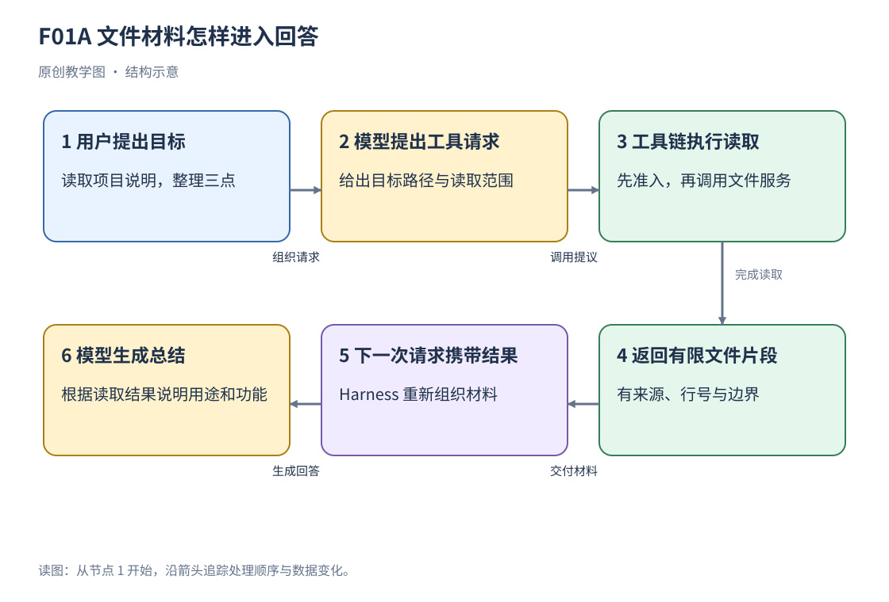

<div align="center">

# 深入理解 DeepSeek Harness

**沿一条真实任务链，读懂 Agent 从输入接纳到结果交付的完整实现。**

[📖 在线阅读](https://theater-ahyeon.github.io/deepseek-harness-textbook/) · [📦 下载完整版](https://github.com/Theater-ahyeon/deepseek-harness-textbook/releases/latest) · [🧭 章节地图](#章节地图) · [🔬 实现证据](evidence-index.md)

</div>


> 从“读取 README 并总结三项功能”出发，逐步理解请求、队列、模型、工具、历史、插件与界面如何协作。每段源码之前都有独立的实现详解，读者可以先通过文字掌握流程，再按需核对代码。

## 🚀 从这里开始

| 你想怎样阅读 | 入口 | 使用方式 |
| --- | --- | --- |
| 立即开始 | [在线图文教材](https://theater-ahyeon.github.io/deepseek-harness-textbook/) | 从第 1 章进入，按章阅读或切换全文阅读 |
| 保存到本地 | [下载完整 ZIP](https://github.com/Theater-ahyeon/deepseek-harness-textbook/releases/latest) | 解压并保留目录，双击 `reader.html` |
| 在 GitHub 里读 | [Markdown 全文](tutorial.md) · [分章正文](book/) | 直接查看文字、图表与源码讲解 |
| 先看架构取舍 | [技术选型专题](tech-choices.md) · [在线专题](https://theater-ahyeon.github.io/deepseek-harness-textbook/tech-choices.html) | 比较项目的实际选型、优势、维护代价与替代方案 |

阅读离线教材无需安装 DeepSeek Harness，也无需配置模型 API。图、字体样式与脚本均可在本地使用。把完整 ZIP 发给别人，解压后即可开始阅读。

## ✨ 这本教材提供什么

| 内容 | 规模 | 阅读价值 |
| --- | --- | --- |
| 系统讲解 | **19 章** | 从任务主链进入，逐步补齐 TypeScript、异步和工程基础 |
| 源码研读 | **27 段实现详解，223 行非空源码逐行说明** | 先理解完整过程，再对照实现写法 |
| 讲解配图 | **42 幅** | 展示数据流、执行边界、状态关系与量化案例 |
| 技术选型 | **14 组比较，17 张表** | 理解为何采用这些机制，以及替换时需要处理什么 |
| 原始参考 | **154 项参考文件** | 用原项目文档核对概念、接口与实现背景 |
| 数值与行为验证 | **41 项可复算结果，6 项源码行为验证** | 将公式、教学输入与实际运行的断言结果对应起来 |

全书面向只掌握少量概念的读者。正文在使用新概念时解释其含义，保留 Agent、Session、Provider、MCP 等专有名词，并把它们放回具体执行过程。学习重点包括组件的职责、数据怎样流动、状态何时变化，以及失败和取消怎样影响后续步骤。

本书尤其适合希望系统学习 Agent 工程、理解 DeepSeek Harness 架构，或准备进一步阅读项目源码的读者。技术细节按任务流程展开，可以不预读原仓库文档，直接从第 1 章开始。

## 一条任务主线，串起整个项目

贯穿案例是：**“读取项目 README，概括用途和三项功能。”**



这条任务依次经过输入接纳、Inbox 领取、模型请求、工具准入、文件读取、结果记录、再次请求与最终呈现。每个阶段都有自己的输入和结果：接纳回执确认输入进入处理流程，工具结果描述实际获取的材料，Session 事件记录执行事实，客户端持续跟随任务变化。

随着章节推进，同一案例会遇到新条件：文件过长需要窗口读取，上下文接近容量需要压缩，模型失败需要恢复，危险操作需要审批，子任务需要交接，页面刷新需要重建状态。读者由此理解这些机制怎样参与同一个任务。

## 🧭 推荐阅读路线

| 阶段 | 章节 | 先建立什么理解 |
| --- | --- | --- |
| **建立主链** | 01—05 | 输入如何接纳；turn、step、attempt 怎样推进；工具怎样读取；事实怎样保存 |
| **理解请求材料** | 06—09 | 提示词与项目指令怎样组装；Skill 怎样加载；历史怎样压缩；流响应怎样恢复 |
| **理解工程装配** | 10—15 | 插件和配置怎样协作；准入与 MCP 怎样接入；Subagent、网页与桌面怎样运行 |
| **理解验证与原理** | 16—19 | 回放检查什么；任务怎样评价；read 怎样整合各层；Cordis 怎样管理组合与释放 |

第一次阅读可以顺着这四个阶段走。遇到语法时查[语法与数据基础](appendices.md)，遇到概念时查[术语索引](glossary.md)。学习某项机制的同时，可以打开[技术选型与替代方案](tech-choices.md)，把实现与架构取舍联系起来。

<a id="章节地图"></a>

## 章节地图

点击章名查看 Markdown 正文；在线阅读器左侧也提供相同的十九章目录。

| 章 | 主题 | 本章回答的核心问题 |
| --- | --- | --- |
| 01 | [DeepSeek Harness 的架构与任务流程](book/01.md) | 一条输入怎样经过模型、工具与 Session，最终成为回答？ |
| 02 | [TypeScript 基础与异步执行](book/02.md) | 对象、函数、Promise、await 和回调在项目中怎样使用？ |
| 03 | [Agent 循环、Inbox 与工具调度](book/03.md) | 输入何时领取？轮次、步骤与尝试怎样划分？并发工具怎样有序提交？ |
| 04 | [文件读取：参数解析与窗口构造](book/04.md) | 路径与行参数怎样变成有大小上限的文件窗口？ |
| 05 | [Session 事件日志、投影与持久化](book/05.md) | 一条事件怎样从内存进入视图与持久存储？ |
| 06 | [提示词组装与项目指令](book/06.md) | 规则、输入与历史按什么顺序进入本次请求？ |
| 07 | [Skill 发现与按需加载](book/07.md) | 摘要发现、调用检查与正文读取怎样衔接？ |
| 08 | [上下文压缩与历史表示](book/08.md) | 摘要怎样替换当前历史表示，提交前检查什么？ |
| 09 | [模型流式响应与请求恢复](book/09.md) | 临时输出何时结算？失败后怎样决定重试？ |
| 10 | [插件装配、运行配置与热重载](book/10.md) | profile 与配置补丁怎样决定实际挂载的能力？ |
| 11 | [工具准入、审批与执行约束](book/11.md) | 一次工具调用怎样经历策略、审批、guard 和执行？ |
| 12 | [MCP：外部工具与资源接入](book/12.md) | stdio 与 HTTP 传输怎样把远端能力接入本地工具链？ |
| 13 | [Subagent：任务拆分与历史继承](book/13.md) | fresh 与 fork 怎样选择子任务起点，父任务如何交接和汇合？ |
| 14 | [Web Client：任务提交与状态同步](book/14.md) | pending、快照、事件序号和持续跟随怎样共同更新页面？ |
| 15 | [桌面架构：Main、Renderer 与 Node Host](book/15.md) | 桌面窗口、页面和独立 Host 进程怎样启动与通信？ |
| 16 | [测试、模型回放与行为验证](book/16.md) | 固定模型输出以后，哪些程序行为可以复现和检查？ |
| 17 | [任务评价、TokenMeter 与遥测](book/17.md) | 怎样联合分析正确性、耗时、token 用量和失败？ |
| 18 | [综合案例：read 工具的接入与呈现](book/18.md) | 工具注册、读取、输出契约、事件记录和卡片怎样连成一条链？ |
| 19 | [Cordis 与 Spatiotemporal Composability](book/19.md) | 论文的可逆性、依赖与生命周期怎样对应具体实现？ |

## 源码研读可以怎样读

每个源码小节采用相同顺序：

**阅读任务 → 实现详解 → 源码摘录 → 逐行说明 → 执行推演。**

“实现详解”使用连续段落，说明调用背景、输入、执行顺序、状态变化、关键分支、返回结果与后续交接。它为整段实现建立完整叙述；源码和逐行表随后提供可核对的证据。

| 阅读方式 | 建议操作 |
| --- | --- |
| 先理解流程 | 勾选阅读页顶部的 **“隐藏代码与逐行表”**，保留全部文字讲解 |
| 对照实现 | 展开代码，结合详解、原文件行号与逐行表查看具体写法 |
| 追踪依据 | 点击证据编号，进入[实现证据索引](evidence-index.md)查看路径、版本与相关材料 |

隐藏代码后，源码小节标题、目录与搜索跳转继续可用。读者可以连续阅读实现逻辑，也可以在关注某个分支时再展开代码。

## 技术选型与替代方案

[独立专题](tech-choices.md)围绕十四组选型，按**源码事实 → 优势 → 维护代价 → 替代方案 → 迁移关注点**展开。比较覆盖：

- **运行与组合：** TypeScript/Node.js、Cordis、Agent loop、Session。
- **数据与接口：** 存储、schema、Typert、模型 Provider、MCP。
- **产品与工程：** 界面、桌面、构建、测试、PTC。

专题包含 17 张表，15 组项目依据绑定 44 项源文件引用，并附 22 个官方技术文档链接。学习者可以据此比较不同方案如何处理同一问题，例如事件日志与关系存储、循环与图工作流、进程内任务与独立执行环境。

## 阅读器与资料入口

阅读器采用白底三栏布局，左侧选择章节，右侧定位本章小节。支持以下操作：

- **按章与全文阅读：** 切换单章视图，或连续浏览全书。
- **离线搜索：** 点击“搜索本书”，或按 `/`，按概念、工具名与关键词定位正文。
- **文字优先：** 隐藏代码与逐行表，继续阅读实现详解。
- **手机阅读：** 从左上角展开章节目录，使用“本页目录”定位小节。
- **查看原图：** 点击配图下方入口，放大查看执行关系。
- **前后章导航：** 从正文下方进入上一章或下一章。

| 资料 | 用途 |
| --- | --- |
| [语法与数据基础](appendices.md) | 回查 TypeScript、异步与数据表示 |
| [术语索引](glossary.md) | 定位术语解释所在章节与段落 |
| [补充能力](subsystems.md) | 了解主链之外的材料、存储、执行、产品与运行治理 |
| [实现证据](evidence-index.md) | 核对真实节选、路径、行号及对应版本 |
| [原项目文档](reference-index.md) | 进一步查阅官方说明与接口背景 |
| [计算与源码验证](examples/README.md) | 查看教学输入、公式、输出与已执行的局部行为验证 |

## 🔬 源码基线与核验记录

教材依据固定源码快照撰写：

| 项目 | 固定值 |
| --- | --- |
| 上游仓库 | [deepseek-ai/deepseek-harness](https://github.com/deepseek-ai/deepseek-harness) |
| 源码提交 | `639ed015397290b3745d163aafe02ffee4aa3f84` |
| 根包版本 | `0.2.0-rc.2` |
| Cordis 版本 | `4.0.4` |
| 核验日期 | `2026-10-03` |
| 正文编辑来源 | `book/*.md` |

[构建核验](validation.json)检查章节、源码摘录、逐行说明、原始参考哈希、术语定位与本地链接。[源码快照清单](source-snapshot.json)和[参考文件清单](reference-manifest.json)记录文件身份与哈希，便于追溯依据。

数值示例保留明确标注的教学输入，使用本地 calculations 工具生成 41 项可复算结果。六项源码行为验证实际调用读取窗口与 Inbox 等局部实现，保存断言观察、执行环境和源文件哈希。相关材料集中在 [examples/](examples/README.md)。

第 19 章讨论 *A Programming Paradigm for Spatiotemporal Composability*，将论文中的可逆操作、独立性、服务解析和生命周期与 Cordis 实现对应；章末提供实际阅读章节与原文入口。

原文与实现核对、中文精修、逐章复审和源码详解扩充均保留记录：[语言复审](revision/chapter-language-review-20261003.md) · [技术选型复核](revision/technology-choices-review-20261003.json) · [源码详解复核](revision/source-reading-explanations-20261003.md)。

## 仓库与离线包结构

```text
deepseek-harness-textbook/
├── README.md                 教材首页与阅读地图
├── reader.html               离线图文阅读入口
├── tutorial.md               Markdown 全文
├── book/                     十九章正文
├── figures/                  配图与 README 封面
├── tech-choices.md            技术选型与替代方案
├── appendices.md              语法与数据基础
├── subsystems.md              补充能力
├── glossary.md                术语定位
├── evidence-index.md          源码与实现证据
├── reference-index.md         原项目文档入口
├── source/                   固定版本源码及原文档
├── examples/                 计算与源码行为验证
└── revision/                 编辑、复审与证据记录
```

分享时保留 ZIP 解压后的完整目录，使图片、页面和参考资料能按相对路径打开。[版本说明](package-info.json)记录阅读包信息，[重构记录](revision/changes.md)保存结构与重要事实变更。

<details>
<summary><strong>维护教材：修改正文与重新构建</strong></summary>

正文唯一编辑来源是 `book/*.md`。构建脚本负责汇总与渲染，编辑章节后可在仓库根目录执行：

```bash
python _tools/refresh_locations.py
python _tools/build_course.py
```

需要同步完整版 ZIP 时执行：

```bash
python _tools/build_course.py --package
```

构建同时检查来源绑定与修订记录。更新已核验的正文时，需要保存相应修订记录，并同步术语定位。`archive/`、旧章节目录及本机依赖不进入阅读包。GitHub 仓库提供阅读器的维护脚本，制作方本地保留完整制作工具；分享 ZIP 用于阅读。

</details>

---

<div align="center">

**从第 1 章开始，沿任务流理解系统，再沿证据深入实现。**

[开始在线阅读 →](https://theater-ahyeon.github.io/deepseek-harness-textbook/) · [下载完整教材 →](https://github.com/Theater-ahyeon/deepseek-harness-textbook/releases/latest)

</div>
