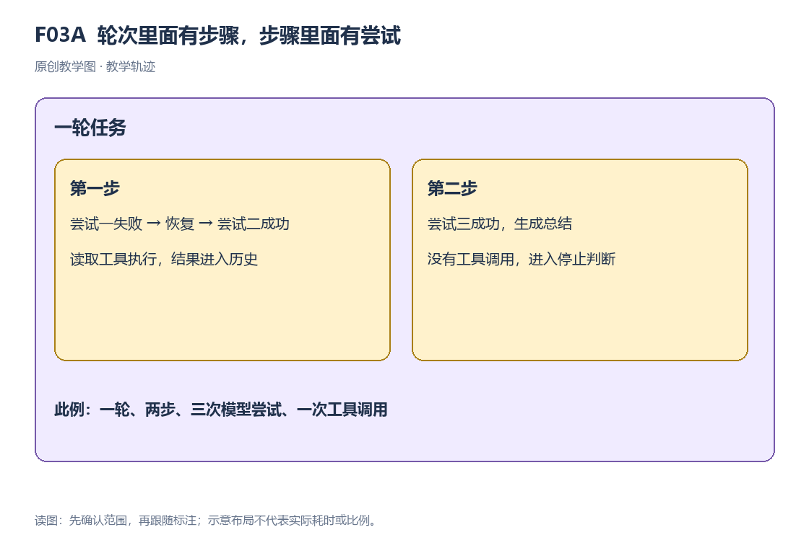
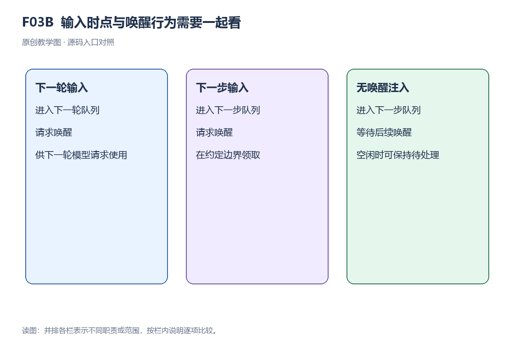

# 第 3 章｜Agent 循环、Inbox 与工具调度

本章学习任务：追踪输入从 Inbox 进入 turn、step 和 attempt 的过程，解释并发执行与有序提交。

## 03.1 基本概念

轮次（turn）是驱动围绕一批输入推进的过程，步骤（step）是其中的执行单元，尝试（attempt）对应步骤内的一次模型请求。读取 README 和根据读取结果生成总结，可以构成同一轮次的两个步骤。请求失败后若恢复策略允许重试，新的请求仍属于原步骤，attempt 增加，turn 和 step 保持不变。

状态描述系统在某个时刻保存的信息，例如待处理消息、轮次编号和驱动阶段。状态转换规定事件发生后这些信息如何更新，驱动负责调度转换。取消信号向执行代码传递停止请求；支持取消的路径检查信号、停止后续工作，并处理已启动操作的收尾。

Inbox 分别保存 `next-turn` 和 `next-step` 输入。`followup` 放入前者，`steer` 放入后者。进入下一步骤时，驱动领取全部 next-step 输入；开启下一轮时，再把一项 next-turn 输入接到这批材料后面。因此，较晚到来的引导可以先被领取，较早排队的另一项普通任务仍在等待。领取以后还要经过前置判断，允许进入本步才发起模型请求。

输入接纳、消息领取、模型请求、工具执行和轮次结束分别对应不同的处理阶段。判断任务进展时，需要把各阶段的事件与结果关联到同一轮次。

## 03.2 沿一个任务看完整流程

设 A 是普通任务，B 是本轮中的补充要求，C 是另一条普通任务。A 已进入当前轮次；C 排在下一轮次；B 通过引导入口进入下一步。

| 边界 | next-step 待处理 | next-turn 待处理 | 领取结果 |
| --- | --- | --- | --- |
| 本轮请求执行中 | B | C | 不改已经发出的请求 |
| 本轮下一步骤 | B | C | 领取 B，C 继续等待 |
| 下一轮开始 | 空 | C | 领取下一轮的一项普通输入 |

驱动先记录轮次开始，再为下一步骤作前置判断。前置拒绝时，轮次可以以 blocked 结束而没有模型步骤；允许时才准备请求。成功请求没有工具调用则可完成；有工具调用则执行并记录结果，按结论继续下一步或结束。失败尝试是否继续由恢复策略决定：只有恢复链（第 9 章展开的错误恢复流程）给出 retry（重试）时，才在同一步骤里再次尝试；否则以失败结束。例如一个任务包含两步，第一步重试一次：共有一个 turn、两个 step、三次模型请求，也就是三次 attempt。

## 03.3 关键机制与设计取舍

### 三层边界



图 03A 外框是一轮任务，内框是两个步骤。第一步有失败和重试两次尝试，第二步有一次成功尝试，因此这条轨迹包含一个 turn、两个 step、三个 attempt。

turn、step 和 attempt 分别统计任务推进的三个层次。前置拒绝时，一轮没有进入模型步骤；读取后总结可以用两个步骤；某一步请求失败后又可以重试。驱动在成功消息提交后提取工具调用；失败尝试的 partial 是尚未成功完成的输出，先进入失败记录与恢复流程。

### Inbox 怎样与驱动合作

Inbox 保存尚未领取的输入。`followup` 排入下一轮并请求唤醒；`steer` 排入下一步并请求唤醒；`inject` 也排入下一步，由后续驱动活动领取。选择哪种入口，决定输入何时进入处理以及是否启动驱动。

空闲时，需要唤醒的输入让驱动启动。已有活跃驱动时，新输入由现有驱动在约定边界领取。维护期间，唤醒请求先记在 `wakeRequested` 中，由维护任务收尾时检查是否启动驱动。这里把正在进行的一次运行称为活动。若活动已收到取消信号，`send` 会把需要唤醒的输入改排到 `next-turn`，等待原活动收尾后再处理。

普通运行路径中，驱动开放轮次，准备下一步，领取消息并组装材料。前置决定可能允许进入或拒绝。进入后发起模型请求，成功消息有工具调用则进入工具批次；工具结果回到 Session 历史。驱动再看停止原因与下一步输入，决定继续或结束。

### 工具执行能重叠，结果仍按模型顺序提交

把贯穿案例稍作教学扩展：模型在同一消息里先提出读取 README 的调用 A，再提出读取包信息的调用 B。要同时说明三个顺序：提议的排列、真实动作的完成先后，以及结果进入 Session 的顺序。三个顺序不必相同。[S02](../evidence-index.md#s02) 对照本节执行器。

执行器按模型给出的顺序建立调用计划，保存调用标识、工具名、已解析参数、Agent 和取消信号。允许并发的调用进入有数量上限的执行池；需要独占的调用设置执行屏障，等待池内任务结束后运行。执行池管理正在执行的调用，屏障约束不同批次的启动顺序。

启动每一项时，先记下 tool/call 及其序号，再等待这一项的前置准备。准备可能已经形成拒绝结果，也可能允许分派真实执行；前置准备按顺序推进，实际分派与工具体才可能重叠。拒绝结果同样要在相应位置进入结果链，作为确定的结果记录留存。

假设 A、B 均允许并发且执行池容量足够，B 先完成。执行器将 B 的结果暂存于索引 1 的结果槽，提交游标仍停在 A 对应的索引 0。A 完成后，执行器按 A、B 的顺序运行结果后处理、追加 Session 结果，并把额外上下文传入下一步骤。结果槽按调用位置暂存完成结果，提交游标保证历史顺序与模型提议顺序一致。

| 时点 | A 的结果槽 | B 的结果槽 | 已提交到 Session 的工具结果 |
| --- | --- | --- | --- |
| 两项已开始 | 尚空 | 尚空 | 无 |
| B 先结束 | 尚空 | 已有结果 | 无，仍等待位置 0 |
| A 随后结束 | 已有结果 | 已有结果 | 按 A、B 顺序处理并追加 |
| 下一步准备 | 已按约定交接 | 已按约定交接 | 模型可使用有确定关联的结果 |

这里的提交把结果追加到 Session；第 5 章继续解释这些事件怎样写入存储。执行器还会在提交之后重新检查尚未启动项的执行模式；某个工具改变注册状态后，后续调用按更新后的执行模式调度。工具的轮次结束提示会汇总给外层驱动，由驱动决定是否继续下一步。

取消与调度失败又是不同分支。取消会停止启动新动作，让已开始的执行收尾并按顺序交接；未开始的模型调用会得到表示跳过的合成结果。合成结果是框架生成的说明，没有对应真实工具动作。调度失败时，执行器等待已分派动作收尾，再把错误返回当前步骤。

按顺序提交让历史与模型提议容易对应，允许执行重叠则可以利用独立工作的等待时间。执行器为此维护并发池、结果槽和提交位置。B 虽然先完成，仍要等待 A 提交；下一步模型按原提议顺序读取结果。

### 队列与状态机的最小基础

队列保存“还有哪些输入等待处理”，状态机记录“当前运行在哪个阶段”。新消息入队后，正在执行的请求继续使用原材料；驱动到下一领取时点，才把待处理输入加入后续请求。

事件通知让关注这些变化的观察者（例如界面或记录组件）知道队列或状态变了。DSH（DeepSeek Harness 的缩写）Inbox 变更先更新可观察状态，再通知监听者，因此监听者可以在通知里查询新状态。

`ReactLoopAgent` 是核心运行驱动。它管理 Inbox、turn、step、模型请求和取消；网页端的 React 组件负责显示这些运行状态。

### 分析示例：数一次有重试的读取任务

教学轨迹如下：开放一轮；第一步第一次模型尝试失败，第二次尝试成功并提出 read；工具返回文件片段；第二步模型成功生成总结；轮次结束。本例共有 1 个 turn、2 个 step、3 次模型 attempt、1 次工具调用。

复算记录：[C3 · 轮次与步骤计数](../examples/calculation-results.json)。

第一步的重试位于同一个尝试循环中，保留原 step，且不重复进入前置步骤或登记用户消息。因此 3 次 attempt 只对应 2 个 step。工具结果驱动的第二次模型步骤仍服务于本次用户输入，turn 数为 1。

按 turn、step、attempt 分别计数，可以看出额外请求来自任务推进还是失败重试。

### 运行中插入新要求



图 03B 的三栏分别对应 followup、steer 和 inject。followup 进入 next-turn 并唤醒，steer 进入 next-step 并唤醒，inject 进入 next-step，由后续驱动活动领取。

回到案例，读取结果后驱动进入下一次材料准备，如果约定时点领取了新约束，这次总结请求可以包含新约束。前置拒绝使轮次以 blocked 结束。取消则使正在运行的路径收尾，剩余输入由 Inbox 和下一次唤醒继续管理。

### 常见误解

“下一步输入会立刻打断当前模型流”：next-step 指定下一次领取的位置。当前请求继续执行；取消则通过独立信号要求它停止。

工具结果按调用顺序记录。工具执行体可以并发运行，前置准备、结果后处理和最终提交分别遵循执行器的顺序约束。

“出现 turn/start 就花费一次模型请求”：前置拒绝或初始空输入可能没有进入步骤。

## 03.4 源码研读

<a id="e03a"></a>

### E03A · 领取时组合两类待处理输入

阅读任务：本段是 Inbox.claim 完整方法。target 指当前是否是新轮次边界，turn 指领取所属轮次。mutate 在这里移除对应列表项并返回被取出的消息；重点是两类列表的领取差异。

#### 实现详解

Inbox.claim 把待处理输入转成当前步骤要使用的一批消息。调用者是准备步骤的 Agent 驱动，传入 target 表明当前边界是否同时开启新轮次，传入 turn 标明这批输入归属哪一轮。Inbox 内有 next-step 和 next-turn 两个列表：前者承载需要在下一步纳入的引导或注入，后者承载等待下一轮的普通任务。

每次领取先取走 next-step 的全部现有消息，并按列表顺序放入 claimed。mutate 同时更新队列状态和返回取出的消息，因此领取后这些输入从待处理列表中移除。在 next-step 边界，领取到此为止；在 next-turn 边界，再从下一轮列表的头部取一项，接在 claimed 后面。即使下一轮排着多项普通任务，本次也只取其中一项。

这样安排使当前轮次的补充要求能够在下一步骤及时进入，同时让排队的普通任务逐轮推进。例如 next-step 有 B、D，next-turn 有 C、E：在当前轮次准备下一步时得到 B、D，C、E 继续等待；在新轮次边界领取相同队列时得到 B、D、C，E 留给后续轮次。这批结果按目标边界和列表顺序组合，不能用所有消息的提交时间重新排序。

队列更新完成后，方法逐条发出 agent/inbox/claimed 通知，通知携带消息和所属 turn，让界面及其他观察者知道输入已被领取。返回的 claimed 数组交给前置步骤处理，随后才组装模型请求。领取说明消息从队列进入了步骤准备，前置处理仍可以拒绝继续。后到的输入保存在队列中，由下次驱动到达领取边界时处理，已发出的模型请求保持原有材料。

代码类型：**真实源码摘录**。证据编号 [E03A](../evidence-index.md#e03a)；下表的数字是原文件行号。

```ts
  claim(target: InboxTarget, turn: number): UserMessage[] {
    const claimed = this.mutate('next-step', 0, this.nextStep.length, [], false)
    if (target === 'next-turn') claimed.push(...this.mutate('next-turn', 0, 1, [], false))
    for (const message of claimed) this.dispatch.emit('agent/inbox/claimed', { message, turn })
    return claimed
  }
```

| 原文件行号 | 写法 | 在这段流程中的作用 |
| --- | --- | --- |
| 109 | 方法接收边界和轮次，并返回消息数组 | 调用者是准备下一步骤的驱动。 |
| 110 | const 保存 mutate 返回值，length 表示列表项数 | 先取走当前全部 next-step 输入，保存为 claimed。 |
| 111 | if 比较 target，push 与展开追加数组成员 | 新轮次边界才再取一项 next-turn 输入，拼到领取批次后。 |
| 112 | for...of 遍历领取结果，emit 发出事件 | 发布每条消息所属轮次的领取通知，供界面等观察者更新状态。 |
| 113 | return 返回数组 | 前置处理可使用这批消息形成本步材料。 |
| 114 | 右花括号结束方法 | 领取动作完成，模型请求仍属于后续步骤。 |


执行推演：next-step 中有 B，next-turn 中有 C。target 为 next-step 时返回 B、保留 C；target 为 next-turn 时先取全部步骤输入，再取一项轮次输入。每项领取还发出对应通知。

## 03.5 理解检查与讲解问答

### 问题 1 · C 先以 followup 排入，B 后以 steer 排入，谁先用于本轮下一步？

讲解：B 在下一步领取，C 留给下一轮。Inbox 先按输入的目标边界分组，再在相应边界领取，所以后到的 B 可以先于 C 进入请求。

### 问题 2 · 一轮两步，第一步重试一次，一共有几次尝试？

讲解：三次。第一步两次，第二步一次；轮次数仍是一次。

### 问题 3 · inject 与 steer 的关键差别是什么？

讲解：两者都进入 next-step；inject 不触发唤醒，steer 触发。驱动空闲时，inject 的输入会留在队列中，等待后续唤醒。

### 问题 4 · 模型先提出 A、再提出 B，但 B 先完成，为什么 Session 可以先没有 B 的结果？

讲解：执行器先把 B 存入位置 1 的临时结果槽，提交位置仍等待 A 所在的位置 0。A 完成后才依次处理、提交 A 和 B。真实执行先后与历史提交顺序不同；若下一次模型请求读取历史，也应以实际已提交的结果为依据。

[全书目录](../tutorial.md) · [本章与原始证据](../evidence-index.md) · [术语索引](../glossary.md)
