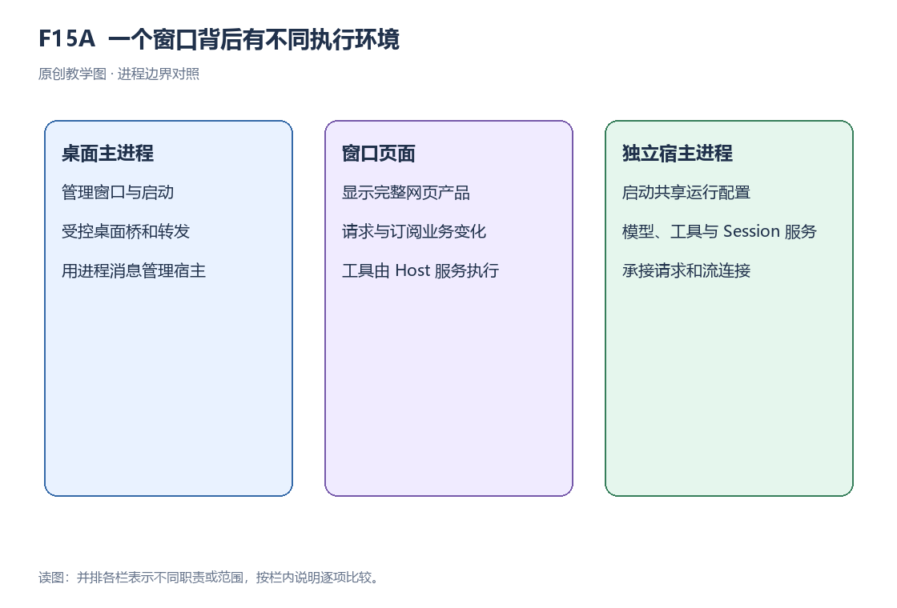
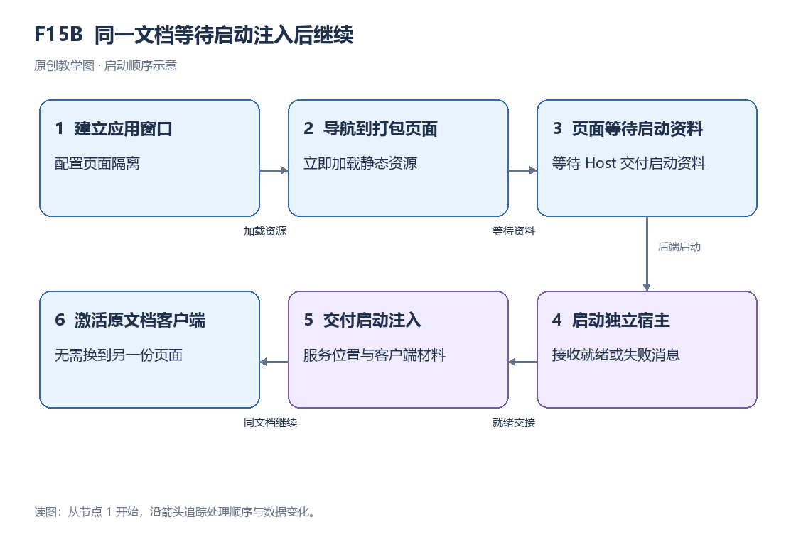

# 第 15 章｜桌面架构：Main、Renderer 与 Node Host

本章学习任务：理解 Main、Renderer 与 Node Host 的职责，追踪页面加载、Host 启动和客户端激活。

## 15.1 基本概念

Electron 负责承载桌面版的 Web 客户端。其中，Renderer 用于渲染并运行页面，Main 负责应用生命周期与窗口管理，preload 则为页面提供受控的桌面接口。独立的 Node Host 子进程运行 Harness 后端服务，Main 统一控制它的启动与退出。

程序在操作系统中的一次运行称为进程，它拥有独立的内存与生命周期。主进程与子进程间通过 IPC（进程间通信）交换启动和退出等消息；而聊天业务依然保留网页客户端的持续流与请求机制。HTTP 处理单次请求响应，WebSocket 维持双向通道，两者与 IPC 承担着不同的通信职责。

应用启动时，Main 会首先加载本地网页，然后等待 Host 提供启动参数及服务地址。页面此时呈现等待界面，直到获取参数后才激活业务客户端。后续的业务请求在转发时会校验页面来源，并向 Host 申请所需的认证信息。

关闭普通主窗口会隐藏窗口，应用继续在后台运行。退出应用时，Main 先检查任务中断情况，再进入后端关闭流程。这两类事件分别按桌面应用生命周期处理。

## 15.2 沿一个任务看完整流程

用户在桌面端看到的启动过程如下：Main 首先导航至本地网页文档，接着发起后端准备操作；HostProcess 随即创建一个独立的 Node 子进程，并监听 fatal 或 ready 消息。当收到包含启动注入资料和服务 URL 的 ready 消息后，当前页面会利用这些数据激活客户端。

如果 200 毫秒时页面显示等待界面，1000 毫秒时业务状态可用，那么应用的完整启动耗时算作 1000 毫秒。排查故障时可分阶段进行：若页面已呈现但 Host 报错，应检查子进程启动情况；若 Host 进入 ready 状态但请求依然失败，需核查服务及转发机制；若业务数据已更新却未在界面展示，则排查视图与客户端。

主进程会将页面的业务路径转发给 Host，同时完成认证适配与来源校验。桌面特有能力（如目录选择）由 preload 提供，而聊天等业务请求仍沿用 Web 客户端的既有通信手段。在这个架构中，Node Host 负责运行 Harness 服务，Main 掌管后端生命周期与窗口。

## 15.3 关键机制与设计取舍

### 三个环境与通信



图 15A 展示了 Main、Renderer 以及独立的 Node Host 三者的并列关系。Main 负责控制启动流程和窗口，Renderer 承担 Web 产品的展示任务，而模型、工具及 Session 服务则运行在 Node Host 中。

### 先加载文档，再等服务准备

`reconcileBackend` 先导航到打包页面，再启动后端。窗口加载本地 Web 资源后等待启动注入；Host 就绪后，已经载入的文档据此激活业务客户端。

调用 `DesktopHostProcess.start` 会生成一个 Node 子进程，同时配置好输出管道与 IPC 通道，用于接收 fatal 或 ready 消息。其中 ready 消息包含 injections 和服务 URL，这些参数正是页面启动所需的信息。早已加载的页面获取这些参数后，便能激活客户端并向 Host 提交业务请求。

本地静态资源与业务请求在桌面协议中分开处理。页面的业务请求经过转发函数时，程序会验证其来源，对齐查询参数与目标路径，并补充相关的认证凭据。页面与 Host 之间依靠 WebSocket 形成双向流通道，而 ready 状态、目录选择等桌面专属能力则通过 preload 的受控接口向外提供。

### 进程与受控桥的基础

Main、Renderer 以及 Node Host 都拥有各自的内存空间与生命周期。Renderer 通过 preload 暴露的桌面接口调用目录选择等功能；而文件工具的实际执行则交给 Node Host 内部的文件服务来完成。

关闭普通主窗口时，程序仅隐藏该窗口并保持后台运行；当触发退出应用操作时，系统才会开始检查任务中断情况并执行后端关闭。这两个不同的生命周期事件均由 Main 负责处理。

### 分析示例：页面出现与业务可用

在教学场景的启动时间线中：0 ms 为起点，200 ms 时页面渲染出等待界面，900 ms 时 Host 准备就绪，到 1000 ms 时客户端正式可用。由此可见，页面出现仅花费 200 ms，而业务完全可用共耗时 1000 ms，中间包含了 800 ms 的等待区间。

复算记录：[C15 · 启动耗时](../examples/calculation-results.json)。

页面先进入等待状态，收到 Host 返回的启动资料后激活客户端。提前显示页面让用户看到启动反馈；业务请求要等后端准备与客户端激活完成后才能发出。

### 启动故障的分层定位



按照启动顺序，图 15B 依次展示了窗口、打包页面、Host 以及启动注入的协作关系。页面起初呈现等待界面，在接收到 ready 资料之后，同一文档内的客户端随即被激活。

在桌面端执行 README 总结任务，依然需要经过 Agent 循环、工具调用与 Session 记录。这其中，Renderer 承载用户界面，Main 管理整个桌面的生命周期，文件读取由 Node Host 内的文件服务完成；桌面壳的作用正是把这三个不同环境连接在一起。

### 常见误解

误区：“页面加载完成等于模型和工具可用”。事实是，客户端激活与 Host 准备都有独立的状态。

误区：“所有业务都经由 preload IPC 直接进入 Agent”。事实是，聊天过程仍由已有的 Web RPC 与持续流承担。

误区：“关闭窗口等于退出应用”。普通主窗口关闭后隐藏并保持运行；退出应用则先检查任务中断情况，再关闭后端。

## 15.4 源码研读

<a id="e15a"></a>

### E15A · 真正启动 Host 子进程的位置

阅读任务：本段摘自 `DesktopHostProcess.start` 内部的子进程启动逻辑。其中 `this.node` 代表选定的 Node 程序，`runtimeDir` 和 `projectDir` 为已备妥的目录；重点观察入口、传递参数与通信管道的建立。对于 ready/fatal 消息的处理在后续步骤完成。

#### 实现详解

Main 通过 DesktopHostProcess 管理 Harness 后端，start 方法在这里创建独立的 Node Host 子进程。方法进入后先检查是否已保存 child；若已有子进程对象，直接返回当前 readyPromise。首次启动才在 runtimeDir 下定位 dsh-desktop-host 的 lib/index.js，并用 this.node 指定的 Node 程序执行入口。

启动参数先列出 Node 选项，再列出 Host 入口与应用参数。--expose-internals 启用入口所需选项；配置 inspectPort 时，才增加绑定 127.0.0.1 的调试参数。入口依次接收运行包目录、项目目录和主运行环境目录，后者优先使用显式配置，否则使用约定路径。提供 packageManager 配置时，再追加 pnpm 命令路径与 Node 目录，供 Host 使用对应环境。

在 spawn 的配置选项中，项目目录被设为工作目录，环境变量由 desktopNodeEnvironment 统一组织。标准输出与错误输出被设为 pipe，标准输入配置为 ignore，同时额外开启了 IPC 通道。新增的 IPC 用于接收 fatal、ready 及退出消息，而输出管道负责收集失败诊断或转发运行输出。这种隔离设置把后端的消息通信与普通进程的文本输出拆分处理。

获取到 spawn 返回的子进程对象后，管理器会为其挂载退出、消息及输出事件的监听器，并继续等待 readyPromise 解析。当 Host 完成启动，会通过 ready 消息发出页面注入资料及服务 URL，Main 接收后，才会让已处于等待状态的页面去激活业务客户端；启动报错或收到 fatal 则转向错误处理分支。以总结 README 为例，Renderer 页面先行展示，等 Node Host 就绪后发起请求；模型与文件服务均在这个子进程内运作，由 Renderer 基于返回的状态动态呈现。

代码类型：**真实源码摘录**。证据编号 [E15A](../evidence-index.md#e15a)；下表的数字是原文件行号。

```ts
    const entry = join(this.runtimeDir, 'node_modules', '@deepseek-ai', 'dsh-desktop-host', 'lib', 'index.js')
    const child = spawn(this.node, [
      '--expose-internals',
      ...(this.inspectPort === undefined ? [] : [`--inspect=127.0.0.1:${String(this.inspectPort)}`]),
      entry,
      this.runtimeDir,
      this.projectDir,
      this.primaryRuntime ?? join(this.runtimeDir, '..', 'runtime', 'primary-runtime'),
      ...this.packageManager === undefined ? [] : [this.packageManager.pnpm, this.packageManager.nodeBin],
    ], {
      cwd: this.projectDir,
      env: desktopNodeEnvironment(this.node, undefined, this.environment),
      stdio: ['ignore', 'pipe', 'pipe', 'ipc'],
    })
```

| 原文件行号 | 写法 | 在这段流程中的作用 |
| --- | --- | --- |
| 188 | const 与 join 拼接路径 | 定位运行包中 desktop-host 的入口文件。 |
| 189 | spawn 调用和参数数组开始 | 以指定 Node 程序启动独立子进程。 |
| 190 | 字符串参数 | 给 Node 启用该入口需要的内部能力选项。 |
| 191 | 条件数组展开 | 只有配置检查端口时才增加调试参数。 |
| 192 | 数组成员 | 把 Host 入口交给 Node 执行。 |
| 193 | 数组成员 | 传入运行包目录。 |
| 194 | 数组成员 | 传入当前项目目录。 |
| 195 | 空值合并和 join | 显式主运行环境优先，否则使用约定的默认目录。 |
| 196 | 条件展开 | 存在包管理器信息时追加其命令与 Node 目录。 |
| 197 | 结束参数数组，开始 spawn 选项 | 后续字段配置 Host 子进程的工作目录、环境和通信方式。 |
| 198 | cwd 选项 | 子进程从当前项目目录运行。 |
| 199 | 环境构造函数 | 根据所选 Node 与配置准备 Host 环境。 |
| 200 | stdio 数组 | 不使用标准输入，捕获输出与错误，并开启 IPC。 |
| 201 | 结束 spawn 调用 | 获取子进程句柄，后续管理其 ready、失败与退出。 |


执行推演：Main 调用 spawn，创建 dsh-desktop-host 的独立 Node 子进程，并将当前项目目录设为其工作目录。管道传递输出，IPC 传递启动消息。spawn 返回的是子进程句柄；是否 ready，需要等待后续 IPC 消息确认。

## 15.5 理解检查与讲解问答

### 问题 1 · Main 与 Node Host 分别运行哪些功能？

讲解：Main 负责调度桌面的窗口状态以及后端的生命周期，而 Harness 的各项服务则交由独立的 Node Host 子进程去运行。

### 问题 2 · 等待页面出现是否等于业务已经可用？

讲解：出现等待页面只说明 Renderer 完成了文档的加载。要让业务真正可用，必须等 Host 发出 ready 消息，并且完成后续的客户端激活步骤。

### 问题 3 · preload 是否直接承接所有聊天业务？

讲解：preload 的作用是暴露部分受控的桌面接口，而具体的聊天业务请求，依然依赖 Web 客户端既有的持续流与请求通道。

[全书目录](../tutorial.md) · [本章与原始证据](../evidence-index.md) · [术语索引](../glossary.md)
