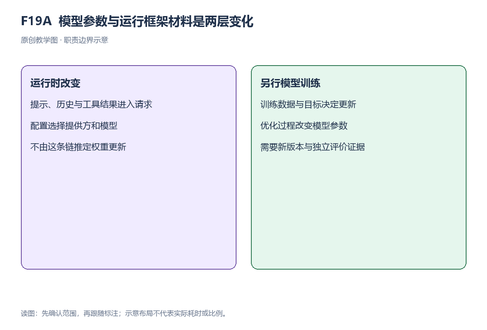
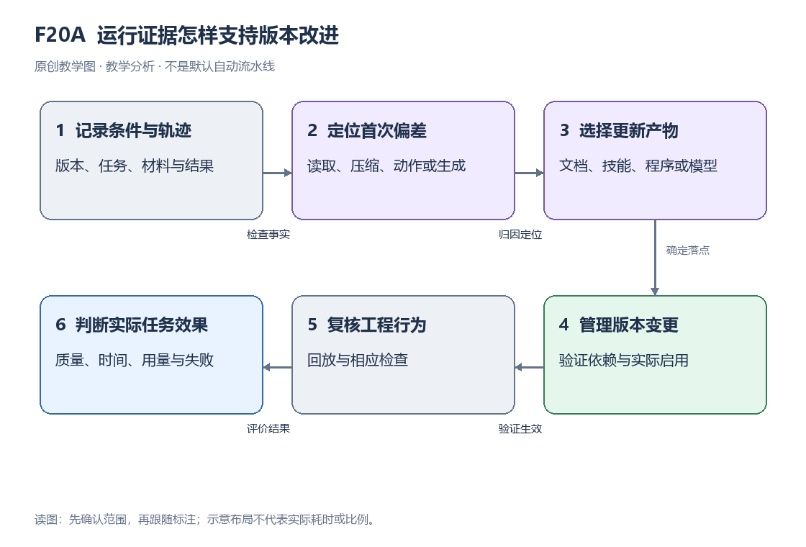
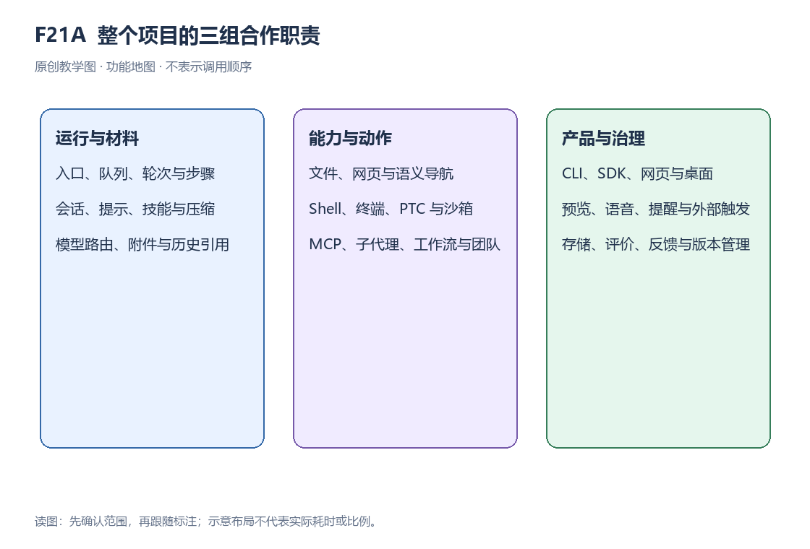
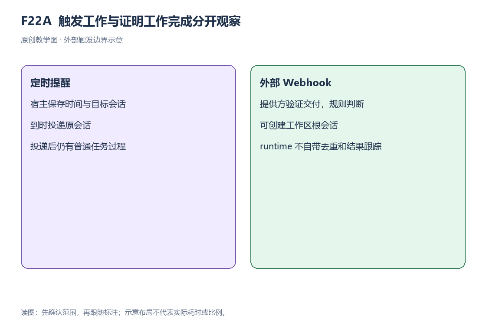

# 原创中文图示目录

40 张原创图均提供 PNG 与 SVG。图号保留专题标识，教材按十章阅读；图内教学假设不作为项目实测。

## F01A｜文件材料怎样进入回答

[可修改 SVG](F01A.svg) · [教材入口](../tutorial.md)

## F01B｜接纳与完成，观察的是不同范围

[可修改 SVG](F01B.svg) · [教材入口](../tutorial.md)

## F02A｜异步等待取决于返回契约

[可修改 SVG](F02A.svg) · [教材入口](../tutorial.md)

## F02B｜注册与执行由不同触发点推动

[可修改 SVG](F02B.svg) · [教材入口](../tutorial.md)

## F03A｜轮次里面有步骤，步骤里面有尝试

[可修改 SVG](F03A.svg) · [教材入口](../tutorial.md)

## F03B｜输入时点与唤醒行为需要一起看

[可修改 SVG](F03B.svg) · [教材入口](../tutorial.md)

## F04A｜参数经过服务读取，成为有限结果

[可修改 SVG](F04A.svg) · [教材入口](../tutorial.md)

## F04B｜返回窗口并不等于完整文件

[可修改 SVG](F04B.svg) · [教材入口](../tutorial.md)

## F05A｜相同事实可以产生不同视图

[可修改 SVG](F05A.svg) · [教材入口](../tutorial.md)

## F05B｜会话追加与存储刷新有不同契约

[可修改 SVG](F05B.svg) · [教材入口](../tutorial.md)

## F06A｜材料从不同生产路径进入请求

[可修改 SVG](F06A.svg) · [教材入口](../tutorial.md)

## F06B｜重复材料增加长度，未增加事实

[可修改 SVG](F06B.svg) · [教材入口](../tutorial.md)

## F07A｜技能目录、读取许可与正文分开

[可修改 SVG](F07A.svg) · [教材入口](../tutorial.md)

## F07B｜按需取得与全部加载的材料量

[可修改 SVG](F07B.svg) · [教材入口](../tutorial.md)

## F08A｜压缩替换当前表层，不抹去全部事实

[可修改 SVG](F08A.svg) · [教材入口](../tutorial.md)

## F08B｜摘要是否保留了关键限制

[可修改 SVG](F08B.svg) · [教材入口](../tutorial.md)

## F09A｜可见片段与最终消息分别结算

[可修改 SVG](F09A.svg) · [教材入口](../tutorial.md)

## F09B｜重试在当前步骤的边界内发生

[可修改 SVG](F09B.svg) · [教材入口](../tutorial.md)

## F10A｜最终配置来自有顺序的应用层

[可修改 SVG](F10A.svg) · [教材入口](../tutorial.md)

## F10B｜消费者依赖契约，配置选择提供方

[可修改 SVG](F10B.svg) · [教材入口](../tutorial.md)

## F11A｜准入之后才进入真实执行体

[可修改 SVG](F11A.svg) · [教材入口](../tutorial.md)

## F11B｜策略、审批与执行环境不是一层

[可修改 SVG](F11B.svg) · [教材入口](../tutorial.md)

## F12A｜外部工具进入原有执行链

[可修改 SVG](F12A.svg) · [教材入口](../tutorial.md)

## F12B｜能力验收必须逐项给证据

[可修改 SVG](F12B.svg) · [教材入口](../tutorial.md)

## F13A｜子会话的起点要明确交代

[可修改 SVG](F13A.svg) · [教材入口](../tutorial.md)

## F13B｜拆分多出交代与汇合责任

[可修改 SVG](F13B.svg) · [教材入口](../tutorial.md)

## F14A｜上行表达目标，下行观察过程

[可修改 SVG](F14A.svg) · [教材入口](../tutorial.md)

## F14B｜快照加后续变化构成观察状态

[可修改 SVG](F14B.svg) · [教材入口](../tutorial.md)

## F15A｜一个窗口背后有不同执行环境

[可修改 SVG](F15A.svg) · [教材入口](../tutorial.md)

## F15B｜同一文档等待启动注入后继续

[可修改 SVG](F15B.svg) · [教材入口](../tutorial.md)

## F16A｜回放固定响应，仍执行工程过程

[可修改 SVG](F16A.svg) · [教材入口](../tutorial.md)

## F16B｜每种检查都有对象和盲区

[可修改 SVG](F16B.svg) · [教材入口](../tutorial.md)

## F17A｜一次任务要留下多种评价记录

[可修改 SVG](F17A.svg) · [教材入口](../tutorial.md)

## F17B｜减少用量与提高质量不是同一句话

[可修改 SVG](F17B.svg) · [教材入口](../tutorial.md)

## F18A｜能力设计接入与卸载的生命周期

[可修改 SVG](F18A.svg) · [教材入口](../tutorial.md)

## F18B｜按职责解释完整任务，而非只背名字

[可修改 SVG](F18B.svg) · [教材入口](../tutorial.md)

## F19A｜模型参数与运行框架材料是两层变化

[可修改 SVG](F19A.svg) · [教材入口](../tutorial.md)

## F20A｜运行证据怎样支持版本改进

[可修改 SVG](F20A.svg) · [教材入口](../tutorial.md)

## F21A｜整个项目的三组合作职责

[可修改 SVG](F21A.svg) · [教材入口](../tutorial.md)

## F22A｜触发工作与证明工作完成分开观察

[可修改 SVG](F22A.svg) · [教材入口](../tutorial.md)
