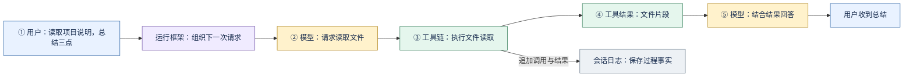

# 配图规划：先看到材料，再看内部机制

状态：40 张原创中文图已全部绘制，分别提供 SVG 与 PNG。实际文件和缩略目录见 [图示目录](figures/index.md)。下文保留设计理由与分镜说明。

参考的是《图解大模型》的直觉优先和大量图示辅助机制理解的方法，来源为[作者网站及公开样图入口](https://www.llm-book.com/)与[官方配套仓库](https://github.com/HandsOnLLM/Hands-On-Large-Language-Models)。已在 Edge 查看并视觉核对作者公开的 [attention 样图](https://www.llm-book.com/images/attention.png)。本方案据此归纳教学图的表达方式，不宣称复刻书中的精确字体、版式或色值，也不把一张样图推广为全书每张图的统一格式。

| 公开样图中可观察的方式 | 在 DSH 教材中的改编 |
| --- | --- |
| 用实际句子中的词及相关性条形，让抽象运算有具体对象 | 用请求文本、read 参数和文件片段作为材料卡片，不只画组件名称 |
| 外层 Self-attention 与内层 Attention head 分开呈现 | 用会话、步骤或进程容器表现不同层级；容器含义必须写明 |
| 输入值、加权结果与最终输出可循迹对照 | 同一材料在请求、工具结果、摘要中保留可识别标签，让变化可见 |
| 运算符、图例和简短标注紧邻对象 | 箭头直接写动作与数据；计数、时间、单位贴近对应区间 |

这些是观察后的原创适配：DSH 控制流不照搬注意力计算，也不用向量图标暗示未实现的 embedding 能力。公开样图只用于核对方法，不随课程附件提供。

## 1. 原创视觉系统

画面使用白底、留白、圆角卡片、短标签和连续编号。重点让学生看清“谁持有材料、材料在哪里改变、什么时候出现结果”。配色是本课程的建议值：

| 类别 | 建议底色 | 文字标签 / 形状补充 |
| --- | --- | --- |
| 用户与界面 | 淡蓝 `#E9F2FF` | 用户 / 界面卡片 |
| 控制与调度 | 淡紫 `#F0EBFF` | 循环 / 队列卡片 |
| 模型输入输出 | 淡黄 `#FFF2CC` | 材料叠片 / 模型卡片 |
| 工具与外部能力 | 淡绿 `#E5F6ED` | 工具 / 服务卡片 |
| 会话事实与存储 | 淡灰 `#EDF1F5` | 事件条目 / 日志容器 |
| 异常与拒绝 | 淡红 `#FFE8E5` | 带“拒绝/失败/取消”字样的分支 |

不要仅靠颜色区分类别。实线箭头表示调用或材料传递，虚线箭头表示事件/状态通知；箭头必须带动作或数据标签。顺序流程标 ①②③，时间线标明确单位；容器边界明确表示会话、进程或机器中的哪一种，不能混用。

图中标签、图例和图注以中文为主，例如“文件读取工具”“下一轮输入”“会话日志”“宿主服务”。首次介绍时在图注对照 `read`、`followup`、`Session`、`Host` 等准确标识；需要定位实现的第二层图才使用源码名称。图例应常驻，不使用没有定义的锁、云或数据库图标暗示能力。

每图包含标题、一个问题、节点内容、箭头含义、图注及替代文字。图注标“结构示意 / 源码推演 / 教学假设 / 实测记录”中的一种。结构图没有比例；示意时间条没有实测刻度。

## 2. 图的展开顺序

先画黑箱：输入 → 处理 → 输出。下一图打开一个框，看其中三个至五个组件。只有学生已经理解组件职责后，才画 turn/step 时间线、并发区间、跨进程边界或恢复路径。

同一任务的输入始终为“读取 README.md，说明用途并总结三点”；示例工具名使用项目的 `read`。教学输入不表示仓库已经录制了这次运行。材料从请求文本变为工具参数、文件片段和回答时，显示简短样例，不用一条无标签线代替。

主图 FXXA 解释常规过程，伴随图 FXXB 解释一个区别、分支或取舍。配图数量来自解释任务，不把所有源码模块塞进总览图。

## 3. 全书分镜表

| 图号 | 需要回答的问题 | 画面与材料 | 图注 / 依据 |
| --- | --- | --- | --- |
| F01A | 一句话如何变成带工具的回答？ | 用户请求 → Harness 调度 → 模型工具请求 → read → 文件片段 → 模型回答；Session 在旁侧接收事件 | 结构示意；循环和工具实现 |
| F01B | 接纳和完成为何是两件事？ | 提交、accepted、开始处理、流式输出、终态五个刻度；省略具体耗时 | 源码推演；prompt 与 follow |
| F02A | await 等待的是哪一个结果？ | 一侧调用栈和 Promise，一侧被唤醒的驱动；accepted 返回后驱动还在继续 | 源码推演；命令控制器 |
| F02B | 注册工具为何还没有执行？ | 工具定义卡片 → 注册表；模型调用卡片 → 查找定义 → execute | 结构示意；tool-fs 与 Tools |
| F03A | turn、step、attempt 如何嵌套？ | 一轮包含多步，一步可含重试；工具阶段在成功模型请求之后 | 结构示意；AgentLoop |
| F03B | 不同消息什么时候进入执行？ | followup 下一轮、steer 下一步、inject 下一步但不自行唤醒，搭配正在运行/空闲两种起点 | 源码推演；inbox/Agent |
| F04A | 模型为什么能读到文件？ | schema 与路径参数 → read execute → ctx.fs → 文件片段 → tool/result → 下一请求 | 结构示意；read 与 registry |
| F04B | 大文件怎样变成有限输入？ | 原始行列表 → 请求行窗口 → 截断提示；CRLF 用单独旁注 | 源码推演；read-render 测试 |
| F05A | 一份日志为何有多种视图？ | 不可变事件条目 → 消息投影、状态投影、JSONL 持久化三个方向 | 结构示意；Session/Projection/Storage |
| F05B | append 返回后文件一定写完吗？ | 内存提交、通知、排队写入、flush 屏障的时间线 | 源码推演；JSONL 持久化 |
| F06A | 下一次请求的材料来自哪里？ | 项目指令、Prompt section/context、会话历史分别入栈，再输出请求材料 | 结构示意；SystemPrompt 与请求构造 |
| F06B | 多个提示词贡献如何组合？ | 有序贡献片段 → assemble；一处重复指令显示重复材料成本 | 教学假设；组装次序须与实现核对 |
| F07A | 技能目录与正文有何差别？ | 小卡片列表 names/descriptions → 指定 name → get 正文 → 加入后续上下文 | 结构示意；SkillRegistry/tool-skill |
| F07B | 按需读取节省了哪些材料？ | 全部正文与只读一个正文的字符/字节条带；不用字符数冒充 token | 教学假设；计算口径在图内 |
| F08A | 压缩改动了什么？ | 原始事件日志保持；模型表层选定区域用摘要替换 | 结构示意；compaction/region |
| F08B | 变短为什么可能丢失信息？ | 两份教学摘要保留/漏掉 README 约束；长度与任务检查并排 | 教学假设；非实测质量收益 |
| F09A | 流式片段怎样形成一次回答？ | prepared call → provider stream → chunk → 临时可见输出 → committed 消息 | 结构示意；LLM 与循环 |
| F09B | 失败重试在同一步中如何发生？ | attempt 失败、等待、下一 attempt 成功；取消分支单独画，工具只接成功消息 | 源码推演；retry/loop |
| F10A | 一个配置怎样变成运行中的应用？ | profile 顺序 bundles → profile patch → home patch → CLI patches → 插件树 → 服务注册 | 结构示意；profile/boot |
| F10B | 服务与使用者如何解耦？ | 插件注入服务接口 → 两种候选 provider；卸载撤销注册；sdk-minimal 标例外 | 结构示意；Cordis/官方架构 |
| F11A | 工具请求在哪里被拦下？ | pre → ask（可选）→ guard → execute → post → result；拒绝旁路跳过工具体 | 结构示意；工具流水线 |
| F11B | 审批、策略、沙箱分别管什么？ | 决策、是否允许执行、执行环境三层框；两次同类调用显示一次审批范围 | 结构示意；不声称完整沙箱追踪 |
| F12A | MCP 工具怎样进入现有工具链？ | server discovery → 名称包装 → 工具注册 → 原执行流水线 → 远端结果 | 结构示意；mcp-client |
| F12B | 连上服务后什么能力还需确认？ | tools/resources/memory 三列；连接状态不能自动填满能力项 | 结构示意；Memory MCP 指南 |
| F13A | spawn 与 fork 起点有何不同？ | 父历史、最近完成 turn 边界、新空 Session、已完成历史前缀四块 | 源码推演；进程内 providers |
| F13B | 多代理可能增加哪些代价？ | 单代理与父子代理的材料、调度、结果汇合；时间无实测刻度 | 教学假设；实验设计题 |
| F14A | 发送和跟随为何是两条链？ | 上排 prompt RPC/accepted；下排 follow snapshot/events/stream → 页面 | 结构示意；client/controller/history |
| F14B | 刷新后怎样恢复页面？ | snapshot + 后续事件；临时 chunk 与提交消息分开；序号缺口标异常 | 源码推演；follow/client |
| F15A | Desktop 里有哪三个执行环境？ | Electron main、renderer、Node Host 三个容器；区分启动 IPC、HTTP、WebSocket | 结构示意；Desktop README 与源码 |
| F15B | 启动时页面与 Host 谁先出现？ | 加载同一页面 → 等待注入；Host 启动并 ready → 客户端激活，不重导航 | 源码推演；reconcileBackend |
| F16A | 回放固定了什么、仍执行什么？ | 录制 → 响应脚本 → ReplayAdapter/拦截 → 真实循环 → 断言 | 结构示意；llm-replay |
| F16B | 不同测试分别能支持什么结论？ | 单元/回放/API e2e/业务 Eval 四列，每列配检查对象与盲区 | 方法图；官方测试指南加课程分析 |
| F17A | 一次任务的时间与用量如何记录？ | 从提交到终态的区间、attempt/tool 数、token 口径分栏 | 测量规划；当前无实测数据 |
| F17B | 方案更便宜是否也更好？ | 教学任务表：通过率、时间、token、失败分类，显示混合权衡 | 教学假设；不填项目性能结论 |
| F18A | 新工具如何接入已有系统？ | profile 挂载 → 服务注入 → defineTool → 通用链 → 结果 → 注销 | 结构示意；adding-a-tool/tool-fs |
| F18B | 全书机制如何在一个案例汇合？ | README 任务的分层视图：入口、循环、上下文、工具、会话、UI、验证；按章节逐层展开 | 综合结构图；不能一次展示全部细节 |

## 4. 第一张图的文字分镜示例

F01A 的问题：“模型不能直接看到本机 README，它如何得到材料？”

图注：原创教学结构示意。项目说明文件对应 `README.md`，文件读取工具对应 `read`，会话日志对应 `Session`。假设文件存在、工具启用且调用获准；不表示模型一定选择调用工具。两次模型框表示两个请求阶段，不表示两套模型。这里只画读取这一条路径，完整事件序列在第 03、05 章展开。

替代文字：运行框架先把任务交给模型；模型提出读取请求后，工具链从文件系统服务取得片段；结果进入下一次请求，模型生成总结。工具调用和结果形成会话事实。

## 5. 成图与检查

已交付可修改的 SVG，并导出 PNG 供普通 Markdown 阅读器使用；保留分镜与图注。图放在每章第一次解释其问题的位置，源码证据后置。比较图共享坐标与量纲；有教学数字时直接在图内标注，误差和样本数在图注说明。

每张图完成后检查：能否凭标签复述流程；是否靠箭头暗示了未验证的调用；是否把暂态与持久事实混同；是否把进程内 fork 画成容器；是否把 Memory MCP 画成默认向量数据库；是否把 accepted 画成任务成功。SVG 与 PNG 均做结构和尺寸检查，并抽查代表图的字体、间距与流程标注；离线阅读版在窄屏允许横向查阅图示。

## 完整版新增图示

十章教材保留原核心专题图号，并新增整体地图、模型边界、改进链与外部触发图。

| 图号 | 讲解位置 | 用途 |
| --- | --- | --- |
| F19A | 模型参数与运行框架材料是两层变化 | 职责边界示意 |
| F20A | 运行证据怎样支持版本改进 | 教学分析 · 不是默认自动流水线 |
| F21A | 整个项目的三组合作职责 | 功能地图 · 不表示调用顺序 |
| F22A | 触发工作与证明工作完成分开观察 | 外部触发边界示意 |
