# 深入理解 DeepSeek Harness

本书围绕“读取项目 README 并总结三项功能”的任务，讲解 DeepSeek Harness 的架构与运行机制。正文按数据流和执行顺序解释组件职责，并在需要时补充 TypeScript 与异步基础；源码研读提供逐行说明，支持进一步核对实现。

第一至九章建立运行与材料基础；第十至十五章解释装配、执行边界和产品；第十六至十八章学习验证、评价和能力整合；第十九章讨论 Cordis 论文与具体实现的对应条件。

每章配有讲解问答，把容易混淆的概念放回具体流程。页面顶部可隐藏源码研读，先连贯阅读机制说明，再按需要查看实现细节。

实现固定在提交 `639ed015397290b3745d163aafe02ffee4aa3f84`，根包 0.2.0-rc.2，Cordis 4.0.4。版本与核验记录见 [实现证据](evidence-index.md)。

## 顺序目录
- [第 1 章 · DeepSeek Harness 的架构与任务流程](#chapter-01)
- [第 2 章 · TypeScript 基础与异步执行](#chapter-02)
- [第 3 章 · Agent 循环、Inbox 与工具调度](#chapter-03)
- [第 4 章 · 文件读取：参数解析与窗口构造](#chapter-04)
- [第 5 章 · Session 事件日志、投影与持久化](#chapter-05)
- [第 6 章 · 提示词组装与项目指令](#chapter-06)
- [第 7 章 · Skill 发现与按需加载](#chapter-07)
- [第 8 章 · 上下文压缩与历史表示](#chapter-08)
- [第 9 章 · 模型流式响应与请求恢复](#chapter-09)
- [第 10 章 · 插件装配、运行配置与热重载](#chapter-10)
- [第 11 章 · 工具准入、审批与执行约束](#chapter-11)
- [第 12 章 · MCP：外部工具与资源接入](#chapter-12)
- [第 13 章 · Subagent：任务拆分与历史继承](#chapter-13)
- [第 14 章 · Web Client：任务提交与状态同步](#chapter-14)
- [第 15 章 · 桌面架构：Main、Renderer 与 Node Host](#chapter-15)
- [第 16 章 · 测试、模型回放与行为验证](#chapter-16)
- [第 17 章 · 任务评价、TokenMeter 与遥测](#chapter-17)
- [第 18 章 · 综合案例：read 工具的接入与呈现](#chapter-18)
- [第 19 章 · Cordis 与 Spatiotemporal Composability](#chapter-19)

<a id="chapter-01"></a>

# 第 1 章｜DeepSeek Harness 的架构与任务流程

本章学习任务：理解任务接纳、模型调用、工具执行与 Session 记录的分工，区分各阶段的输入和结果。

## 01.1 基本概念

程序由可执行的指令组成，数据是指令处理的信息，例如任务文本或文件内容。大语言模型（Large Language Model，LLM）根据输入生成文本或工具调用建议。模型服务负责生成，文件服务负责访问文件；读取建议经过工具链执行后，返回的文本才能用于后续回答。

Agent 是围绕任务反复构造上下文、调用模型并使用工具的运行单元。Harness 提供支撑这一过程的运行机制，DeepSeek Harness 是本书分析的具体实现。Tool 是程序实现的操作，例如读取文本的 `read`。工具定义向模型公开名称、用途和参数说明；调用参数指定本次操作的目标，工具结果返回执行所得的信息，例如文件第 1—20 行的文本。

Session 维护持续交互的身份与事件日志。日志按发生顺序记录消息、轮次边界和工具调用等事件。消息承载对话内容，过程事件描述任务的执行状态；后续模型请求使用从日志派生的消息历史。Inbox 保存已接纳、尚待领取的输入，分别维护下一轮和下一步的消息队列，由驱动在对应边界领取。

请求指定调用方希望服务执行的操作，例如向某个 Session 提交文本。请求标识用于识别重复提交，避免同一输入重复排队。网页等客户端负责发起请求和接收结果，Host 提供项目的服务接口。提交入口返回接纳回执后，后台任务继续运行。

附件是随消息提交的文件、图像等材料。纯文本请求可以省略附件；附件的处理与传输流程将在后续章节展开。

上下文是本次请求提供给模型使用的材料，例如任务文字、行为规则和已读到的文件。system prompt 是用于向模型表达系统行为规则的那部分文字；模型根据这段文字生成回答；文件访问由工具链和文件服务控制。

这条流程涉及用户与五类系统组件：接纳入口、Agent 驱动、LLM 服务、ToolRuntime 和 Session。接纳入口校验并接收输入，驱动调度步骤，LLM 服务调用模型，ToolRuntime 管理工具执行，Session 记录过程与结果。

源码讲解涉及以下基础概念：函数封装可调用的步骤，变量绑定值，对象组织相关属性，返回值是函数向调用方提供的结果，类型描述值的结构与约束。第 2 章结合项目中的实际写法逐项解释。

## 01.2 沿一个任务看完整流程

以“读取 README，概括项目用途和三项功能”为例，成功路径从提交任务开始。入口构造消息、排入 Inbox，并返回接纳回执。驱动领取输入后构造第一次模型请求，模型返回读取文件的工具调用。ToolRuntime 记录调用并检查准入；调用获准后，文件服务读取文本。读取结果进入 Session，成为第二次模型请求的上下文。模型据此生成总结，驱动记录轮次结束，客户端显示结果。

| 时点 | 谁处理 | 输入与变化 | 已知结论 |
| --- | --- | --- | --- |
| 提交 | 接纳入口 | 输入文字变成待处理消息 | 接纳成功，不代表已读文件 |
| 第一次请求 | 驱动与模型 | 用户目标和工具说明变成读取提议 | 提议还没有执行 |
| 工具阶段 | 工具与文件服务 | 路径变成有大小上限的文本片段或错误结果 | 查调用与结果才能确认读取 |
| 第二次请求 | 驱动与模型 | 历史新增工具结果 | 总结可以依据获取的材料 |
| 收尾 | 驱动、记录与界面 | 记录结束原因并显示产物 | 显示最终总结和结束原因 |

入口先检查是否有文字或附件，两者都没有就拒绝接纳。接纳以后若文件不存在，工具返回错误，后续请求可据此解释资料不足或选择其他目标。模型请求失败时，驱动先记录失败，再由恢复策略决定是否重试；工具阶段等待成功响应。这个案例的主循环包含两次相互依赖的请求：第一次提出读取，第二次使用读取结果。主循环就是驱动反复执行“请求模型—执行工具—再请求”的过程。

## 01.3 关键机制与设计取舍

### 请求与结果的数据流转

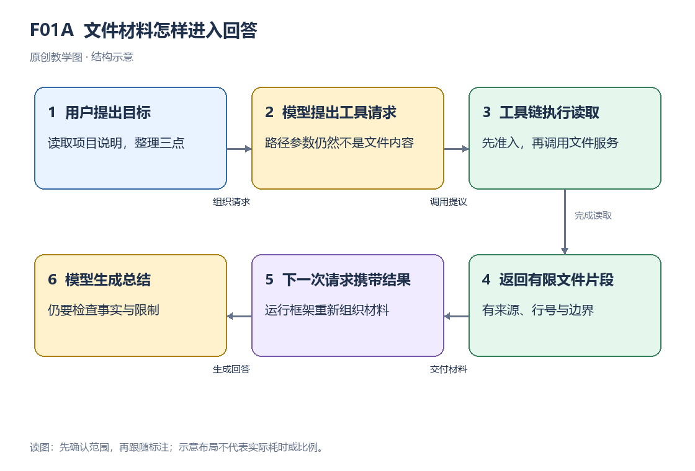

图 01A 按箭头展示成功路径：接纳任务、模型提出 read、文件服务返回窗口、下一次请求使用结果，再生成总结。第一次请求负责提出读取，第二次请求负责利用读到的文本。

1. 用户提交任务，入口把消息放入 Inbox，返回接纳回执。
2. 驱动组装第一次请求。模型提出 Tool Call，指定 read 和参数 `{ file_path: "README.md" }`。花括号里的“名称—值”组合称为对象，这里保存本次读取的路径。
3. ToolRuntime 完成准入，执行包装函数检查参数，再由文件服务读取目标。
4. 工具结果记录到 Session；驱动组装第二次请求，把已获取的文件窗口交给模型。
5. 模型根据这些文字生成总结，驱动记录轮次结束，界面显示结果。

### 接纳与后台执行的分工

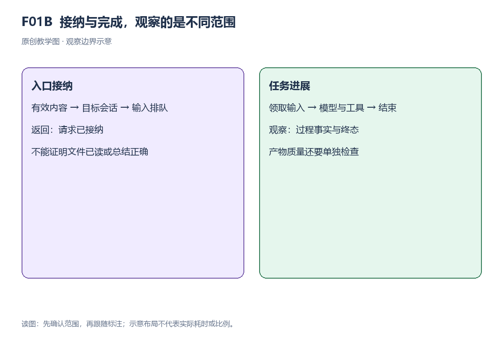

图 01B 左侧是入口接纳，右侧是后台任务。左侧结束于输入排队，右侧继续经历模型请求、工具执行和轮次结束；文件不存在、模型限流等错误出现在后续运行中。

`accepted: true` 是入口接纳本次输入的回执。文件读取和模型生成随后各自产生结果。读取 README.md 时若文件不存在，工具服务构造带错误信息的 `ToolResult`，驱动把它加入历史。下一次模型请求便能根据这个错误说明资料不足，或调整读取目标。

排查错误时，沿处理顺序检查：先查入口是否接纳，再查驱动是否启动，再查模型是否返回合规 Tool Call，最后查工具执行状态与终态事件。

## 01.4 源码研读

<a id="e01a"></a>

### E01A · 接纳时的身份与来源

阅读任务：节选位于 prompt 的输入校验之后。请求已包含 Session 标识和请求标识，代码据此定位 Agent、识别重复输入并构造消息来源对象。后续流程继续处理附件、消息排队和接纳回执。

代码类型：**真实源码摘录**。证据编号 [E01A](evidence-index.md#e01a)；下表的数字是原文件行号。

```ts
    const agent = await this.resolveAgent(request.sessionId)
    if (hasPromptRequest(agent, request.requestId)) return { accepted: true }
    const source: MessageSource = {
      kind: 'user',
      rpcId: request.requestId,
      ...(clientTimeZone === undefined ? {} : { clientTimeZone }),
    }
```

| 原文件行号 | 写法 | 在这段流程中的作用 |
| --- | --- | --- |
| 329 | const 保存一次结果，await 等待 resolveAgent | 按请求的 Session 标识获取本次接收输入的 Agent 对象。 |
| 330 | if 判断条件，return 提前结束方法 | 已识别的 requestId 不再排入一次，返回已有接纳确认。 |
| 331 | 冒号声明类型，花括号开始对象 | source 将保存本次用户消息的来源字段。 |
| 332 | 字符串属性 kind | 将来源类别记为 user，区别于其他消息来源。 |
| 333 | 点号读取属性，属性赋值 | 把入口的请求标识记成 rpcId，供后续关联使用。 |
| 334 | 三点号展开对象，三元表达式选择分支 | 未提供时区不增加字段；提供时加入规范化的时区值。 |
| 335 | 结束对象字面量 | source 建立完成，后续创建用户消息时使用它。 |


执行推演：已识别的请求标识直接得到接纳回执；新标识则继续建立用户消息的来源信息，随后进入附件处理、排队和回执返回。

<a id="e01b"></a>

### E01B · 工具调用的关联记录

阅读任务：appendToolCall 是 executeToolCalls 使用的记录辅助函数。输入包含 Session、turn、step 和工具调用块；函数把调用信息追加到 Session 内存日志，并返回用于关联结果的事件序号。

代码类型：**真实源码摘录**。证据编号 [E01B](evidence-index.md#e01b)；下表的数字是原文件行号。

```ts
function appendToolCall(session: Session, turn: number, step: number, block: ToolCallBlock): SessionSeq {
  const event = session.append('tool/call', { turn, step, callId: block.id, name: block.name, arguments: block.arguments })
  return event.seq
}
```

| 原文件行号 | 写法 | 在这段流程中的作用 |
| --- | --- | --- |
| 263 | function 定义函数，冒号给参数与返回值标注类型 | 调用者交入本次工具调用所属的 Session 和推进位置。 |
| 264 | const 接收方法返回的事件，对象简写使用同名参数 | 把调用身份、名称、参数和所属 turn/step 追加到 Session 记录。 |
| 265 | return 读取事件的 seq | 返回刚创建的序号，供结果与调用关联。 |
| 266 | 右花括号结束函数 | 记录辅助函数到此结束，真实工具动作在调用者的后续路径中。 |


执行推演：当前日志有 9 项时，新调用得到序号 9。函数返回该序号，供后续结果关联；调用者接着推进工具执行，存储写入由 Session 的监听器另行处理。

## 01.5 理解检查与讲解问答

### 问题 1 · accepted 回执确认了哪个处理阶段？

讲解：accepted 回执确认入口已接纳输入。文件结果要在驱动领取输入、模型提出调用、工具准入和实际读取之后产生。

### 问题 2 · 如何核对总结与实际读取内容的对应关系？

讲解：先找到 read 的调用记录和成功结果，确认返回的行范围覆盖总结所用的材料，再逐项对照总结与原文。这样才能把总结中的结论追到实际读取结果。

### 问题 3 · 两次模型请求的上下文有什么差异？

讲解：成功路径中的第二次请求新增了工具读取结果。它依据前一步执行所得的文本生成总结，因此两次请求在数据上存在依赖。

[全书目录](tutorial.md) · [本章与原始证据](evidence-index.md) · [术语索引](glossary.md)

<a id="chapter-02"></a>

# 第 2 章｜TypeScript 基础与异步执行

本章学习任务：掌握值、对象、函数与类型的常见写法，理解 Promise、await 和回调的执行时机。

## 02.1 基本概念

变量是与值绑定的名称，例如 `path` 保存路径字符串。字符串表示文本，数字可以表示行号，布尔值表示真或假。对象组织相关属性，例如读取请求包含路径、起始行和行数，`request.content` 访问请求的内容属性。数组按索引保存一组值。数组索引通常从 0 开始，文件行号通常从 1 开始，窗口计算需要区分这两种编号方式。

函数封装可复用的处理逻辑，通过参数接收输入，通过返回值提供结果。方法是对象上的函数，例如 `agent.followup(message)` 调用 Agent 的消息接纳方法。类定义对象的结构和操作，由类创建的对象称为实例。接口和类型描述数据结构，例如将路径声明为字符串；文件是否存在则由执行时的文件服务检查。

TypeScript 在 JavaScript 的写法上增加类型说明。`const` 固定变量绑定，`let` 允许重新赋值；对象内部仍可能变化。冒号后面通常是类型，问号表示可缺省，`return` 把值返回调用者，`throw` 使当前路径失败。花括号既可能围住对象，也可能围住一组语句，要看它的位置。模块是单独组织代码的文件；`import` 引入别的模块，`export` 让别处能够使用本模块的名称。

Promise 表示异步操作的结果，状态包括等待中、成功和失败。`async` 函数返回 Promise，`await` 暂停当前函数的后续执行，等待该结果；JavaScript 运行时在此期间可以处理其他就绪工作。进程由操作系统管理，线程是进程内的执行路径。并发允许多项工作交错推进，并行使用多个执行资源在同一时刻处理工作。操作能否重叠，取决于启动和等待顺序。回调是供其他代码在约定时机调用的函数，例如事件监听器。阅读 `() => ...` 时，需要定位它的注册位置、调用者和触发条件。

JavaScript 提供执行语义，TypeScript 在其基础上增加静态类型检查，用于发现数据结构和调用方式中的问题。输入合法性、文件权限与资源可用性由运行时代码检查。等待外部 I/O 时，事件循环继续处理就绪任务，结果到达后恢复相应的异步函数。

### 常见语法与项目中的用途

阅读源码时，可以用下表查询常见写法；每段节选还配有逐行解释。

| 写法 | 语言含义 | 本项目里的阅读用处 |
| --- | --- | --- |
| const / let | 固定绑定／可重新赋值的绑定 | 保存结果或推进游标；固定绑定不冻结对象内部 |
| undefined / null | 未提供的值／显式表示无值 | 区分缺省配置与实际结果 |
| this / new | 当前对象／创建实例 | 访问所属服务，或建立错误与传输对象 |
| :、?、void | 类型说明、可缺省、不使用返回值的类型约定 | 阅读参数形状、可选字段与函数签名 |
| Promise 与 await | 异步结果与等待该结果 | 确认等待结束对应接纳、读取还是其他阶段 |
| if / else / switch | 按条件或类别选择路径 | 分清允许、拒绝和不同后端 |
| === / !== | 严格相等／不等比较 | 比较模式、序号或行动类别 |
| && / \|\| | 短路求值：&& 遇到假值停止，\|\| 遇到真值停止，返回停下时的操作数 | 阅读复合条件与取值表达式，确认右侧是否执行 |
| ?. / ?? | 对缺省对象安全访问／缺省时采用另值 | 读取可选 Agent、选择配置默认值 |
| () => ... | 将函数写成可传递的值 | 定位回调的调用者与触发时机，区分定义和执行 |
| {...对象} | 将已有对象属性放入新对象 | 保留已有决定，再替换 messages |
| {a,b}=对象 | 解构取出指定属性 | 将目标和文件信息分开命名 |
| [...数组] / ...数组 | 复制数组成员／展开成员 | 返回新视图或组合领取结果 |
| for...of | 逐项取出数组等集合的成员 | 对领取消息逐项发通知 |
| map / filter / some | 转换每项／保留符合条件项／检查是否有符合项 | 构造卡片行、提取工具提议、检测重复材料 |
| slice / toSpliced | 取子区间／返回修改后的新数组 | 截取历史前缀或插入指令；摘要需要单独生成 |
| try / catch / finally | 尝试路径／处理失败／离开时收尾 | 跟踪错误怎样返回和资源怎样释放 |
| return / throw / continue | 返回结果／抛出错误／进入下一次循环 | 跟踪返回值、异常传播与重试位置 |
| yield | 给流消费者一项结果并可继续 | 阅读跟随事件或逐步效果 |
| 泛型 <T>、unknown、as | T 为具体类型留位置，例如同一容器可保存文字或事件；unknown 要求先确认值的种类；as 向类型检查器声明自己的判断 | 用类型组织事件；as 不会替程序验证真实输入 |
| readonly / private | TypeScript 的只读约束／类成员访问约束，主要用于类型检查 | 阅读代码中的写入与访问约定；运行时私有字段使用 # 名称 |
| using | 作用域结束时调用资源释放协议 | 读取附件绑定等有资源生命周期的代码 |

右括号结束的结构由对应左括号决定，可能是对象、函数、条件或调用。逐行说明标出这些结构；结合参数传递、函数调用和返回值，可以还原代码的执行流程。

## 02.2 沿一个任务看完整流程

`await prompt(...)` 等待提交回执。prompt 校验内容，将消息提交给 Agent，再返回接纳结果。调用方收到回执后继续执行，Agent 驱动在后台推进任务，生成结果通过持续观察通道传回客户端。

假设输入是空白文字且没有附件，内容判断为假，方法抛出错误，调用者的等待以失败结束；假设输入有效，方法继续到后面的接纳逻辑。这里的 Promise 返回 SessionPromptValue，也就是接纳回执。

注册工具时，程序把名称、参数说明和执行函数交给注册表。执行函数此时作为一个值保存，具体调用到来时才运行。箭头函数、对象方法和事件回调都要区分定义与调用。要让两个异步操作重叠，可以先分别启动，再用 `Promise.all` 汇总结果。全部成功时，它按传入顺序返回结果数组；任一项失败时，汇总的 Promise 就失败，其他已启动操作仍按各自流程收尾。

## 02.3 关键机制与设计取舍

### 回执返回后，驱动继续工作

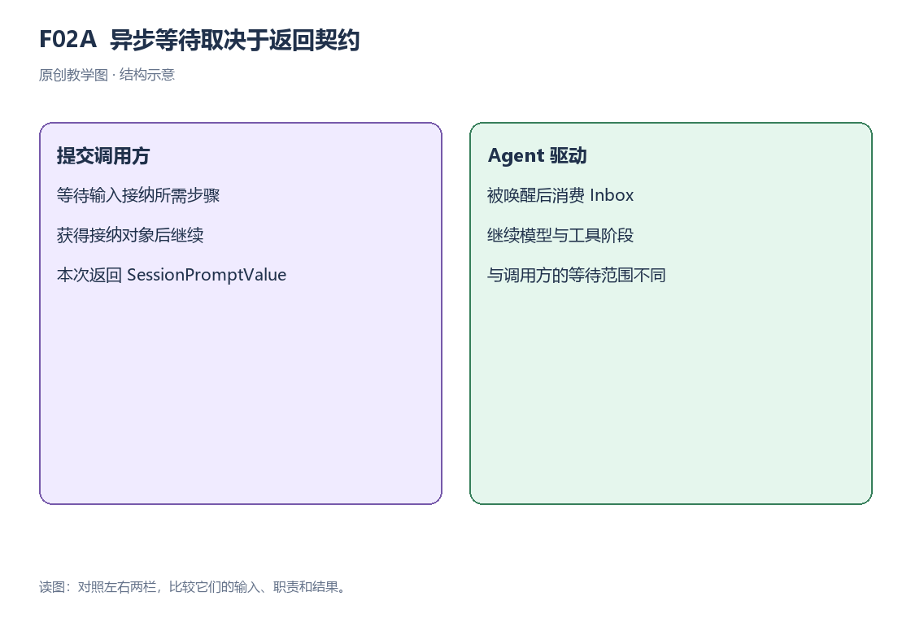

图 02A 并排展示两个等待范围。调用方等待 prompt 返回接纳对象；Agent 驱动在被唤醒后继续领取输入、调用模型和执行工具。

### 分析示例：注册次数与执行次数

假设启动时运行三次“注册工具”的函数，随后模型只调用了一次文件读取工具。注册次数是 3，执行次数是 1。注册次数统计能力定义，执行次数统计实际调用。

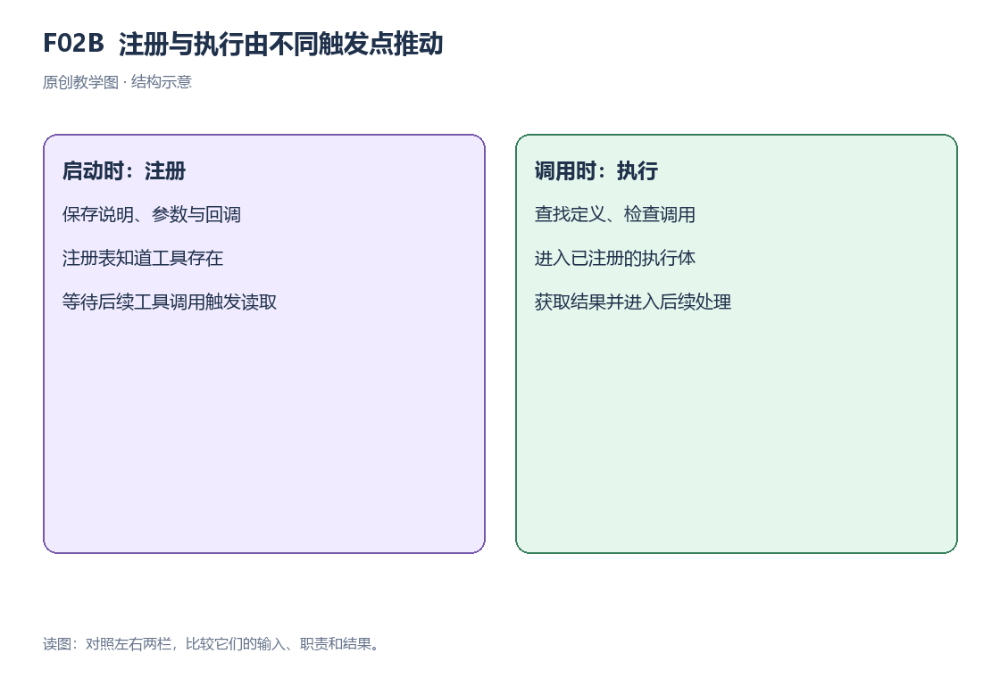

图 02B 左侧保存工具定义，右侧使用定义执行调用。名称、参数和回调在启动时注册，read 的执行函数在具体调用到来时运行。

文件读取插件通过 `applyReadTool` 注册 `defineTool(...)` 定义，其中的 `async execute(...)` 以函数值的形式保存在注册表中。模型发出具体调用后，工具运行时才调用该函数并执行文件读取。注册位置和调用位置共同决定工具的执行时机。

### 接纳入口的异步执行顺序

`prompt` 首先校验请求并解析目标。已识别的 requestId 直接返回回执；新请求构造用户消息，调用 `followup` 或 `steer`，随后返回接纳结果。`followup` 将消息加入 Inbox 并请求唤醒驱动，模型请求与工具执行由驱动继续调度。

调试“提交成功但没有回答”时，沿 Inbox、驱动状态、模型请求和工具结果继续查。await prompt 已经结束，后台驱动仍在运行。

### 容易混淆的地方

“async 使函数内部所有动作并行”：连续写两个 await 时，第二个操作要等第一个返回后才开始。先启动两个操作、再汇总它们的 Promise，才给它们提供重叠推进的机会。

“类型合法就不会失败”：类型不能证明文件存在、网络可达或权限获准；运行时检查依然必要。

工具定义中的 execute 属性保存执行函数。注册完成后，具体调用仍需经过工具运行时，才能进入函数体。

## 02.4 源码研读

<a id="e02a"></a>

### E02A · async 返回的结果由方法契约决定

阅读任务：节选是 prompt 方法开头的输入校验。request 是入口接收的请求对象，内容不合法时方法抛出错误。时区、附件、消息入队与 accepted 返回位于后续逻辑，其主流程见第 1 章。

代码类型：**真实源码摘录**。证据编号 [E02A](evidence-index.md#e02a)；下表的数字是原文件行号。

```ts
  async prompt(request: SessionPromptRequest): Promise<SessionPromptValue> {
    if (!hasPromptContent(request.content)) {
      throw new RemoteError(
        'gateway/bad-request',
        'prompt content must include non-whitespace text or an attachment',
        {},
      )
    }
```

| 原文件行号 | 写法 | 在这段流程中的作用 |
| --- | --- | --- |
| 311 | async 标记异步方法，Promise 标注结果类型 | prompt 的返回契约是 SessionPromptValue，调用方由此获得接纳回执。 |
| 312 | if 与感叹号分别表示判断和取反 | 内容不符合要求时进入拒绝分支。 |
| 313 | throw 抛出一个 new 创建的错误对象 | 中断当前接纳路径，将失败返回调用方。 |
| 314 | 第一个字符串实参 | 指定远程错误类别 gateway/bad-request。 |
| 315 | 第二个字符串实参 | 说明至少需要非空白文字或一个附件。 |
| 316 | 空对象实参 | 本错误不附加更多结构化细节。 |
| 317 | 右圆括号结束构造调用 | RemoteError 的参数已传完，throw 生效。 |
| 318 | 右花括号结束 if 分支 | 有效请求不执行本分支，方法其余逻辑继续。 |


执行推演：请求只有空白文字且无附件时，条件成立，构造并抛出 RemoteError，调用方等待失败。有效内容跳过这段拒绝，继续后面的接纳处理。

## 02.5 理解检查与讲解问答

### 问题 1 · await 一个方法，是否等于等待整个用户任务完成？

讲解：由方法返回契约决定。等待接纳方法只获取回执；等待读取方法才获取读取结果。

### 问题 2 · 注册对象里写了 execute 函数，为什么没有立即读文件？

讲解：注册只是保存函数值与说明。后来发生具体工具调用时，框架才调用执行函数。

### 问题 3 · 类型说路径是字符串，是否证明文件存在？

讲解：类型检查确认参数符合字符串类型；文件是否存在、权限是否允许以及读取是否成功，由运行时代码分别验证。

[全书目录](tutorial.md) · [本章与原始证据](evidence-index.md) · [术语索引](glossary.md)

<a id="chapter-03"></a>

# 第 3 章｜Agent 循环、Inbox 与工具调度

本章学习任务：追踪输入从 Inbox 进入 turn、step 和 attempt 的过程，解释并发执行与有序提交。

## 03.1 基本概念

轮次（turn）是驱动围绕一批输入推进的过程，步骤（step）是其中的执行单元，尝试（attempt）对应步骤内的一次模型请求。读取 README 和根据读取结果生成总结，可以构成同一轮次的两个步骤。请求失败后若恢复策略允许重试，新的请求仍属于原步骤，attempt 增加，turn 和 step 保持不变。

状态描述系统在某个时刻保存的信息，例如待处理消息、轮次编号和驱动阶段。状态转换规定事件发生后这些信息如何更新，驱动负责调度转换。取消信号向执行代码传递停止请求；支持取消的路径检查信号、停止后续工作，并处理已启动操作的收尾。

Inbox 分别保存 `next-turn` 和 `next-step` 输入。`followup` 放入前者，`steer` 放入后者。进入下一步骤时，驱动领取全部 next-step 输入；开启下一轮时，再把一项 next-turn 输入接到这批材料后面。因此，较晚到来的引导可以先被领取，较早排队的另一项普通任务仍在等待。领取以后还要经过前置判断，允许进入本步才发起模型请求。

输入接纳、消息领取、模型请求、工具执行和轮次结束分别对应不同的处理阶段。判断任务进展时，需要把各阶段的事件与结果关联到同一轮次。

## 03.2 沿一个任务看完整流程

设 A 是普通任务，B 是本轮中的补充要求，C 是另一条普通任务。A 已进入当前轮次；C 排在下一轮次；B 通过引导入口进入下一步。

| 边界 | next-step 待处理 | next-turn 待处理 | 领取结果 |
| --- | --- | --- | --- |
| 本轮请求执行中 | B | C | 不改已经发出的请求 |
| 本轮下一步骤 | B | C | 领取 B，C 继续等待 |
| 下一轮开始 | 空 | C | 领取下一轮的一项普通输入 |

驱动先记录轮次开始，再为下一步骤作前置判断。前置拒绝时，轮次可以以 blocked 结束而没有模型步骤；允许时才准备请求。成功请求没有工具调用则可完成；有工具调用则执行并记录结果，按结论继续下一步或结束。失败尝试是否继续由恢复策略决定：只有恢复链（第 9 章展开的错误恢复流程）给出 retry（重试）时，才在同一步骤里再次尝试；否则以失败结束。例如一个任务包含两步，第一步重试一次：共有一个 turn、两个 step、三次模型请求，也就是三次 attempt。

## 03.3 关键机制与设计取舍

### 三层边界


图 03A 外框是一轮任务，内框是两个步骤。第一步有失败和重试两次尝试，第二步有一次成功尝试，因此这条轨迹包含一个 turn、两个 step、三个 attempt。

turn、step 和 attempt 分别统计任务推进的三个层次。前置拒绝时，一轮没有进入模型步骤；读取后总结可以用两个步骤；某一步请求失败后又可以重试。驱动在成功消息提交后提取工具调用；失败尝试的 partial 是尚未成功完成的输出，先进入失败记录与恢复流程。

### Inbox 怎样与驱动合作

Inbox 保存尚未领取的输入。`followup` 排入下一轮并请求唤醒；`steer` 排入下一步并请求唤醒；`inject` 也排入下一步，由后续驱动活动领取。选择哪种入口，决定输入何时进入处理以及是否启动驱动。

空闲时，需要唤醒的输入让驱动启动。已有活跃驱动时，新输入由现有驱动在约定边界领取。维护期间，唤醒请求先记在 `wakeRequested` 中，由维护任务收尾时检查是否启动驱动。这里把正在进行的一次运行称为活动。若活动已收到取消信号，`send` 会把需要唤醒的输入改排到 `next-turn`，等待原活动收尾后再处理。

普通运行路径中，驱动开放轮次，准备下一步，领取消息并组装材料。前置决定可能允许进入或拒绝。进入后发起模型请求，成功消息有工具调用则进入工具批次；工具结果回到 Session 历史。驱动再看停止原因与下一步输入，决定继续或结束。

### 工具执行能重叠，结果仍按模型顺序提交

把贯穿案例稍作教学扩展：模型在同一消息里先提出读取 README 的调用 A，再提出读取包信息的调用 B。要同时说明三个顺序：提议的排列、真实动作的完成先后，以及结果进入 Session 的顺序。三个顺序不必相同。[S02](evidence-index.md#s02) 对照本节执行器。

执行器按模型给出的顺序建立调用计划，保存调用标识、工具名、已解析参数、Agent 和取消信号。允许并发的调用进入有数量上限的执行池；需要独占的调用设置执行屏障，等待池内任务结束后运行。执行池管理正在执行的调用，屏障约束不同批次的启动顺序。

启动每一项时，先记下 tool/call 及其序号，再等待这一项的前置准备。准备可能已经形成拒绝结果，也可能允许分派真实执行；前置准备按顺序推进，实际分派与工具体才可能重叠。拒绝结果同样要在相应位置进入结果链，作为确定的结果记录留存。

假设 A、B 均允许并发且执行池容量足够，B 先完成。执行器将 B 的结果暂存于索引 1 的结果槽，提交游标仍停在 A 对应的索引 0。A 完成后，执行器按 A、B 的顺序运行结果后处理、追加 Session 结果，并把额外上下文传入下一步骤。结果槽按调用位置暂存完成结果，提交游标保证历史顺序与模型提议顺序一致。

| 时点 | A 的结果槽 | B 的结果槽 | 已提交到 Session 的工具结果 |
| --- | --- | --- | --- |
| 两项已开始 | 尚空 | 尚空 | 无 |
| B 先结束 | 尚空 | 已有结果 | 无，仍等待位置 0 |
| A 随后结束 | 已有结果 | 已有结果 | 按 A、B 顺序处理并追加 |
| 下一步准备 | 已按约定交接 | 已按约定交接 | 模型可使用有确定关联的结果 |

这里的提交把结果追加到 Session；第 5 章继续解释这些事件怎样写入存储。执行器还会在提交之后重新检查尚未启动项的执行模式；某个工具改变注册状态后，后续调用按更新后的执行模式调度。工具的轮次结束提示会汇总给外层驱动，由驱动决定是否继续下一步。

取消与调度失败又是不同分支。取消会停止启动新动作，让已开始的执行收尾并按顺序交接；未开始的模型调用会得到表示跳过的合成结果。合成结果是框架生成的说明，没有对应真实工具动作。调度失败时，执行器等待已分派动作收尾，再把错误返回当前步骤。

按顺序提交让历史与模型提议容易对应，允许执行重叠则可以利用独立工作的等待时间。执行器为此维护并发池、结果槽和提交位置。B 虽然先完成，仍要等待 A 提交；下一步模型按原提议顺序读取结果。

### 队列与状态机的最小基础

队列保存“还有哪些输入等待处理”，状态机记录“当前运行在哪个阶段”。新消息入队后，正在执行的请求继续使用原材料；驱动到下一领取时点，才把待处理输入加入后续请求。

事件通知让关注这些变化的观察者（例如界面或记录组件）知道队列或状态变了。DSH（DeepSeek Harness 的缩写）Inbox 变更先更新可观察状态，再通知监听者，因此监听者可以在通知里查询新状态。

`ReactLoopAgent` 是核心运行驱动。它管理 Inbox、turn、step、模型请求和取消；网页端的 React 组件负责显示这些运行状态。

### 分析示例：数一次有重试的读取任务

教学轨迹如下：开放一轮；第一步第一次模型尝试失败，第二次尝试成功并提出 read；工具返回文件片段；第二步模型成功生成总结；轮次结束。本例共有 1 个 turn、2 个 step、3 次模型 attempt、1 次工具调用。

复算记录：[C3 · 轮次与步骤计数](examples/calculation-results.json)。

第一步的重试位于同一个尝试循环中，保留原 step，且不重复进入前置步骤或登记用户消息。因此 3 次 attempt 只对应 2 个 step。工具结果驱动的第二次模型步骤仍服务于本次用户输入，turn 数为 1。

按 turn、step、attempt 分别计数，可以看出额外请求来自任务推进还是失败重试。

### 运行中插入新要求


图 03B 的三栏分别对应 followup、steer 和 inject。followup 进入 next-turn 并唤醒，steer 进入 next-step 并唤醒，inject 进入 next-step，由后续驱动活动领取。

回到案例，读取结果后驱动进入下一次材料准备，如果约定时点领取了新约束，这次总结请求可以包含新约束。前置拒绝使轮次以 blocked 结束。取消则使正在运行的路径收尾，剩余输入由 Inbox 和下一次唤醒继续管理。

### 常见误解

“下一步输入会立刻打断当前模型流”：next-step 指定下一次领取的位置。当前请求继续执行；取消则通过独立信号要求它停止。

工具结果按调用顺序记录。工具执行体可以并发运行，前置准备、结果后处理和最终提交分别遵循执行器的顺序约束。

“出现 turn/start 就花费一次模型请求”：前置拒绝或初始空输入可能没有进入步骤。

## 03.4 源码研读

<a id="e03a"></a>

### E03A · 领取时组合两类待处理输入

阅读任务：本段是 Inbox.claim 完整方法。target 指当前是否是新轮次边界，turn 指领取所属轮次。mutate 在这里移除对应列表项并返回被取出的消息；重点是两类列表的领取差异。

代码类型：**真实源码摘录**。证据编号 [E03A](evidence-index.md#e03a)；下表的数字是原文件行号。

```ts
  claim(target: InboxTarget, turn: number): UserMessage[] {
    const claimed = this.mutate('next-step', 0, this.nextStep.length, [], false)
    if (target === 'next-turn') claimed.push(...this.mutate('next-turn', 0, 1, [], false))
    for (const message of claimed) this.dispatch.emit('agent/inbox/claimed', { message, turn })
    return claimed
  }
```

| 原文件行号 | 写法 | 在这段流程中的作用 |
| --- | --- | --- |
| 109 | 方法接收边界和轮次，并返回消息数组 | 调用者是准备下一步骤的驱动。 |
| 110 | const 保存 mutate 返回值，length 表示列表项数 | 先取走当前全部 next-step 输入，保存为 claimed。 |
| 111 | if 比较 target，push 与展开追加数组成员 | 新轮次边界才再取一项 next-turn 输入，拼到领取批次后。 |
| 112 | for...of 遍历领取结果，emit 发出事件 | 发布每条消息所属轮次的领取通知，供界面等观察者更新状态。 |
| 113 | return 返回数组 | 前置处理可使用这批消息形成本步材料。 |
| 114 | 右花括号结束方法 | 领取动作完成，模型请求仍属于后续步骤。 |


执行推演：next-step 中有 B，next-turn 中有 C。target 为 next-step 时返回 B、保留 C；target 为 next-turn 时先取全部步骤输入，再取一项轮次输入。每项领取还发出对应通知。

## 03.5 理解检查与讲解问答

### 问题 1 · C 先以 followup 排入，B 后以 steer 排入，谁先用于本轮下一步？

讲解：B 在下一步领取，C 留给下一轮。Inbox 先按输入的目标边界分组，再在相应边界领取，所以后到的 B 可以先于 C 进入请求。

### 问题 2 · 一轮两步，第一步重试一次，一共有几次尝试？

讲解：三次。第一步两次，第二步一次；轮次数仍是一次。

### 问题 3 · inject 与 steer 的关键差别是什么？

讲解：两者都进入 next-step；inject 不触发唤醒，steer 触发。驱动空闲时，inject 的输入会留在队列中，等待后续唤醒。

### 问题 4 · 模型先提出 A、再提出 B，但 B 先完成，为什么 Session 可以先没有 B 的结果？

讲解：执行器先把 B 存入位置 1 的临时结果槽，提交位置仍等待 A 所在的位置 0。A 完成后才依次处理、提交 A 和 B。真实执行先后与历史提交顺序不同；若下一次模型请求读取历史，也应以实际已提交的结果为依据。

[全书目录](tutorial.md) · [本章与原始证据](evidence-index.md) · [术语索引](glossary.md)

<a id="chapter-04"></a>

# 第 4 章｜文件读取：参数解析与窗口构造

本章学习任务：理解 read 的参数校验、文件访问和窗口构造，分析缺失文件与输出截断的处理。

## 04.1 基本概念

文件路径标识读取目标，当前工作目录是相对路径的解析基准。Session 与所选文件 Provider 共同确定 `README.md` 对应的实际位置。后端实现统一文件接口：接口规定读取操作及返回形式，具体后端负责本机、远端等环境中的路径解析和文件访问。

工具参数契约规定可接受的字段、类型和值。schema 描述字段结构，例如字符串路径和数字行号；解析逻辑进一步检查取值、补齐缺省参数，并转换成执行体使用的内部输入。读取窗口保存本次选定的文本行，同时返回总行数与截断信息，供模型判断是否需要续读。

流式文件读取按批次向窗口构造器提供文本，避免在内存中保存整个大文件。模型流式响应则按批次返回生成内容，两者分别作用于文件输入和模型输出。读取结果受行数、单行长度和输出字节上限约束，并明确标示实际保留范围。第 18 章进一步说明结构化结果如何生成模型文本与界面元数据。

字节是存储和传输数据的计量单位。UTF-8 把文字编码成字节序列，一个汉字通常占多个字节。模型的 tokenizer 又把文字编码成 token。文件字节数、文本行数和模型 token 数采用不同计量规则，工具输出上限与模型容量分别控制。

读取前要经过通用工具准入；获准后依次解释参数、选择读取方式并构造窗口。拒绝调用与读取时发现文件不存在，是两个独立阶段的结果。

## 04.2 沿一个任务看完整流程

假设 README 有五行，工具参数是路径 README.md、offset 为 2、limit 为 2。调用先经过 ToolRuntime 准入；获准后，defineTool 包装函数检查参数的 schema，read 执行体再检查路径不为空、行号与行数为正整数。合法输入变成内部的 filePath、offset 和 limit。文件服务解析目标、获取文件信息，然后依大小信息选择一次读取或流式读取；窗口构造器保留第二、三行，并受其他输出上限限制。

如果不提供 offset，使用第 1 行；不提供 limit，采用本次配置的默认上限。提供 0、负数或超过允许上限的 limit，会走参数错误分支。文件大小未知时采用流式路径，是为了避免无法判断大小的后端先缓存任意大文件。

结果返回后，ToolRuntime 校验并渲染输出，驱动再记录工具结果。下一次请求得到的是这次读取的窗口，窗口中的行号和总行数帮助模型决定是否续读。

## 04.3 关键机制与设计取舍

### 一次读取的材料变化

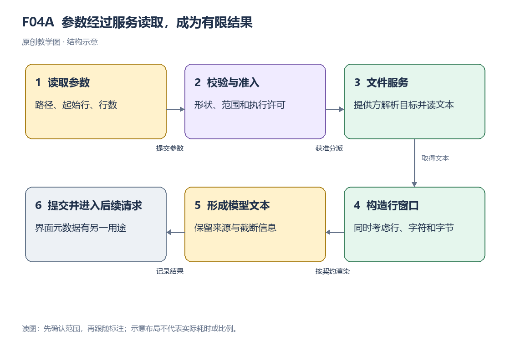

图 04A 从路径和行范围走到文件服务，再构造行窗口、渲染模型文本并记录结果。通用准入先决定是否分派，工具执行阶段再完成参数校验和实际读取。

`read` 接收 `file_path`、可选 `offset` 和 `limit`，起始行从 1 开始。参数 schema 描述字段名称、类型和必填要求；`parseReadArgs` 检查路径非空、行号和行数为正整数，并应用配置上限与默认值。

### 启动注册与调用执行

启动时，文件工具插件获取所需服务，调用 `applyReadTool` 注册工具定义，并贡献对应使用指导。定义里同时有说明、参数、执行体和输出呈现契约。此时没有读用户指定的文件。

实际调用先经过通用工具准入，由安全策略判断是否放行，详细规则见第 11 章。获准后，包装函数检查 schema，`read` 执行体解析参数，再通过 `resolveRegularReadTarget` 获取目标和文件信息。文件较小时整读，大小未知或达到阈值时流读。`buildWindow` 按行范围、单行长度和字节上限保留文本，同时继续扫描剩余输入，统计准确的总行数。结果因此可以同时告诉模型“本次返回哪几行”和“整份文件有多少行”。

`ctx.fs` 由当前 profile 选中的文件 Provider 实现。本机 Provider 访问本机路径，SSH Provider 访问远端路径；read 通过同一接口调用它们。读取结果随后分成模型文本和界面展示元数据，第 18 章会把这两条输出路径连起来。

### 行、字符和字节

行数、单行长度和输出字节数共同控制返回体积。长行先截到规定长度，再按 UTF-8 字节数检查能否加入窗口。模型随后对这份文字作 token 编码，所以读取 100 行时，token 数还要根据具体内容计量。

参数错误在读取前返回。路径不存在或目标不是普通文件时，目标解析报错，再由通用结果链形成工具错误。达到字节上限时，窗口停止保存后续行，继续统计总行数，并在成功结果中标明截断。

### 分析示例：读到哪些行

教学文件有 120 行，请求从第 41 行读取 30 行，且本例假设字节与单行长度限制没有提前截断。最后一行是 41＋30−1＝70，所以返回 41—70 行，后面仍有 50 行。

复算记录：[C4 · 行窗口计算](examples/calculation-results.json)。

若重要约束在第 100 行，就要继续读取后面的窗口。若字节上限让结果提前停在第 60 行，实际覆盖范围是 41—60 行；续读应从第 61 行开始。每次都以返回结果中的范围为准。

有限窗口降低材料体积并让来源更容易定位，代价是需要正确续读和识别遗漏。整体读取先获取完整文本，流式读取分批交给窗口构造器；两条路径都应用同一组输出上限。

### 重走 README 任务

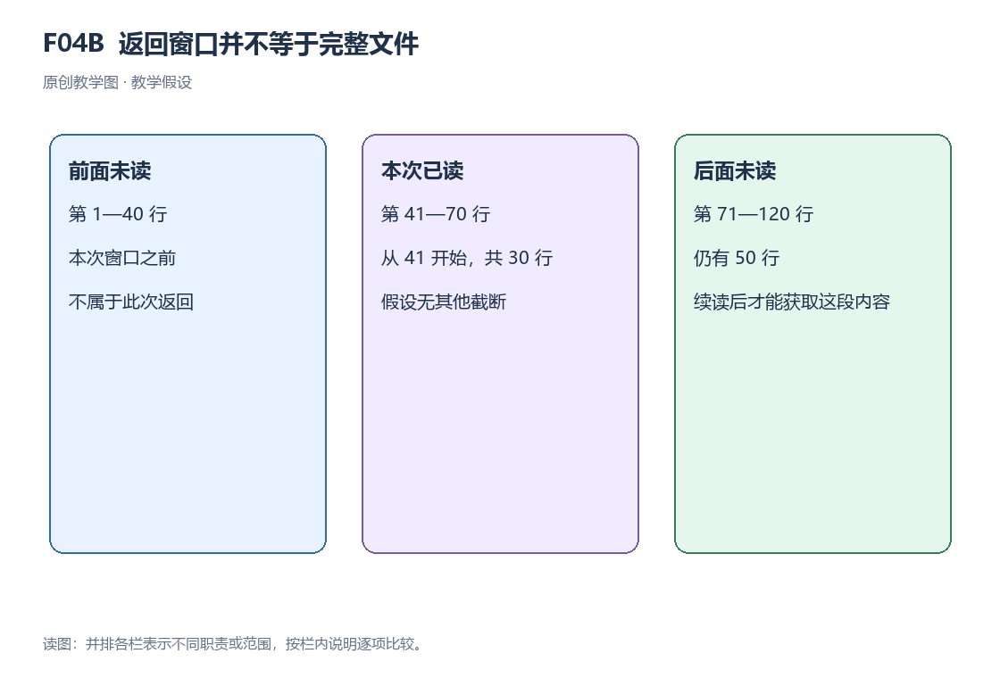

图 04B 把 120 行文件分成三段：第 1—40 行在窗口前，本次返回第 41—70 行，第 71—120 行留待续读。正文中的行范围说明本次结果覆盖哪里。

### 常见误解

“read 成功等于全文进入上下文”：检查行窗口、截断和实际结果。成功与完整性是不同属性。

“模型能直接执行参数里的任意路径”：先有工具准入，再有文件服务的解析与执行边界，不能略过这些层。

“行数限制就是 token 预算”：单位不同，材料统计与模型 token 计量需要分别进行。

## 04.4 源码研读

<a id="e04a"></a>

### E04A · 参数默认值与错误分支

阅读任务：这是 parseReadArgs 完整函数。调用者把模型提交的外部参数和配置上限交进来；本次观察缺省值与不合法值怎样区别处理。

代码类型：**真实源码摘录**。证据编号 [E04A](evidence-index.md#e04a)；下表的数字是原文件行号。

```ts
export function parseReadArgs(args: { file_path: string; offset?: number; limit?: number }, maxLimit: number): ReadInput {
  if (args.file_path.trim().length === 0) throw new Error('file_path must be a non-empty string')
  const offset = args.offset === undefined ? 1 : parsePositiveInteger(args.offset, 'offset')
  const limit = args.limit === undefined ? maxLimit : parsePositiveInteger(args.limit, 'limit')
  if (limit > maxLimit) throw new Error(`limit must be less than or equal to ${maxLimit}`)
  return { filePath: args.file_path, offset, limit }
}
```

| 原文件行号 | 写法 | 在这段流程中的作用 |
| --- | --- | --- |
| 55 | export 让别的模块可用，function 定义操作，问号表示可缺省 | 接收外部路径与可选窗口参数，返回内部 ReadInput。 |
| 56 | trim 去首尾空白，if 与 throw 建立错误分支 | 空白路径不能进入文件解析和读取。 |
| 57 | 三元表达式根据 undefined 选值 | 未提供 offset 用 1，提供了则检查正整数。 |
| 58 | 同样的三元选择 | 未提供 limit 用当前上限，明确提供的值必须合法。 |
| 59 | 大于号比较，模板字符串插入上限 | limit 超过配置的窗口行数上限时，抛出参数错误。 |
| 60 | 对象返回，显式改写属性名 | 外部 file_path 对应内部 filePath，其余采用解析后的值。 |
| 61 | 结束函数 | 返回规范化输入，供执行体继续解析目标并读取。 |


执行推演：file_path 为 README.md、offset 缺省、limit 为 2 时，内部输入是 filePath=README.md、offset=1、limit=2；limit=0 由正整数解析拒绝，超过 maxLimit 则走原文件第 59 行。

<a id="e04b"></a>

### E04B · 大小信息决定文本获取方式

阅读任务：位置在 read 的执行体内，参数已经解析。target 保存后端解析的目标，info 保存文件信息，caps 是本次读取限制，exec.signal 是取消信号，ctx 是携带各项服务的 Context 对象。后续 outcome 和结果返回在正文中说明。

代码类型：**真实源码摘录**。证据编号 [E04B](evidence-index.md#e04b)；下表的数字是原文件行号。

```ts
      const { target, info } = await resolveRegularReadTarget(ctx, exec, input.filePath)

      // Stream when the file is large OR size is unknown, so a size-less backend
      // never buffers an arbitrarily large file.
      const chunks = info.size === undefined || info.size >= caps.streamMinSize
        ? await ctx.fs.streamText(target, exec.signal)
        : [await ctx.fs.readText(target, exec.signal)]
      const window = await buildWindow(
        chunks,
        { offset: input.offset, limit: input.limit, maxLineLength: caps.maxLineLength, maxBytes: caps.maxBytes },
        target.displayPath,
      )
```

| 原文件行号 | 写法 | 在这段流程中的作用 |
| --- | --- | --- |
| 141 | await 等待解析，花括号解构返回对象 | 获取符合普通文件读取要求的目标和信息。 |
| 143 | 原注释说明选路条件 | 文件大或者大小未知时采用流式读取。 |
| 144 | 原注释说明未知大小的风险 | 避免先缓存任意大文件。 |
| 145 | const 与逻辑或组成判断 | 按左侧条件选中流式或整读的结果，存入 chunks。 |
| 146 | 问号分支等待 streamText | 获取后端文本流，并传入同一取消信号。 |
| 147 | 冒号分支与数组字面量 | 一次读获取到文本后包装成一个批次供窗口处理。 |
| 148 | await 等待窗口构造函数 | 把获取文字的方式与窗口选择分开。 |
| 149 | 第一个实参 | 把文本批次或流交给窗口构造器。 |
| 150 | 对象实参列出边界 | 传入行范围、单行长度和字节上限。 |
| 151 | 第三个实参 | 传入可显示的路径用于结果表达。 |
| 152 | 结束函数调用 | window 是经过窗口规则处理的结果，尚需构造最终规范值。 |


执行推演：大小小于流式阈值时获取完整文本作为一个批次；大小未知或达到阈值时获取文本流。两种输入都交给 buildWindow，再按起始行和限制构造结果。

## 04.5 理解检查与讲解问答

### 问题 1 · offset=2、limit=2 是否代表文件只有两行？

讲解：offset=2 指定从第 2 行开始，limit=2 指定最多返回 2 行。整个文件的行数由结果中的总行数信息给出。

### 问题 2 · 未提供 limit 与提供 limit=0 一样吗？

讲解：不同。缺省采用配置默认值；0 不满足正整数条件，走参数错误。

### 问题 3 · 未知大小的文件为什么走流式路径？

讲解：避免先缓存一个无法判断大小的完整文件，同时让窗口处理接收有界输出所需的批次。

[全书目录](tutorial.md) · [本章与原始证据](evidence-index.md) · [术语索引](glossary.md)

<a id="chapter-05"></a>

# 第 5 章｜Session 事件日志、投影与持久化

本章学习任务：追踪事件从内存日志进入存储与派生视图的过程，解释 append、flush 和 Session 恢复。

## 05.1 基本概念

Session 事件日志按顺序记录消息、工具调用和运行边界。终端调试输出属于另一条输出通道。序号说明事件在 Session 中的位置；时间记录发生时刻，序号决定事件顺序和连续性。

快照保存某个时刻的数据副本，冻结限制对象及其内部数据被修改。派生根据已有事实生成新的数据形式，例如从消息事件形成模型历史；投影按事件规则持续维护可查询状态，例如最新待办列表。三者分别用于保留数据、构造视图和更新业务状态。

可序列化数据可以按约定转换成存储或传输格式。例如包含字符串和数字的对象可表示为 JSON，含任意函数的运行对象需要另行处理。冻结保护内存对象，持久化负责写入存储。缓存复用已经计算的派生结果，原始记录变化时使相关缓存失效。

持久化将内存数据写入程序退出后仍可保留的存储。JSON 是表示对象、数组等值的文本格式，JSONL 按行保存 JSON 记录。Session.append 更新内存日志并通知订阅者，JSONL Provider 将事件加入写入队列，再由 writer.append 完成文件追加。flush 等待存储 Provider 排空缓冲并完成写入。

Session 恢复还原已经记录的对话和运行过程；文件当前内容由文件服务读取，外部进程状态由进程 Provider 查询。

## 05.2 沿一个任务看完整流程

设 Session 已有 0—8 号事件，新工具调用追加为 9 号。Session 先创建数据副本，检查事件与 Surface 规则，再加入内存日志并通知观察者。Surface 是参与组装模型请求的消息序列，下一节展开它的维护方式。JSONL 写入者接到通知后安排存储，界面观察者则更新显示状态；同一条事件分别驱动这两项工作。

| 检查点 | 处理结果 | 后续工作 |
| --- | --- | --- |
| append 返回 | Session 追加并发布事件 | 实时存储缓冲继续写入 |
| 消息派生返回 | 从当前 Surface 形成消息数组 | 模型使用这份历史组织请求 |
| flush 成功 | 存储监听器完成排空和持久化等待 | 调用者继续关闭或后续处理 |

重新打开 Session 时，存储 Provider 读取可支持的数据格式，恢复逻辑事实；投影再按这些事实恢复业务视图。格式迁移与运行恢复不同：迁移让旧表示能被当前代码理解，恢复则处理先前中断的运行状态。外部终端的连接与进程状态由对应 Provider 重新确认。

## 05.3 关键机制与设计取舍

### 一份事实，多个消费方

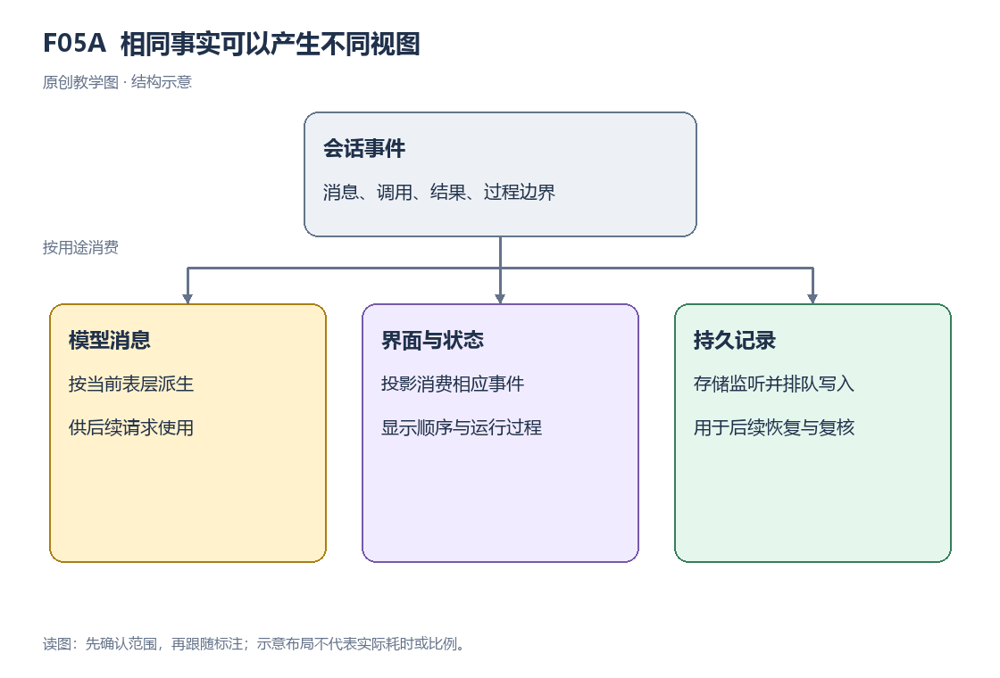

图 05A 由 Session 事件分出三个用途：模型历史按 Surface 派生，界面和状态投影消费过程事件，存储监听器排队写入持久记录。

持久日志保存已追加的底层过程事件，模型消息则由当前 Surface 派生。Surface 是参与组装下次模型请求的消息节点序列，规定哪些消息按什么顺序进入请求。Surface 管理器根据事件维护这份序列。生成途中的流式文本片段仍是临时观察；循环正式提交助手消息后，该消息才成为可交给持久化 Provider 处理的记录。提交使消息进入 Session 内存日志，flush 则等待存储写入完成。

### append 怎样建立一个事实

`Session.append` 先创建可序列化的数据副本，再构造带序号和时间的冻结条目。可序列化表示数据能按约定转换成保存格式。接着，方法校验事件字段，并检查 Surface 约束：这条事件是否符合当前消息序列的更新规则。两项校验通过后，事件进入日志并发布。副本与冻结共同防止调用者后来修改原对象时改变已记录的历史。

随后 Session 发布该事实，消费方依各自接口更新或排队处理。消息派生 `deriveMessages` 遍历当前 Surface 中的消息节点，生成新的消息数组。状态投影则按注册的事件消费规则维护可查询状态。消息视图处理消息节点，状态投影处理各自关心的过程事件。

DSH 的 JSONL Provider 为每个 Session 管理一条写入通道，称为写入句柄。它监听 `session/event`，将新条目排入后台缓冲；收到 `session/flush` 后，先等待缓冲排空，再等待 writer.flush 完成。Session 通过事件通知存储，存储组件负责实际文件读写。

### 投影和持久化屏障

Session 投影按事件规则更新状态，供不同消费方查询。例如，待办投影根据待办变更事件维护最新列表，运行状态投影根据生命周期事件维护当前阶段。同一份日志可以支持多种投影，各自保留业务所需的数据。

JSONL 的持久化链分为两层：实时监听器先把事件放进缓冲，writer.append 再按序写入文件并调用文件同步。session/flush 先等待 drainLive 排空实时缓冲，再等待 writer.flush；尚未写入事件的空 Session 会在此创建并同步头记录。文件追加或同步失败时，存储层关闭追加句柄，再把文件截回本批写入前的长度并同步，随后抛出原错误。若回退也失败，就用 AggregateError 同时报告写入错误与回退错误。成功回退后，本批可以按未推进的游标重试。

### 分析示例：消息、调用与事件的计数

教学片段有一条用户消息、两条助手消息和一条工具结果，另有一条工具调用、两项轮次边界和四项步骤边界，共 11 个列出的事件。这里得到的消息数是 4，工具调用数是 1，日志片段事件数是 11；三个值回答不同问题。

复算记录：[C5 · 消息与事件计数](examples/calculation-results.json)。

统计对话消息时筛选消息事件；统计工具调用时筛选 tool/call；统计运行轨迹时再纳入轮次、步骤、请求信息和用量。回放按这些事件还原对应模型响应。

### 写入时间线与故障判断

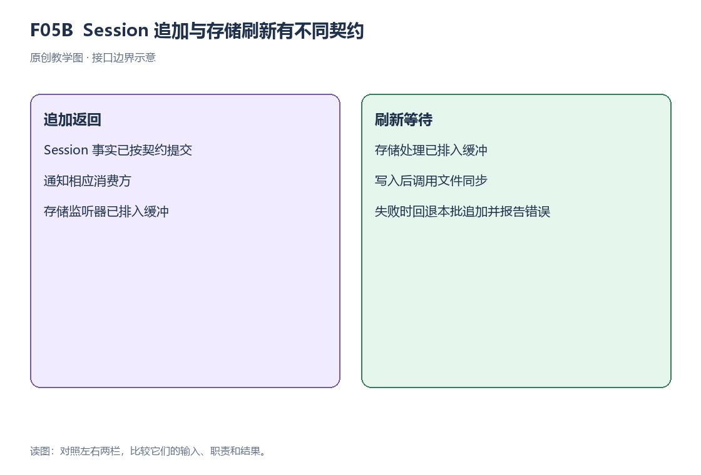

图 05B 对比 append 返回和 flush 等待。append 完成 Session 内追加与通知，flush 等待存储监听器排空并完成写入；后台写入从接到通知时就可以开始。

在标准流程中，用户输入、助手工具提议、工具调用、工具结果、助手总结和轮次边界依次进入事件序列。消息视图组织后续请求，界面更新显示，存储 Provider 写入文件。若界面已更新但写入失败，故障定位于存储链；页面刷新后临时文字丢失时，需优先排查该片段是否曾提交为助手消息事件，并确认其是否成功写入文件。

### 常见误解

“日志里每一项都发给模型”：消息派生只处理相应的消息节点，过程边界另有用途。

“可从日志还原，所以视图必须与原日志相同”：派生视图可以按用途选择、组合和更新；压缩会在第八章进一步改变当前 Surface。

“页面显示了，所以已经保存到磁盘”：界面与存储分别消费事件。查看存储写入和 flush 的结果，才能确定对应记录是否已保存。

## 05.4 源码研读

<a id="e05a"></a>

### E05A · 事件对象建立与验证

阅读任务：这是 Session.append 中已经获取可序列化副本之后的节选。重点观察序号、时间、数据副本和校验；后续加入日志、发布通知、返回事件是另一段逻辑。

代码类型：**真实源码摘录**。证据编号 [E05A](evidence-index.md#e05a)；下表的数字是原文件行号。

```ts
    const event = deepFreeze({
      type,
      seq: SessionSeq(this.log.length),
      time: Date.now(),
      data: dataSnapshot,
      ...(surfaceMetadataSnapshot as { surfaceOp?: unknown; sourceEventSeqs?: unknown }),
    } as unknown as SessionEvent<T>)
    validateSessionEventData(event, `session event "${type}" at seq ${event.seq}`)
    this.surfaceManager.validateNext(event as SessionEvent)
```

| 原文件行号 | 写法 | 在这段流程中的作用 |
| --- | --- | --- |
| 744 | const 保存 deepFreeze 返回值，对象开始 | 将已准备的事件字段组织并冻结，保持记录稳定。 |
| 745 | 属性简写 | 保存调用者指定的事件类别。 |
| 746 | 读取 length 后包装序号 | 按日志当前位置建立连续的 Session 事件序号。 |
| 747 | 方法调用获取当前时间 | 保存记录时间，不以时间替代序号。 |
| 748 | 显式属性赋值 | 使用已生成的 dataSnapshot 副本，隔离调用方对原始输入的后续修改。 |
| 749 | 展开对象，as 说明类型 | 加入已建立副本的 Surface 意图和来源关联字段。 |
| 750 | 结束对象与冻结调用，类型断言 | 把结果作为当前事件类型处理；类型断言本身不作磁盘写入。 |
| 751 | 调用事件数据校验 | 检查事件字段符合该类型的运行约束。 |
| 752 | 调用 Surface 管理者的校验 | 检查这条事件能否按当前消息视图规则追加。 |


执行推演：已有 9 项日志时，新事件的 seq 为 9。方法先冻结并校验事件；校验失败就抛错，通过后才加入日志、发布通知。

<a id="e05b"></a>

### E05B · 后台写入与持久化等待

阅读任务：JSONL 存储组件注册两项事件监听。session/event 到达时将事件排入后台缓冲；session/flush 到达时等待缓冲排空并完成刷新。注册调用保存回调，具体事件触发回调执行。

代码类型：**真实源码摘录**。证据编号 [E05B](evidence-index.md#e05b)；下表的数字是原文件行号。

```ts
    ctx.on('session/event', (session: Session, event) => {
      this.writers.get(session.id)?.enqueueLive(event, (error) => {
        ctx.logger.warn(`session-persistence: background write for session "${session.id}" failed (buffered events retained): ${String(error)}`)
      })
    })
    ctx.on('session/flush', (session: Session) => {
      const writer = this.writers.get(session.id)
      if (writer === null || writer === undefined) return undefined
      return (async () => {
        await writer.drainLive()
        await writer.flush()
      })()
    })
```

| 原文件行号 | 写法 | 在这段流程中的作用 |
| --- | --- | --- |
| 535 | on 注册事件回调，箭头函数接收 Session 与事件 | 订阅 Session 新事实，稍后发生事件才进入函数体。 |
| 536 | 可选调用与回调参数 | 有对应 writer 才排入实时写入队列，并设置失败处理。 |
| 537 | 模板字符串和 warn 调用 | 后台写入失败时记录 Session 与错误，提示缓冲事件仍保留。 |
| 538 | 结束 enqueueLive 的错误回调 | 回调负责记录后台写入错误，缓冲事件仍保留以供后续处理。 |
| 539 | 结束新事件监听器 | 登记的监听器继续等待后续事件。 |
| 540 | 注册另一项监听 | session/flush 是要求等待持久化边界的事件。 |
| 541 | const 获取 Map 中的 writer | Map 是按键查值的集合；这里按当前 Session 身份找到它的存储写入者。 |
| 542 | if 与 return | 没有 writer 时本监听不承担刷新工作。 |
| 543 | async 箭头函数立即调用并返回 Promise | 把内部异步排空任务交给等待 flush 的调用者。 |
| 544 | await 排空实时缓冲 | 先等待已经排入的实时事件处理完。 |
| 545 | await 等待刷新 | 再等待写入者完成其刷新契约。 |
| 546 | 结束函数并立即调用 | 向外返回这次等待任务。 |
| 547 | 结束 flush 监听器注册 | 之后 Session 服务可收集并等待这些刷新监听者。 |


执行推演：新事件发出后，如果有写入者则排入后台缓冲；后台失败会记录警告并保留缓冲事件。显式 flush 的处理获取同一写入者，先排空实时缓冲，再等待刷新。

## 05.5 理解检查与讲解问答

### 问题 1 · append 执行返回是否代表磁盘持久化已完成？

讲解：不能。追加首先完成 Session 内记录与发布，后台写入有单独的 flush 等待边界。

### 问题 2 · 为什么事件与聊天消息数量不同？

讲解：事件包括生命周期和状态记录，只有相应消息节点参与消息派生。

### 问题 3 · 恢复 Session 后，原来的外部终端一定恢复了吗？

讲解：Session 恢复对话记录和运行事实；终端进程保存在执行环境中，需要由进程 Provider 确认它是否仍在运行、连接是否可用。

[全书目录](tutorial.md) · [本章与原始证据](evidence-index.md) · [术语索引](glossary.md)

<a id="chapter-06"></a>

# 第 6 章｜提示词组装与项目指令

本章学习任务：理解提示贡献、项目指令与历史的组装规则，追踪作用域选择、去重和请求冻结。

## 06.1 基本概念

一次模型请求的上下文包含系统规则、当前输入、历史消息和工具说明等材料。提示词向模型描述目标与行为要求，system prompt 承载其中的系统规则。用户消息、项目指令和工具结果以各自的来源进入请求，后续组装依据这些来源选择内容和顺序。

注册阶段保存插件提供的提示段或动态上下文，请求组装阶段读取当前可用的贡献。作用域决定贡献对哪些 Agent 可见，同名选择规则决定采用哪个版本，排序规则决定各项内容的排列顺序。三类规则共同确定本次请求的输入。

项目指令描述工作区和当前文件路径相关的规则。每次模型请求前，项目指令插件先选择规则文件，将内容整理成指令消息，再与待处理输入一起进入本步。历史则从 Session 的 Surface 派生，随后与这些新材料汇合。

请求冻结为当前调用建立独立、稳定的数据副本。新消息、插件变化与压缩影响后续请求的组装；已经提交的请求继续使用原副本。因此运行中到达的引导消息，需要在下一步骤被领取后生效。

## 06.2 沿一个任务看完整流程

以“总结 README，但保留实验性功能的限制”为例，用户目标是一条来源明确的消息。system prompt 贡献说明行为规则，工具贡献说明 read 怎样调用，历史提供先前已经获取的材料；工作区指令再依据当前范围补充约束。

组装器先决定哪些贡献在当前作用域可见，再解决同名项和顺序问题。前置指令处理会清掉不再需要的待处理指令，并把这次需要的指令放入本步消息批次。用户消息在首次尝试登记，重试不再重复登记它；请求创建后获取独立配置副本。

请求执行期间补充的“只总结正式功能”先进入 next-step 队列。当前请求使用既定副本，下一步骤领取新消息并重新组装上下文。后续压缩可以改变历史 Surface，在途请求则保持原内容。定位材料缺失时，分别检查可见提示贡献、前置消息、历史 Surface 和最终请求。

## 06.3 关键机制与设计取舍

### 材料有不同的入口

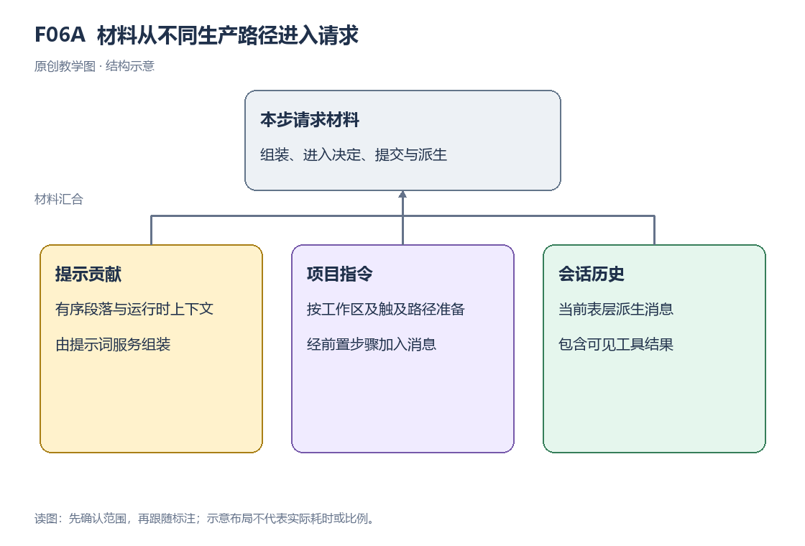

图 06A 的三路材料汇入本步请求：SystemPrompt 组装提示贡献，项目指令形成前置消息，Session 历史按 Surface 派生。它们分别保留自己的来源和排列规则。

system prompt 通常描述运行方式和工具使用等约束。运行时上下文提供当时环境材料，例如当前时间、工作目录或刚读取过的文件路径。项目指令描述工作区规则。用户消息提出当前目标，工具结果给出已获取事实。知道每类材料从哪里来，才能检查冲突、遗漏与重复。

### 从贡献到请求冻结

插件用 `SystemPrompt.section` 注册具名提示段，用 `context` 注册动态上下文。每项贡献带有作用域。同名项先选择当前 Agent 更近的作用域，再按服务规定的顺序排列。完整提示段另有自己的选择规则。SystemPrompt 服务根据这些规则组装本步提示词。

驱动在步骤准备阶段领取输入，调用 `assemble` 组装提示，并生成本步运行时上下文，随后进入 `agent/pre-step` 前置处理链。该链按顺序执行，决定步骤能否继续及其消息批次。项目指令插件先等待相关投影就绪，再根据工作区和触及路径选择规则文件。触及路径是工具调用已经接触的文件路径，用于确定适用的目录规则。选中的规则形成上下文消息，插入本步批次。

进入步骤后，框架准备模型调用，记录需要的系统消息、首次进入的用户消息和请求信息，再派生并冻结请求。冻结确保本次请求的内容不会因共享对象被修改而发生预期外变化，下一步重新组装消息和上下文。

### 顺序与作用域的基础

每项提示贡献通过名称、作用域和顺序参与组装。名称用于识别同名项并选择有效版本，作用域限制可见范围，顺序确定最终排列。显式定义这些信息，使不同插件提供的材料能够按一致规则组合。

消息同时保存内容与来源。项目指令来自规则文件，用户需求来自提交入口，工具结果来自执行链。框架按这些来源组织消息；一段文字里出现“系统提醒”，不会改变它原有的消息类别。

### 分析示例：重复材料占了多少空间

教学请求包含工具指导 800 字节、项目规则 600 字节、用户需求 200 字节、历史 2400 字节，共 4000 字节。某插件又加入完全相同的项目规则 600 字节，新总量为 4600 字节，增加 15%。

这个算例的组成量保存在[计算输入](examples/metrics-input.json)中，`calculations` 按“基础组成求和—加入重复规则—除以原总量计算增幅”的顺序复算。[计算记录](examples/calculation-results.json)中的 `C6_baseline_bytes`、`C6_augmented_bytes` 与 `C6_increase_percent` 对应这三个结果。

重复规则增加请求体积，也使来源判断更加复杂。项目指令用 sameContextPayload 检查等价消息，SystemPrompt 按名称和作用域选择贡献。定位重复内容后，可以在对应组装入口处理，减少后续压缩需要处理的冗余。

### 在下一步加入项目约束

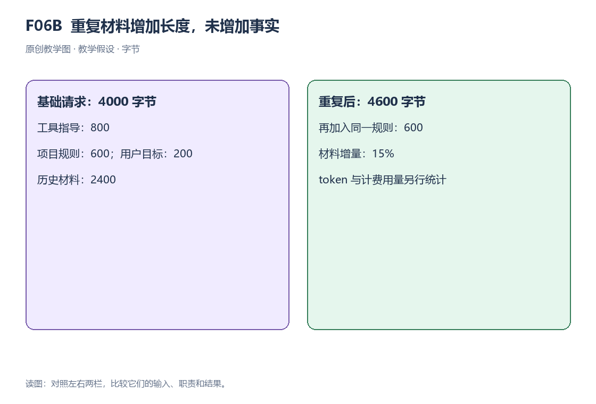

图 06B 比较重复材料的体积：基础请求 4000 字节，重复一份 600 字节规则后变成 4600 字节，增加 15%。两侧比较的是内容组成和字节数。

驱动准备模型调用时检查取消信号。工具成功访问文件后，项目指令插件按调用结果收集触及路径。当前步骤结束时，插件排队更新对应指令；下一步前置链等待更新完成，再把本次需要的规则消息加入请求。

### 常见误解

“所有项目指令都直接变成 system prompt”：项目指令在前置步骤中形成指令消息，再与本步输入组合；SystemPrompt 服务另行组装 system prompt。

“更长的提示词必定更可靠”：长度只描述材料体积。冲突、重复和是否被正确执行仍要检查。

“冻结一次请求就冻结整个 Session”：冻结保护本次材料；下一步可读取新消息、工具结果或新的 Surface 状态。

## 06.4 源码研读

<a id="e06a"></a>

### E06A · 项目指令进入本步消息

阅读任务：位置是前置指令处理已经算出 desired 之后。desired 是这一步要插入的指令消息；pending 是待清理指令，decision 保存准备中的消息批次，messages 是已领取输入。重点观察去重和插入位置；指令文件的发现过程见本章前面的讲解。

代码类型：**真实源码摘录**。证据编号 [E06A](evidence-index.md#e06a)；下表的数字是原文件行号。

```ts
    for (const message of pending) agent.inbox.remove(message.id)
    if (desired === undefined || decision.messages.some(message => sameContextPayload(message, desired))) {
      return decision
    }
    // Fold the context right after the claimed batch, so the direct prompt
    // precedes it and the driver-appended runtime context follows it.
    const lastClaimedIndex = decision.messages.findLastIndex(message => messages.includes(message))
    const entered = decision.messages.toSpliced(lastClaimedIndex + 1, 0, desired)
    return { ...decision, messages: entered }
```

| 原文件行号 | 写法 | 在这段流程中的作用 |
| --- | --- | --- |
| 332 | for...of 遍历 pending 并调用 remove | 先从 Agent Inbox 移除不再保留的待处理指令消息。 |
| 333 | if、逻辑或与 some 检查 | 没有新指令或已经有等价内容时，不重复插入。 |
| 334 | return 返回既有决定 | 本分支保持当前批次不变。 |
| 335 | 结束 if 分支 | 只有需要新增内容的情况继续。 |
| 336 | 原注释说明插入相对位置 | 指令放在领取输入之后。 |
| 337 | 原注释说明后续追加的运行材料 | 直接输入在前，驱动后补的运行上下文在后。 |
| 338 | findLastIndex 与 includes | 在决定的消息数组里找到最后一条属于领取批次的输入。 |
| 339 | toSpliced 建立新数组 | 在该位置之后插入 desired，不原地改写旧数组。 |
| 340 | 展开对象并替换 messages | 返回新的前置决定，供本步请求组装使用。 |


执行推演：desired 已经包含在批次时，返回原决定；需要新指令时，找到最后一条已领取输入，把 desired 放在它之后，返回新的批次对象。

## 06.5 理解检查与讲解问答

### 问题 1 · 项目指令一定进入 system prompt 吗？

讲解：项目指令由前置步骤形成消息，并加入本步材料；system prompt 则由 SystemPrompt 服务组装。两条路径在准备请求时汇合。

### 问题 2 · 引导消息到来后，已经发出的请求会改变吗？

讲解：在途请求使用已冻结的数据副本。新消息在下一次领取边界进入后续请求。

### 问题 3 · 重试为什么不重复登记用户消息？

讲解：首次尝试登记后已有这份 Session 事实，再次登记会把一个输入变成重复历史。

[全书目录](tutorial.md) · [本章与原始证据](evidence-index.md) · [术语索引](glossary.md)

<a id="chapter-07"></a>

# 第 7 章｜Skill 发现与按需加载

本章学习任务：追踪 Skill 的目录发现、入口检查与正文读取，区分工作方法与工具执行权限。

## 07.1 基本概念

Skill 是封装任务方法的说明及相关资源，例如技术报告的整理流程。目录摘要公开名称和用途，正文解释操作步骤与要求。模型通过摘要发现候选，在需要使用时读取对应正文。

Skill 服务负责发现、列出和读取定义，`skill` 工具让模型按名称获取正文。调用权限分别声明是否允许用户调用、是否允许模型调用；读取入口按相应标志检查。目录可见性用于发现候选，调用标志决定能否从这一入口加载。

Skill 加载获取正文并将其加入模型上下文。正文指导模型组合已有工具，文件访问、网络调用和发布操作仍由工具注册、准入与执行环境控制。用户显式指定 Skill 和模型调用 skill 工具分别采用对应的读取路径。

需要区分三个观察点：目录是否包含名称，读取是否获取定义，正文是否进入本次请求。排查未按 Skill 步骤执行的故障时，先找这三个证据，再评价正文的方法是否清楚。

## 07.2 沿一个任务看完整流程

假设目录包含 report-skill，摘要标明其用于整理技术报告。模型先根据摘要匹配任务需求，再调用 Skill 读取工具。工具根据当前工作目录、Agent 范围和取消信号获取目录，找到名称以后检查它是否允许模型调用；通过后再获取完整定义。

若目录里的定义已经移除，查询不到名称就报错；名称仍可见但禁止模型调用时，工具返回入口限制错误。获取正文以后，框架把它整理成模型材料，后续模型请求便能使用其中的方法。

用户显式调用的入口会检查用户可调用条件，符合时才建立 Skill 调用来源的指令消息。未知名称和不符合条件的文字不会都被解释为命令。正文中的方法通过后续模型推理与工具调用落实。

## 07.3 关键机制与设计取舍

### 先知道名称，再获取正文

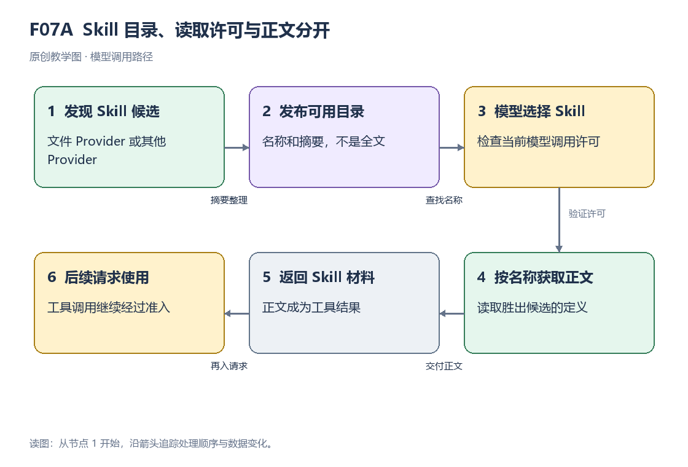

图 07A 沿模型调用路径展开：发现候选、发布摘要、选中名称、检查模型调用许可、获取正文。正文作为工具结果记录，随后进入下一次模型请求。

### 注册表与 Provider 分别负责什么

`SkillRegistry` 管理可见 Provider 和候选。文件系统 Provider 负责从相应目录发现 Skill 并读文件内容。`list` 返回摘要列表；`get` 按名称选择候选；同名项依次按 Provider 优先级、Provider 顺序和本地顺序取舍，把候选定位信息返回对应 Provider 读取，再校验完整定义。这使消费方不必固定绑定某个文件目录实现。

工具插件在前置步骤把当前 Agent 可调用的 Skill 目录写成持久提示消息。目录包含名称与说明，正文按需读取。目录发生变化时，插件发布替换消息；发现过程不完整时，保留已有目录。模型调用 `skill` 后，执行体检查名称、可见摘要和模型调用标志，再获取完整定义并返回正文。

用户直接调用走另一条路径。前置步骤检查直接用户消息第一行的 `/<name>`，名称存在且允许用户调用时，加载正文并注入本步消息。模型调用 `skill` 工具则把正文记录为工具结果，供后续步骤使用。消息来源与调用标志决定这两条路径各自何时生效。

### 按需加载与工具权限

按需加载在任务需要时获取 Skill 内容。正文提供工作方法，工具注册决定可调用能力，准入链决定本次调用是否允许，执行环境限制实际资源访问。这些控制机制在加载后继续生效。

目录摘要帮助选择 Skill，正文提供步骤、参数和限制。例如“用于文档整理”只说明用途，具体怎样整理要在加载正文后确定。Provider 读取失败、名称消失或入口禁止调用时，工具返回对应错误。

### 分析示例：按需材料量

教学目录有三个 Skill，正文分别是 2000、3000、5000 字节，目录摘要合计 600 字节。本次只获取第一个 Skill，目录加正文为 2600 字节；若都加载则为 10600 字节，差额 8000 字节。计算假设两种方案都携带同一目录，忽略其他请求材料。

复算记录：[C7 · Skill 材料用量](examples/calculation-results.json)。

按需方案省去未选中 Skill 的正文，同时增加查找和读取操作。评价时需要同时记录材料量、加载次数和任务结果。摘要准确性、选择结果与正文版本影响加载所得的方法是否适合当前任务。

### 回到项目说明整理

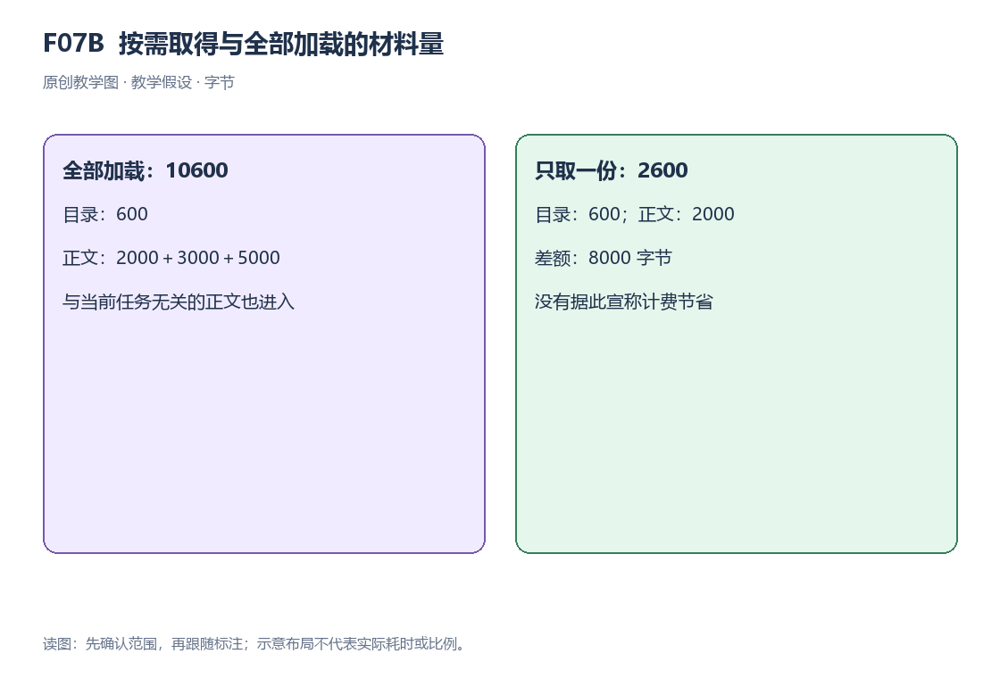

图 07B 左侧携带三个 Skill 的全部正文和同一目录，共 10600 字节；右侧携带目录与第一个正文，共 2600 字节，差额为另外两份正文的 8000 字节。

Skill 正文指导报告结构，read 结果提供项目事实。模型把两者结合，生成注明来源和限制的总结。

### 常见误解

“目录列出一百个 Skill，所以上下文已包含一百份全文”：目录与正文有不同契约，应查看实际获取材料。

“任何页面里出现 /Skill 名 都会触发”：直接调用手势有消息来源与可调用策略限制。

“Skill 加载后可以绕过工具准入”：Skill 改变材料和工作方法，准入仍在第十一章的工具链里。

## 07.4 源码研读

<a id="e07a"></a>

### E07A · 读取正文前的可见性和入口检查

阅读任务：这是 Skill 读取工具执行体中的节选。args.name 是请求的名称，exec 提供 Agent 与取消信号；重点区分目录查询、模型调用条件与获取正文。后续结果构造不在本段。

代码类型：**真实源码摘录**。证据编号 [E07A](evidence-index.md#e07a)；下表的数字是原文件行号。

```ts
      const lookup = { cwd: exec.agent?.session.header.cwd, signal: exec.signal, scope: exec.agent }
      const summary = (await ctx.skills.list(lookup)).find(skill => skill.name === args.name)
      if (!summary) {
        throw new Error(`skill "${args.name}" is unknown or no longer available`)
      }
      if (!isModelInvocable(summary)) {
        throw new Error(`skill "${args.name}" is not available for model invocation`)
      }
      const skill = await ctx.skills.get(args.name, lookup)
      if (!skill) {
        throw new Error(`skill "${args.name}" is unknown or no longer available`)
      }
```

| 原文件行号 | 写法 | 在这段流程中的作用 |
| --- | --- | --- |
| 133 | 对象和可选属性访问 | 把 Session 工作目录、取消信号和 Agent 范围组合成查询条件。 |
| 134 | await 后 find，箭头函数比较名称 | 获取该范围目录并选中请求名称的摘要。 |
| 135 | if 取反判断 | 没有摘要时进入错误分支。 |
| 136 | throw 构造错误与模板文字 | 名称未知或已不可用时中断读取；反引号串里的 ${…} 会替换成具体名称。 |
| 137 | 结束第一个 if | 找到摘要后继续下一项条件检查。 |
| 138 | 函数调用与取反 | 检查摘要是否允许模型通过这个入口调用。 |
| 139 | throw 抛出入口限制错误 | 可见但不可由模型调用的 Skill 不能继续加载。 |
| 140 | 结束第二个 if | 通过入口条件才继续。 |
| 141 | await get | 向 Skill 服务获取完整定义，不能把目录摘要当作正文。 |
| 142 | if 检查加载结果 | 目录查询以后定义仍可能消失。 |
| 143 | throw 抛出已不可用错误 | 没有正文时停止，不编造 Skill 内容。 |
| 144 | 结束最后一个 if | 有效定义交给后续渲染和结果处理。 |


执行推演：目录中没有名称时第一个分支抛错；有名称但不允许模型调用时第二个分支抛错；都通过才调用 get，之后还要处理定义已消失等情况。

## 07.5 理解检查与讲解问答

### 问题 1 · 看到 Skill 摘要以后，正文是否已经可用？

讲解：还没有。摘要帮助选择，读取工具获取完整定义后才能形成正文材料。

### 问题 2 · Skill 可见但不允许模型调用，会怎样？

讲解：读取入口检查调用条件，不能因名称出现在目录中就放行。

### 问题 3 · Skill 能否自行提高工具权限？

讲解：不能。Skill 提供方法与说明，真实工具仍经过本身的准入和执行限制。

[全书目录](tutorial.md) · [本章与原始证据](evidence-index.md) · [术语索引](glossary.md)

<a id="chapter-08"></a>

# 第 8 章｜上下文压缩与历史表示

本章学习任务：理解上下文容量、压缩选区、稳定性检查与提交过程，比较信息保留与请求开销。

## 08.1 基本概念

模型一次请求可容纳的材料有容量限制。token 是模型处理文字时使用的编码单位，tokenizer 把文字编码成 token，词数、汉字数和 token 数分别统计。上下文压力把当前材料的 token 计量与模型容量比较。TokenMeter 分别记录本地估计和可复用的 Provider 用量信息。

压缩（compaction）将选定历史改成较短表示，供后续请求使用。例如，把十次文件调查整理成“已读哪些文件、得到什么结论、还缺什么”。原始事件留在日志中，当前 Surface 则使用摘要表示这段历史。

摘要压缩通过较短表示保留关键内容，细节可能被省略。选区检查保持工具调用与结果配对，保留最近历史，并将尚未关闭的步骤留在选区之外。摘要生成期间，稳定性检查确认相关依赖仍与准备依据一致；通过检查后，提交流程把摘要纳入 Session 的当前视图。

裁剪、compaction 和 spill 分别改变不同的数据表示。裁剪移除可省略内容，compaction 以摘要替换选定历史，spill 将长文本保存到外部存储并提供取回入口。它们都减少当前请求承载的内容，后续恢复原文和访问细节的方式则各不相同。

## 08.2 沿一个任务看完整流程

假设本轮准备请求时材料接近容量，压缩插件在前置步骤测量压力、选择可处理的历史范围、生成较短表示。若选不到范围，就没有压缩结果；若范围可处理，生成期间仍要保持关联条件，提交前再次检查稳定性。

流程先追加 `compaction/start`，在请求摘要前建立压缩锁。摘要通过稳定性检查后，代码依次记录 `compaction/summary`、替换 Surface 的检查点消息和 `compaction/end`。开始以后的失败会进入收尾分支，尝试追加一次结束事件；结束事件本身失败时，未配对的开始标记继续占用锁。已追加的记录保留在 Session 中，错误按 summary 或 commit 阶段报告。自动压力钩子捕获错误、记录警告后继续前置链；上下文溢出恢复则按策略裁剪、重新计量并选择范围。

用一个小例子检查信息损失：原文写“功能 X 是实验性的，只在某后端提供”，摘要若只保留“有功能 X”，字数更少却改变了约束。比较前后应该检查任务仍需要的结论、来源、未完成事项和调用关联。缩短材料为后续请求腾出容量，摘要中的功能范围则决定模型能否准确回答。

## 08.3 关键机制与设计取舍

### 同一历史的两种形态

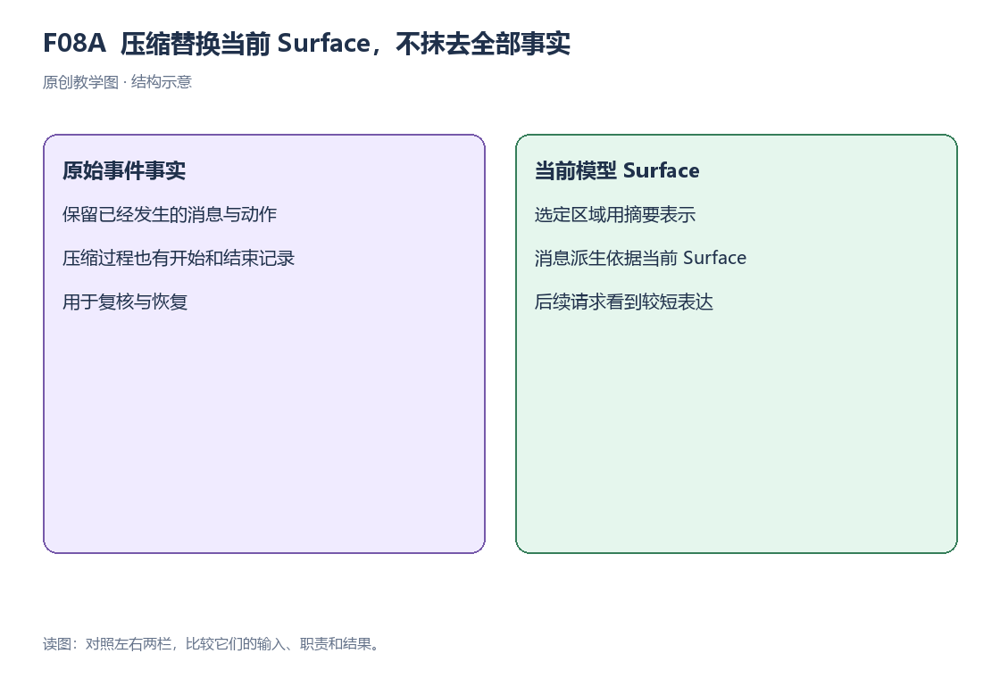

图 08A 左侧保存原始事件，右侧展示当前 Surface。压缩在 Surface 上用摘要替换选中区域；原始消息、调用和压缩过程记录继续留在日志里。

### 触发条件与压缩主链

基本压缩插件有两个自动入口：前置步骤检测上下文压力，以及请求恢复链处理 Provider 确认的上下文溢出。`compactIfNeeded` 先检查目标、策略和计量状态。压力入口根据模型容量计算阈值，未达到阈值就返回；选不到安全区域时，也返回而不请求摘要。

选区确定后，流程检查 Surface 范围和压缩事务状态。事务在这里指由开始、摘要、替换消息和结束标记组织的一次压缩流程。开始标记先建立锁，摘要返回后再检查选区稳定性，通过后按顺序追加提交记录。选区发生冲突时，稳定性检查抛错，流程转入失败收尾。

前置压力压缩失败时，插件记录警告，驱动继续原有前置链。上下文溢出恢复由目标策略和次数上限决定是否再尝试。手工压缩通过维护阶段预留驱动，检查空闲状态与取消信号，并在结束标记追加后等待存储 flush。

### 逻辑视图和信息保留

Surface 是当前模型历史的消息节点序列。事件日志保留完整运行记录，Surface 根据任务需要选择这些记录的当前表示。摘要可以省略重复叙述，但应保留项目名称、路径、功能限制与未完成事项，避免改变后续推理所需的事实。

长期记忆通过存取和检索把其他任务的材料带回请求；compaction 调整当前 Session 的历史表示。语义检索中的 embedding 把文字编码为用于相似度比较的数字向量，第 12 章再介绍这类外部服务。

### 分析示例：长度与额外成本分开算

教学区域原为 12000 字节，摘要为 3000 字节，当前可见材料减少 9000 字节，即该区域缩短 75%。但为了生成摘要，流程仍要进行模型请求，产生输入与输出用量；评价总用量时，需要把摘要请求计入。

压缩前后的假设值保存在[计算输入](examples/metrics-input.json)中；`calculations` 用原大小减摘要大小，再将差值除以原大小。[计算记录](examples/calculation-results.json)中的 `C8_saved_bytes` 和 `C8_reduction_percent` 分别给出减少量与缩短比例。

设后续原本需要三次重复携带该区域，简化教学口径下，材料传输字节差额为 3×9000＝27000 字节。第 17 章把后续请求用量、缓存用量和这次摘要开销放在一起比较。若摘要漏了“某功能尚未稳定”，总结质量还可能下降。

压缩效果由材料体积和信息保留程度共同决定。较短摘要降低后续请求的上下文压力，较完整摘要保留更多任务细节。比较不同方案时，应使用相同的产物检查规则，同时记录压缩比例与后续回答质量。

### 两份摘要的区别

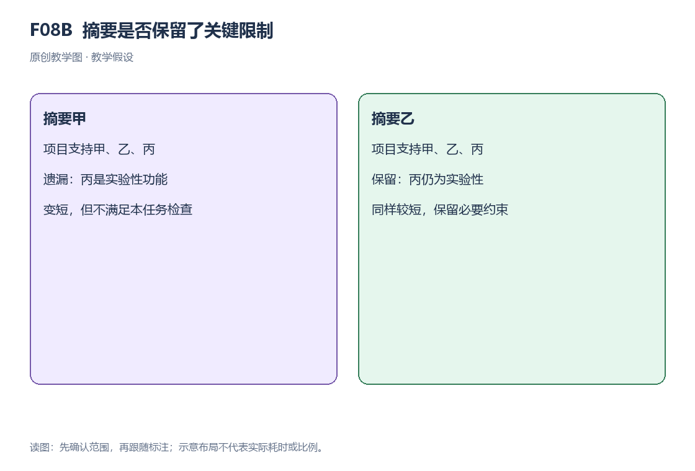

图 08B 对比两份摘要：甲列出功能甲、乙、丙，乙同时保留“丙仍为实验性”的限制。总结项目功能时，乙能够提供本任务需要的完整约束。

摘要生成失败时，选区仍采用原历史。提交阶段失败时，先前已追加的摘要或替换消息可能已经留在 Session 中，代码记录 commit 错误并处理结束标记。排查时要定位失败发生在哪次 append，以及当前 Surface 和压缩锁的状态。

### 常见误解

“压缩就是删除历史”：当前 Surface 替换不等于抹去所有原始事实。

compaction 调整当前 Session 的历史表示。跨 Session 记忆需要独立的存储、发现和检索能力，由相关服务提供。

“越短的摘要越优”：必须结合本任务需要保留的事实与约束检查。

## 08.4 源码研读

<a id="e08a"></a>

### E08A · 提交前稳定性检查与结束记录

阅读任务：节选位于摘要生成后的提交阶段。dependencies、session 和 summarized 保存准备依据，lifecycle 标识本次压缩，startEvent 关联开始事件。owner 为空时先检查取消信号，再校验稳定性并提交。外层 catch 根据失败阶段处理错误与结束记录。

代码类型：**真实源码摘录**。证据编号 [E08A](evidence-index.md#e08a)；下表的数字是原文件行号。

```ts
    if (options.owner === null) signal?.throwIfAborted()
    assertStable(dependencies, session, summarized)
    stage = 'commit'
    const pending = commitCompactionBody(session, startEvent, summarized)
    closing = true
    const endEvent = session.append('compaction/end', lifecycle)
    closed = true
```

| 原文件行号 | 写法 | 在这段流程中的作用 |
| --- | --- | --- |
| 232 | if 与可选方法调用 | 这段提交没有归属（owner 为空）时先响应取消，避免继续正常提交。 |
| 233 | 调用检查函数 | 确认摘要依据与当前 Session 仍满足稳定条件。 |
| 234 | 字符串赋值 | 将失败归因阶段切到 commit，供外层异常处理使用。 |
| 235 | const 保存提交结果 | 把已准备的摘要交给 Session 提交操作。 |
| 236 | 布尔状态赋值 | 标记已经进入关闭压缩记录的阶段。 |
| 237 | 追加事件并保存返回值 | 记录本次 compaction/end，形成对应生命周期终结。 |
| 238 | 布尔状态赋值 | 标记关闭记录已完成，避免外层再次按未关闭状态处理。 |


执行推演：稳定性检查不通过时，正常提交不会继续；通过后提交摘要，追加 compaction/end，再建立完整结果。压力触发、无可用选区和失败收尾的流程见本章前面的讲解。

## 08.5 理解检查与讲解问答

### 问题 1 · 摘要更短是否证明压缩更好？

讲解：压缩率只衡量材料变短了多少。还要对照原文检查任务约束、来源和未完成事项是否保留，再检查后续回答是否满足任务要求。

### 问题 2 · 压缩与 spill 改变的东西相同吗？

讲解：不同。压缩形成较短表示；spill 保存长内容并提供取回入口。

### 问题 3 · 生成摘要期间来源变了，为什么要再检查稳定性？

讲解：防止把基于旧依赖生成的摘要提交成当前有效材料。

[全书目录](tutorial.md) · [本章与原始证据](evidence-index.md) · [术语索引](glossary.md)

<a id="chapter-09"></a>

# 第 9 章｜模型流式响应与请求恢复

本章学习任务：追踪模型路由、请求准备和流式消费，解释失败结算、恢复决定与同一步骤内的重试。

## 09.1 基本概念

流式响应通过连续到达的数据片段传递模型输出，片段可以包含文本、工具调用信息、用量或结束状态。驱动持续消费片段，直至迭代结束或消费过程抛错，并根据 finish 结算结果。适配器将模型服务的协议转换成统一接口，Provider 与模型路由确定本次请求使用的服务。

限流是服务限制一段时间里可接收的请求数量；超时是等待超过规定边界。它们都可能产生失败，但恢复方式由策略决定。

重试是在某次执行失败后重新尝试。恢复策略决定哪些失败可以重试，以及要作哪些准备；agent/request-error 链返回 retry 时，循环才发起下一次尝试。失败尝试产生的临时内容可以被观察，但不能直接作为成功助手消息执行其中的工具提议。

请求先解析模型路由和配置，再获取流并消费片段。流正常结束后，驱动检查 finish：成功则提交助手消息，错误或中止则记录失败尝试并询问恢复链。消费过程中直接抛出的异常走 catch 分支，结算已开始的尝试后继续抛出；这一分支与 finish 携带失败状态的恢复入口分开。

当 finish.kind 为 max-tokens 时，循环先提交已经生成的助手消息，再返回 max-tokens 结束原因，跳过该消息的工具执行。这里达到的是当前请求的输出上限，与上下文过长触发的压缩恢复分开处理。

## 09.2 沿一个任务看完整流程

假设第一次尝试返回部分文本后以失败状态结束。界面可以显示临时进展，驱动记录失败，并向恢复链提供失败类型、Provider、重试策略和取消信号。恢复链返回 retry 时进入下一次尝试；没有重试决定时抛出对应模型错误。

| 到达的内容 | 循环处理 | 能否进入工具执行 |
| --- | --- | --- |
| 正在生成的片段 | 更新临时流状态 | 先显示临时进展 |
| 失败尝试的工具提议 | 记录尝试失败并走恢复 | 不走成功工具阶段 |
| 成功终结的助手消息 | 建立消息并提取工具调用 | 再交给通用准入链 |

重试并没有重新接纳一次用户任务。已经登记的用户输入不应重复追加；请求准备也保持对应的配置语义。每次重试重新准备调用，恢复处理可以改变后续请求配置。turn 和 step 保持不变，attempt 增加。

## 09.3 关键机制与设计取舍

### 临时输出与最终事实

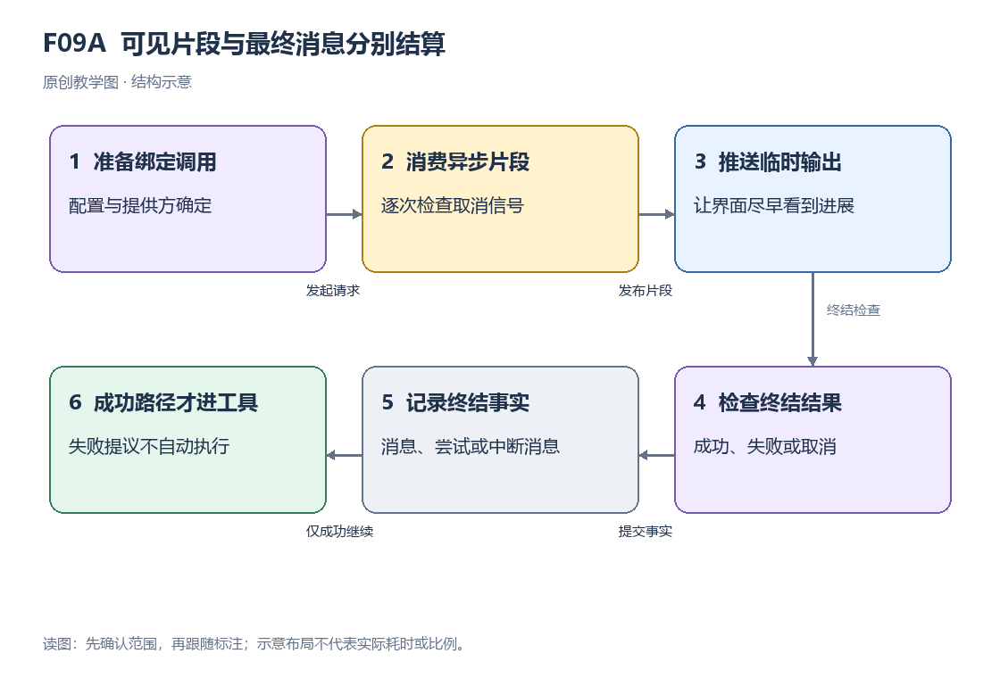

图 09A 把临时输出和正式提交分开：片段先更新界面，finish 决定成功、失败或取消，循环再记录助手消息或失败尝试。完成且未达到 max-tokens 的消息才进入工具调用判断。

### 一次调用怎样绑定 Provider

LLM 服务的 `prepareCall` 按 provider 标识查找适配器，解析目标模型与配置，返回绑定这次调用的 prepared call。它保存冻结配置与重试策略，且只能分派一次。每次重试重新准备调用，适配器将具体服务的响应转换成统一流。

DeepSeek 适配器把响应转换成异步片段，并组合取消信号。空闲监测统计等待新片段的时间，超出阈值就产生超时错误。超时、取消和传输失败分别分类；结束时停止消费，并尝试关闭逐项提供片段的迭代器。关闭失败作为诊断信息保留。

驱动用 `for await` 消费片段，逐次检查取消信号并推送临时输出。正常终结生成助手消息并记录；符合请求错误恢复流程的失败先记录尝试，再经 `agent/request-error` 链决定是否重试。没有 retry 决定时抛出 LlmError；已取消时由取消信号结束等待。

### 异步迭代与响应消费

Promise 表示一次异步结果，异步可迭代对象表示依次产生的一组值。`for await` 等待下一项，处理完成后再继续迭代。例如流中依次出现文本甲、文本乙和结束信息，驱动按到达顺序处理各项，并在消费结束后读取终结状态。

`for await` 每次等待下一个片段，直到迭代器结束。驱动随后读取 finish，确定这次响应怎样结算。取消信号沿驱动和适配器传递，各层在检查到取消后停止后续消费，并进入连接清理。

### 分析示例：重试等待算在哪里

教学轨迹为第一次尝试用时 400 ms 后失败，退避等待 300 ms（退避：失败后先等待一段时间再重试的策略），第二次尝试用时 700 ms 后成功。不计其他开销，模型阶段共 400＋300＋700＝1400 ms，其中请求尝试时间 1100 ms，等待时间 300 ms，尝试数 2。

复算记录：[C9 · 请求与退避耗时](examples/calculation-results.json)。

若用户在退避等待中取消，流程在第二次尝试开始前结束，此时只有一次请求。重试能够重新处理临时故障，也会增加等待和用量；Provider 与恢复插件共同决定重试策略。

### 失败、取消与成功走不同出口

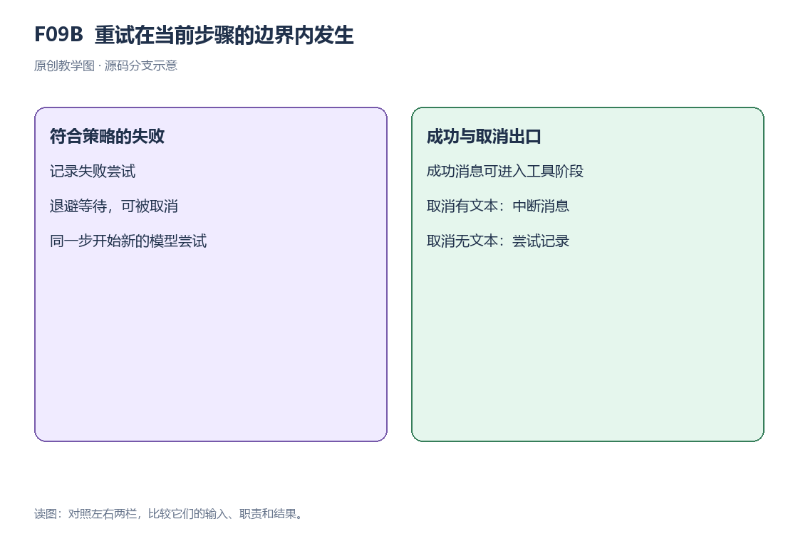

图 09B 左侧展示可重试失败的处理，右侧列出成功和取消出口。失败记录 attempt 后等待恢复；取消时，有保留文本就提交 interrupted 消息，无文本就记录 attempt。

README 任务中的首次模型请求若失败，驱动记录该尝试并按恢复决定重试。成功响应提出 read 调用后，流程进入工具执行；读取结果加入下一步骤的上下文，模型据此生成总结。失败输出留在尝试记录中，成功消息中的调用才进入工具阶段。

### 常见误解

“每个 chunk 都是一条助手消息”：片段属于尝试中的暂态流，最终消息有自己的提交边界。

“重试只是再次发送同一函数，在哪里都一样”：重试位置决定是否重复材料、工具副作用（对外部世界产生的实际影响，例如写文件）或其他提交。

“取消后保留了文本，所以任务成功”：应检查 interrupted 与结束原因，并另做产物判断。

## 09.4 源码研读

<a id="e09a"></a>

### E09A · 配置复制与冻结

阅读任务：节选位于 prepareCall 的配置准备阶段。config 指定 Provider 与模型，registration 提供适配器。代码解析配置并建立独立冻结副本，网络调用和流消费位于后续执行阶段。

代码类型：**真实源码摘录**。证据编号 [E09A](evidence-index.md#e09a)；下表的数字是原文件行号。

```ts
    const registration = this.registration(config.provider)
    const adapterCall = await registration.adapter.prepareCall(config.provider, config.model, signal)
    const modelInfo = this.normalizeModelInfo(registration, config.model, adapterCall.model)
    const resolved = this.resolveCallWithInfo(config, modelInfo)
    const resolvedConfig = deepFreeze(structuredClone(resolved.config))
    const context = resolved.context === undefined
      ? undefined
      : deepFreeze(structuredClone(resolved.context))
```

| 原文件行号 | 写法 | 在这段流程中的作用 |
| --- | --- | --- |
| 937 | const 与属性读取 | 按 config.provider 查找已登记的 Provider 适配器。 |
| 938 | await 适配器准备操作 | 获取该路由的模型准备信息，带入取消信号。 |
| 939 | 函数调用与属性读取 | 将适配器模型信息规范成项目使用的形式。 |
| 940 | 函数调用 | 结合模型信息解析本次调用配置与上下文。 |
| 941 | structuredClone 与 deepFreeze 嵌套调用 | 先复制配置再冻结，隔开共享可变输入。 |
| 942 | 三元表达式开始 | 判断本次解析结果是否包含随调用携带的附加 context（上下文材料）。 |
| 943 | 问号分支 | 未提供就保持 undefined，不凭空添加内容。 |
| 944 | 冒号分支 | 有 context 时复制并冻结，形成同样稳定的请求准备资料。 |


执行推演：原 config 后续被别处修改时，已复制并冻结的 resolvedConfig 不跟着变化。没有 resolved.context 时保持缺省；有则同样建立冻结副本。实际网络流在后续执行阶段获取。

<a id="e09b"></a>

### E09B · 失败以后是否再尝试

阅读任务：位置在失败已经登记、恢复链已经返回 action 之后。本段处于尝试循环内；finish 保存本次尝试的失败终结信息。重点是没有 retry 时怎样结束，以及 continue 返回哪个循环。

代码类型：**真实源码摘录**。证据编号 [E09B](evidence-index.md#e09b)；下表的数字是原文件行号。

```ts
          signal.throwIfAborted()
          if (action?.kind !== 'retry') {
            throw new LlmError(finish.failure.message, finish.failure.code, finish.failure)
          }
          continue
```

| 原文件行号 | 写法 | 在这段流程中的作用 |
| --- | --- | --- |
| 505 | 调用信号检查 | 已经取消时先停止，不被重试行动覆盖。 |
| 506 | 可选属性与不等比较 | 只有明确的 retry 才允许正常进入下一尝试。 |
| 507 | throw 与 new | 用失败消息、代码和详情构造 LlmError，交给上层错误路径。 |
| 508 | 结束 if 分支 | retry 情况跳过抛错。 |
| 509 | continue | 进入当前步骤的下一次模型尝试，保持 turn 与 step 不变。 |


执行推演：action 没有值或 kind 不是 retry，就抛出模型错误；kind 为 retry 且未取消，才进入同一步骤的下一次尝试，不进入本次失败响应的成功工具阶段。

## 09.5 理解检查与讲解问答

### 问题 1 · 失败流里出现工具提议，是否应该执行？

讲解：不进入成功助手消息的工具阶段。先记录失败并按恢复行动决定下一次尝试。

### 问题 2 · 每次请求失败都会重试吗？

讲解：不会。恢复链必须返回 retry，且取消等条件仍有效。

### 问题 3 · 临时文字已经显示，为什么后来还会失败？

讲解：片段到达只说明生成正在推进，成功需要相应终结与后续处理完成。

[全书目录](tutorial.md) · [本章与原始证据](evidence-index.md) · [术语索引](glossary.md)

<a id="chapter-10"></a>

# 第 10 章｜插件装配、运行配置与热重载

本章学习任务：理解配置条目、profile 与依赖注入，分析插件装配、字段覆盖和热重载。

## 10.1 基本概念

插件是一份可装入应用的能力实现，例如注册文件工具的模块。配置给出本次采用的参数，profile 选择整组插件及其设置。启动程序按配置装入插件，插件再注册服务、工具和监听器。

依赖是插件运行所需的外部能力，例如文件工具依赖工具注册表与文件服务。依赖注入由框架向插件提供这些服务。Context 是 Cordis 访问服务、登记资源的接口对象；插件的装入、运行和卸载共同构成生命周期，注册与释放发生在对应阶段。

配置条目保存插件身份及其设置，补丁指定对条目字段的修改。配置合成按既定顺序应用补丁，生成加载器使用的条目树。注册表维护名称与实现的对应关系，供消费方解析所需能力。

启动入口先读取运行选择与配置层，再合成条目、加载插件，满足依赖后执行插件的装入函数。函数执行期间注册工具，不表示文件已经读取。条目补丁按 id 定位插件，对补丁中的每个条目字段直接赋值。

热重载在运行时替换符合条件的部件。内部模块可以局部刷新，外部依赖变化则走完整重载路径。Cordis 在卸载时调用已登记的清理函数，例如撤销工具注册或事件监听；第 19 章展开资源登记与释放的机制。

## 10.2 沿一个任务看完整流程

以文件工具插件为例：配置给出读取上限，启动程序把合成后的条目交给加载器；依赖可用以后执行 apply。apply 检查参数并注册 read 等工具，使注册表更新。实际的文件操作在用户任务发起合法调用并进入执行函数时发生。

配置层先展平成有序补丁列表。applyEntryPatches 按 id 找条目，再用补丁值覆盖对应字段；config 也是一个整体字段。insert 可以向顶层或指定分组加入条目，新条目随即进入 id 索引，供后续补丁修改。缺少目标、目标不是分组或 name 校验不匹配时，函数记录警告并跳过该补丁。

卸载时，框架处理登记的资源释放。热重载还需分析模块依赖：可替换的内部模块走局部处理，外部依赖变化会设置完整重载并调用退出路径。局部替换先释放旧实例的登记资源，再装入新实例；完整重载交给退出和重启路径处理。

## 10.3 关键机制与设计取舍

### 配置层怎样汇合

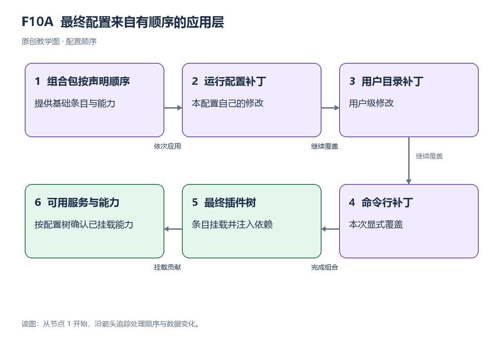

图 10A 按配置应用顺序排列：bundle、profile patch、用户目录 patch、命令行 patch。最终条目交给加载器，满足依赖的插件完成挂载。

### 启动到挂载的主链

CLI 是 Command-Line Interface，即通过终端命令与选项操作程序的入口。它解析启动参数，profile 模式进入 `runProfile`。运行器准备环境，读取组合包和有序补丁，得到 Cordis 配置条目。每个条目保存插件及其设置；多个条目按分组组织成应用树。`boot` 将树中的插件挂载到应用，插件由此提供服务、工具和事件监听。

消费者通过 Context 访问服务，例如文件工具使用文件服务，循环使用模型服务。Provider 实现服务接口，profile 决定挂载哪一份实现。查看应用树，可以确定当前运行使用哪些包及其配置。

官方架构中的 base 是多种 profile 的共享第一层，而 `sdk-minimal` 是例外：它的组合包拥有完整显式配置树，不应用 base。不同 profile 对热重载的设置也不同。热重载在可局部替换时使相应变化生效；需要完整重载的情形仍走退出与重新启动路径。

### 依赖注入与生命周期

依赖注入（dependency injection）让插件声明所需服务，再由配置环境提供。框架在当前作用域解析服务；依赖未满足时，实例等待可用环境，服务注册冲突则进入错误处理。作用域决定插件树中哪些位置可以获取这项服务。

插件从安装到卸载的存续期间称为生命周期。注册产生的副作用通常随插件卸载而撤销，例如移除事件监听或能力声明。事件监听是插件为某类事件登记的响应。撤销这项注册后，插件就不再接收相应通知；插件已发出的网络请求和已写入的文件仍由各自服务处理后续状态。

### 分析示例：覆盖整个 config

设一个插件条目的 config 是 `{timeout: 100, limit: 20}`，后续补丁给同一 id 设置 `{timeout: 300}`。applyEntryPatches 直接替换 config，结果只剩 timeout: 300。

加载插件时，配置 schema 再为缺省字段应用默认值。若要显式保留 limit: 20，后续 config 中也应写出它。条目覆盖和插件配置解析是两个连续阶段。

### Provider 替换的含义

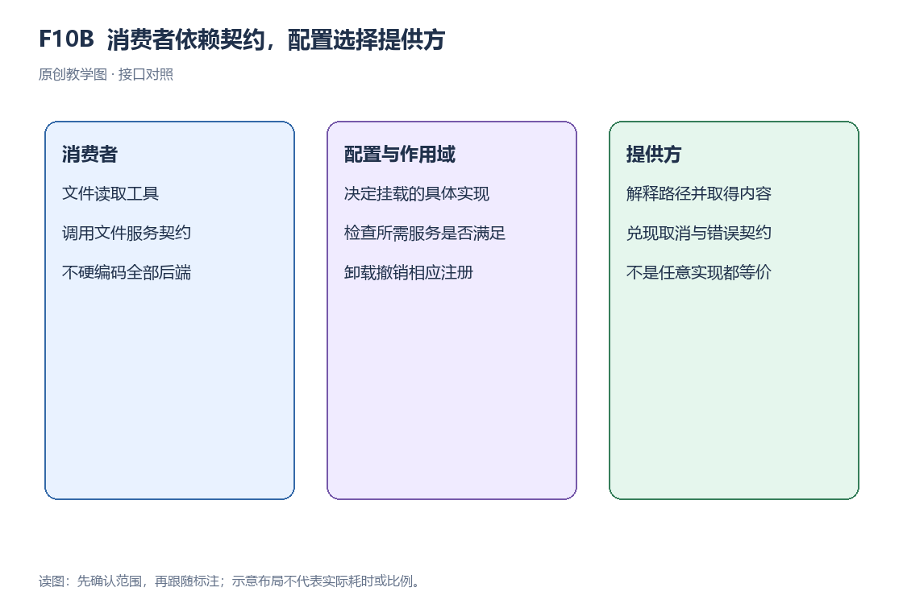

图 10B 的三栏是消费者、配置与作用域、Provider。read 调用文件服务接口，配置选出具体实现，Provider 负责路径、读取、取消和错误处理。

读取 README 的 profile 需要装入循环、工具、文件服务和模型 Provider。所选模型路由与工具作用域继续决定本次可用能力。Skill、压缩和 MCP 也按当前配置树启用。

### 常见误解

“包安装了，能力就启用了”：安装与挂载是不同动作，当前 profile 决定是否进入应用树。

base 是多数 profile 的共享配置层；`sdk-minimal` 使用独立的显式配置树。

“卸载插件会撤销它做过的一切”：卸载调用已登记的释放函数；文件写入和远端请求由各自服务处理后续状态。

## 10.4 源码研读

<a id="e10a"></a>

### E10A · 配置层与条目补丁的合成

阅读任务：这是 composeEntries 完整函数。layers 是启动阶段获取的配置层集合，warn 是可替换的警告回调；重点看展平、复制和真正执行合成规则的位置。

代码类型：**真实源码摘录**。证据编号 [E10A](evidence-index.md#e10a)；下表的数字是原文件行号。

```ts
export function composeEntries(
  layers: readonly PatchOptions[][], warn: (message: string) => void = () => {},
): EntryOptions[] {
  return applyEntryPatches([], structuredClone(layers.flat()), (message: string, ...args: unknown[]) => {
    let index = 0
    warn(message.replace(/%C/g, () => JSON.stringify(args[index++])))
  })
}
```

| 原文件行号 | 写法 | 在这段流程中的作用 |
| --- | --- | --- |
| 731 | export 与 function | 公开配置合成操作供启动程序调用。 |
| 732 | readonly 嵌套数组与默认箭头函数 | 接收多层补丁，未给警告处理时采用空操作。 |
| 733 | 返回类型与函数体开始 | 合成结果是 EntryOptions 数组。 |
| 734 | flat、structuredClone 与回调 | 展平并复制层数据，再交给条目补丁函数，以空条目集为起点。 |
| 735 | let 初始化计数 | 当前警告格式替换从第 0 个附加参数开始。 |
| 736 | replace 正则与 JSON.stringify | 将警告中的占位符换成参数的可读表示，再通知 warn。 |
| 737 | 结束回调与补丁调用 | applyEntryPatches 的结果作为本函数结果返回。 |
| 738 | 结束函数 | 加载器随后依据合成条目装配插件。 |


执行推演：多层条目先展平并复制，再交给 applyEntryPatches。applyEntryPatches 按 id 定位目标并直接覆盖字段；同一目标的后层补丁覆盖前层值。

## 10.5 理解检查与讲解问答

### 问题 1 · 插件装入时注册 read，是否已经发生读取？

讲解：没有。装入使工具可用，后来具体调用才进入执行体。

### 问题 2 · 热重载是否保证永远不重启？

讲解：内部模块满足局部替换条件时执行热替换；外部依赖变化触发 fullReload，随后通过 loader.exit 退出，交给重启路径重新加载。

### 问题 3 · 配置覆盖能否按任意深合并理解？

讲解：applyEntryPatches 对条目字段直接赋值。config 是一个整体字段，后面的 config 会替换前面的对象；加载插件时，schema 再为缺省字段应用默认值。

[全书目录](tutorial.md) · [本章与原始证据](evidence-index.md) · [术语索引](glossary.md)

<a id="chapter-11"></a>

# 第 11 章｜工具准入、审批与执行约束

本章学习任务：追踪准入策略、审批、guard、参数校验与执行顺序，区分拒绝、取消和执行错误。

## 11.1 基本概念

准入决定某次工具调用是否进入执行体。前置策略可以允许、拒绝、取消或要求审批；审批服务取得本次决定；后续守卫检查额外限制。`allowed-once` 将许可绑定到这一次审批，后来的调用重新进入准入流程。

守卫遵循单调约束：它可以增加拒绝，前置拒绝则继续有效。`undefined` 表示当前守卫没有提出额外拒绝，调用仍遵循已有准入决定。执行环境限制实际资源访问，操作系统沙箱及文件、网络控制由具体 Provider 和配置决定。

一次调用依次留下调用记录、执行状态和结果。前置拒绝时，框架直接构造拒绝结果；进入执行体后抛错时，已经完成的外部动作按实际情况保留。结果后处理再决定交给模型哪些内容。沿这三个时点，可以分清“没有执行”和“执行后失败”。

准入策略、审批、守卫和执行环境各自提供控制接口，可以独立扩展。故障定位需要确认错误发生在哪一阶段：前置拒绝、审批拒绝、执行失败与结果处理失败分别对应不同记录。

## 11.2 沿一个任务看完整流程

模型提出读取某路径，循环先登记调用事实。ToolRuntime 建立描述本次调用的执行上下文 exec，进入前置链。拒绝时直接形成拒绝结果；要求审批时，服务记录 asked，等待应答，再记录 decided。允许后继续检查守卫，通过后分派层重新解析执行工具，调用其包装函数。包装函数完成 schema 校验，才进入 read 的读取逻辑。

考虑四项请求：前置拒绝、审批拒绝、允许后成功、允许后抛错。请求数是 4，实际进入执行体是 2，成功结果是 1。最后一项已经进入执行体，失败前发生了哪些动作，要沿执行体内部的调用顺序追踪。

执行体返回后，结果规范化把返回值整理成统一结构，后置策略再决定模型最终收到的内容。若策略替换结果文字，模型会看到替换后的版本；此前完成的读取或修改保留在外部系统中。调用记录、准入决定和执行结果分别解释这次调用怎样推进。

## 11.3 关键机制与设计取舍

### 工具执行前后的处理链

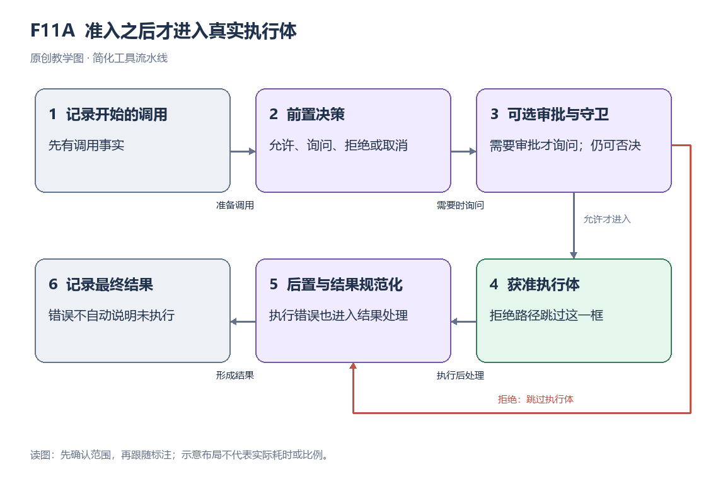

图 11A 的主线是调用记录、前置决定、可选审批与守卫、执行、结果处理和记录。拒绝支线跳过 execute，再把拒绝结果交给后续处理。

### 从调用到最终结果

循环先记录工具调用，ToolRuntime 创建执行上下文并检查取消。`tools/pre-execute` 链返回允许、拒绝、取消或审批请求，策略插件在这条链上作出决定，链尾默认返回 allow。需要审批时，服务向应答者发出询问、记录事实并回传结论。交互界面通常由用户应答，自动化桥接也可以提供机器应答。前置决定为允许时，ToolRuntime 再检查单调守卫。单调指守卫只能否决或原样放行，不能把应拒绝的调用升级为授权。

进入分派后，注册表重新解析可执行工具，融合来自调用方与外层封装的取消信号，再调用真实 `execute`。执行体返回的规范对象经过成功结果构造；抛错被转成工具错误。之后还有后置处理、内容约束和最终结果通知，循环再按约定顺序记录模型面对的结果。

审批服务在开放轮次内记录 `approval/asked` 与 `approval/decided`。开放轮次指已经开始、尚未结束的 turn，这让询问和应答归属到同一轮任务。`allowed-once` 允许本次审批对应的调用。要求审批时，若缺少审批服务、调用 Agent 或可用应答通道，serviceAsk 返回拒绝。

### 三种边界分别回答什么

准入策略为本次调用生成处理决定，审批服务收集确认结果，执行环境约束实际资源访问。沙箱或文件系统守卫在执行层实施范围限制；审批确认与这些资源约束分别配置，并在同一次调用中依次生效。

profile 选择审批策略与执行 Provider，将决策流程和资源限制装配到工具链。分析权限行为时，需要同时检查前置决定、审批结果、后续 guard 与执行后端的配置。

### 分析示例：请求数与执行数

教学批次有四项已记录工具请求：一项前置拒绝，一项审批拒绝，一项允许且执行成功，一项允许但执行体抛错。请求数 4，实际进入执行体数 2，成功结果数 1。被拒绝的两项没有进入工具体，但仍可能有错误形式的结果。

复算记录：[C11 · 请求与执行计数](examples/calculation-results.json)。

isError 是工具结果中的错误标志。前两项在执行前被拒绝，后两项已经进入执行体；最后一项在失败前产生了哪些动作，要查看执行体。准入记录说明是否放行，结果记录说明调用怎样结束。

发生拒绝时查前置决定和审批记录；执行体抛错时查文件服务或进程结果；输出错误则查结果校验与渲染。

### 读取任务的拒绝与结果替换

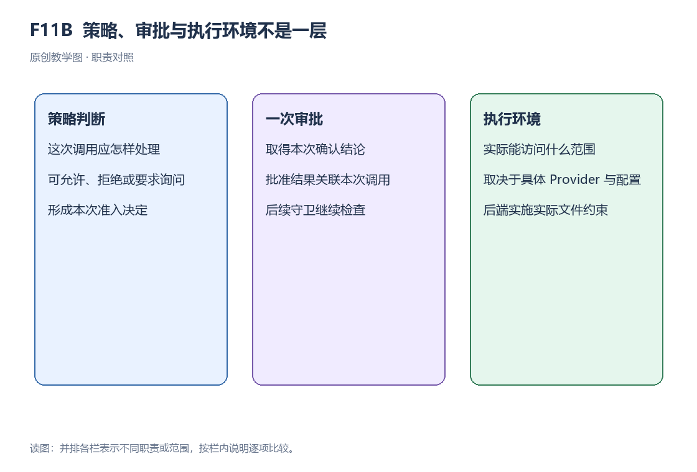

图 11B 并列三类控制：策略给出处理决定，审批获取本次确认，执行环境限制实际资源访问。审批后，调用继续接受守卫与环境约束。

假设 read 已获取文件，后置策略随后替换结果文字。下一次请求使用替换后的文字，文件读取本身已经完成。后置处理控制返回内容，外部资源的修改和撤回由执行服务处理。

### 常见误解

“审批允许就绕过全部限制”：后续 guard 与实际执行环境仍有自己的边界。

“所有错误都是执行前拒绝”：执行体错误、取消与后置结果处理都可能产生错误结果。

“工具调用记录等于操作完成”：调用、执行与最终结果分别有证据。

## 11.4 源码研读

<a id="e11a"></a>

### E11A · 准入链与可选询问

阅读任务：这是 prepareExecution 中创建执行上下文之后的节选。exec 描述本次调用，carrier 确定服务派发范围；观察前置决定与审批分支，后续守卫和实际分派不在本段。

代码类型：**真实源码摘录**。证据编号 [E11A](evidence-index.md#e11a)；下表的数字是原文件行号。

```ts
      const carrier = scopeTarget(this, exec.agent)
      const gate = await this.ctx.waterfall(
        carrier, 'tools/pre-execute', exec,
        () => Promise.resolve<PreToolDecision>({ kind: 'allow' }),
      )
      const askResolution = gate.kind === 'ask'
        ? await this.serviceAsk(exec, gate)
        : { decision: gate, approvalCancelled: false }
```

| 原文件行号 | 写法 | 在这段流程中的作用 |
| --- | --- | --- |
| 1504 | const 保存范围选择结果 | 按工具服务与本次 Agent 确定派发范围。 |
| 1505 | await waterfall | 等待前置处理链给出本次准入决定。 |
| 1506 | 调用实参 | 指定范围、事件名和执行上下文，处理者据此判断。 |
| 1507 | 箭头函数创建已成功完成的 Promise | 无人提出不同决定时提供默认 allow。 |
| 1508 | 结束前置调用 | gate 保存处理链最终决定。 |
| 1509 | 比较类别并开始三元选择 | 只有 ask 需要询问路径。 |
| 1510 | await serviceAsk | 等待一次审批并获取包括取消状态的结果。 |
| 1511 | 对象分支 | 其他决定直接进入后续处理，同时标记本分支没有审批取消。 |


执行推演：gate 为 ask 时等待 serviceAsk；allow 或 deny 则保留当前决定，不走询问。没有前置处理改写默认值时采用 allow，但仍需经过后续守卫与实际环境约束。

<a id="e11b"></a>

### E11B · 一次审批怎样留下关联记录

阅读任务：这是审批服务已经获取可记录 Session 之后的正常路径。req 保存工具和调用信息；重点是同一个审批标识怎样关联 asked 和 decided。取消或失败处理还需依 decide 和上层调用契约理解。

代码类型：**真实源码摘录**。证据编号 [E11B](evidence-index.md#e11b)；下表的数字是原文件行号。

```ts
    const id = ApprovalRequestId(randomUUID())
    session.append('approval/asked', {
      id,
      toolName: req.toolName,
      ...req.callId !== undefined ? { callId: req.callId } : {},
      ...req.reason !== undefined ? { reason: req.reason } : {},
    })
    const outcome = await this.decide(req, session)
    session.append('approval/decided', { id, outcome })
    return outcome
```

| 原文件行号 | 写法 | 在这段流程中的作用 |
| --- | --- | --- |
| 224 | const、randomUUID 与身份包装 | 生成本次审批独有的 id。 |
| 225 | 调用 append 并开始对象 | 记录一次 approval/asked 事实。 |
| 226 | 对象属性简写 | 保存审批身份。 |
| 227 | 属性读取 | 保存被询问的工具名称。 |
| 228 | 条件展开 | 有调用标识时加入，以便关联具体工具请求。 |
| 229 | 条件展开 | 有原因时记录本次询问原因。 |
| 230 | 结束对象和追加调用 | asked 事实已交给 Session 记录。 |
| 231 | await 等待决定 | 暂停本审批路径，等待相应决策结果。 |
| 232 | 追加另一个事件 | 用同一 id 记录 outcome，闭合正常决策路径。 |
| 233 | return | 将本次结论返回准入链。 |


执行推演：生成审批标识后，先记录 asked，再等待 decide。返回的 outcome 记入同一标识的 decided，并交给这次调用的准入链；下一次调用重新进入自己的准入流程。

## 11.5 理解检查与讲解问答

### 问题 1 · 审批允许一次以后，守卫还能拒绝吗？

讲解：能。允许一次不绕过后续守卫与执行环境限制。

### 问题 2 · 结果 isError 是否证明没有外部动作？

讲解：isError 标记这次调用以错误结束。若错误发生在准入阶段，执行体没有运行；若发生在执行体中，失败前已经完成的读取、写入或远端请求仍按实际执行情况保留。

### 问题 3 · 后置处理删掉结果文字，能否撤销此前读取？

讲解：后置处理修改返回给模型的内容。此前的读取已由文件服务执行，撤销外部动作需要执行服务提供相应操作。

[全书目录](tutorial.md) · [本章与原始证据](evidence-index.md) · [术语索引](glossary.md)

<a id="chapter-12"></a>

# 第 12 章｜MCP：外部工具与资源接入

本章学习任务：理解 stdio 与 Streamable HTTP 传输，追踪能力发现、注册代次、工具调用与资源读取。

## 12.1 基本概念

Model Context Protocol（MCP）规定客户端怎样与服务端发现能力并交换请求和结果。客户端发起调用，服务端提供能力。协议处理通信与能力发现，具体服务实现存储、检索或其他动作。

stdio 是 standard input/output 的缩写，通过子进程的标准输入和标准输出传递协议数据。标准输入接收外部数据，标准输出发送程序结果。HTTP（Hypertext Transfer Protocol，超文本传输协议）规定请求与响应的交换方式，URL 标识服务地址。Streamable HTTP 使用服务 URL，支持跨网络连接。连接、能力发现、工具注册和调用完成分别对应不同状态。

名称包装让来自不同服务器的工具能进入同一注册表。公开名称和服务器原工具名可能不同；执行包装保存二者的对应关系，因此模型调用公开名以后，客户端仍向服务器发送原名。

MCP 工具接收参数并执行操作，资源接口按标识读取材料。客户端分别发现并调用这些能力。跨 Session 记忆还需要服务保存信息，并在后续 Session 中提供相应查询。

## 12.2 沿一个任务看完整流程

假设服务 A 通过 stdio 提供 search 工具。客户端启动配置指定的进程、建立连接、获取完整工具列表，再构造公开名称并更新注册代次。代次标识本次连接及其工具注册结果。模型调用公开名称后，请求经过本地 ToolRuntime；执行包装使用服务器原工具名，将参数、取消信号与超时配置传入远端调用。

服务 B 使用 Streamable HTTP 时，客户端连接它的 URL；服务 A 的 stdio 则由本机子进程承载。两者发现的工具都接入本地 ToolRuntime。更新时先准备完整定义，准备失败保留旧注册；开始交换后若新注册失败，客户端撤销本轮已注册项，结果是该服务器没有工具注册。

远端工具返回内容后，本地包装按输出契约整理，再交给 Session。资源能力通过独立接口发现和读取。检索算法由服务器实现：子字符串查询匹配原文是否含查询词，向量检索则按 embedding 相似度选择材料。

## 12.3 关键机制与设计取舍

### 外部工具复用原工具链

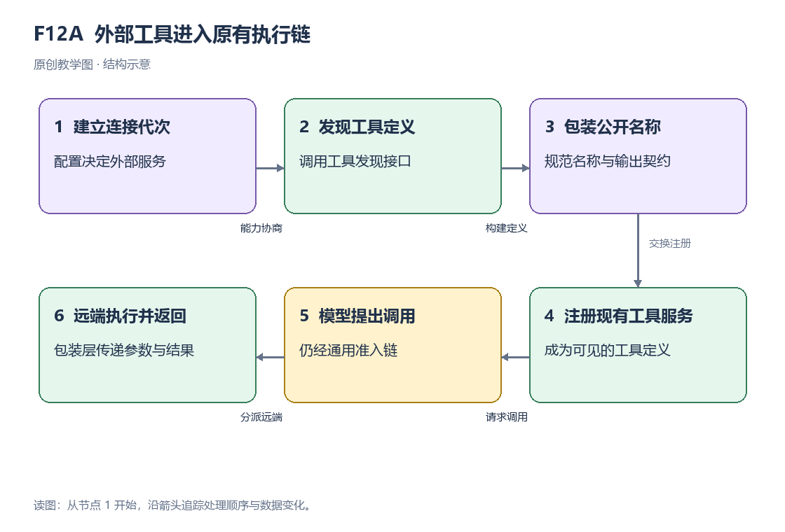

图 12A 从 MCP 连接与工具发现开始，经过公开名称包装和本地注册，再进入模型调用与远端执行。本地 ToolRuntime 继续处理准入、取消和结果。

### 连接、发现与代次交换

MCP 客户端按配置建立连接，并同步该连接代次的工具列表。代次标识一轮连接及其注册结果。同步分两阶段：先获取完整列表并构建所有定义，此时保留旧注册；准备成功后撤销旧注册，再逐项注册新定义。新注册发生冲突时，代码撤销本轮已注册项，使该服务器留下零项工具；严格启动同步继续抛错，普通同步记录错误并返回空注册表。

工具公开名采用 `mcp__服务名__原工具名` 的命名形式。简单有效名称直接拼接，非法字符和过长名称经过规范化与哈希处理。哈希把输入映射成较短标识，执行包装仍保存服务器原名，用于发送远端调用。

包装定义将远端参数 schema、说明和执行函数接到 ToolRuntime。模型调用公开名，参数经过本地准入与执行链，再由包装层向服务器原名发起调用。返回的模型文本与结构化内容按输出契约处理；资源插件另行提供资源发现和读取。

### 连接与知识能力的基础区别

客户端发起请求，服务端提供协议能力，远程调用在进程或网络之间传递参数与结果。MCP 规定这层交互协议。RAG（Retrieval-Augmented Generation，检索增强生成）先检索相关材料，再将材料加入模型上下文，例如检索项目文档后生成总结。协议接入和检索生成分别解决通信与信息组织问题。

Memory 服务的存储与查询实现决定是否支持 embedding、语义检索和跨 Session 记忆。embedding 将文本编码为用于相似度比较的向量，第 8 章已有介绍。本项目的 Memory MCP 指南提供可选第三方服务的接入方式，其中 Reference Memory 采用子字符串查询；相关能力通过对应服务配置启用。

### 分析示例：分项检查服务能力

教学服务已经建立连接，发现了一个检索工具，但没有声明资源能力，也没有验证跨 Session 记忆。四项验收应填：连接通过、工具发现通过、资源读取未证实、跨 Session 记忆未证实。

继续使用该工具前，还要检查一次实际调用结果、调用许可与结果质量。以协议接入可以复用成熟链路，代价是多了外部可用性、超时、版本和返回契约问题。

### 回到项目资料任务

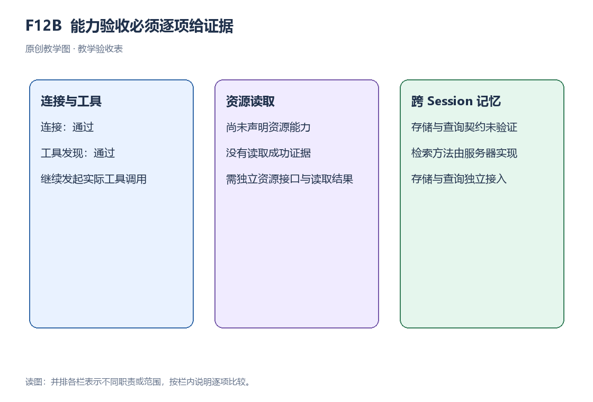

图 12B 按能力分别列状态：连接与工具发现已经完成，资源能力尚未声明，跨 Session 存储与查询尚未接入。每一栏对应一组独立的请求。

服务发现失败时，检查当前连接代次和已注册定义，而不只看页面的连接指示灯。远端调用失败时，则要查包装执行与服务器返回，不能自动归类为本地文件权限错误。

### 常见误解

“用了 MCP 就做了 RAG”：协议接入与检索生成方法是不同层次。

“服务连上就知道它的全部资料”：需要能力发现和具体读取；连接本身不提供全文。

Memory 服务的能力需要由存储实现、查询算法和启用配置确定。向量检索依赖相应的向量表示与检索实现。

## 12.4 源码研读

<a id="e12a"></a>

### E12A · stdio 与 HTTP 的不同执行边界

阅读任务：这是 createTransport 完整函数。config 已通过配置解析，transport 决定选哪一种连接；重点是命令与 URL 分别交给谁处理。

代码类型：**真实源码摘录**。证据编号 [E12A](evidence-index.md#e12a)；下表的数字是原文件行号。

```ts
export function createTransport(config: Config): Transport {
  switch (config.transport) {
    case 'stdio':
      return new StdioClientTransport({
        command: config.command,
        args: config.args,
        env: buildChildEnv(config.env),
        cwd: config.cwd,
      })
    case 'streamable-http':
      return new StreamableHTTPClientTransport(
        new URL(config.url),
        { requestInit: { headers: config.headers } },
      )
  }
}
```

| 原文件行号 | 写法 | 在这段流程中的作用 |
| --- | --- | --- |
| 31 | export function 与类型标注 | 按配置创建一项 MCP 传输对象。 |
| 32 | switch 选择分支 | 用 transport 字段决定执行方式。 |
| 33 | case 字符串标签 | 进入标准输入输出传输分支。 |
| 34 | return new 与对象参数 | 创建并返回会启动子进程的传输。 |
| 35 | command 字段赋值 | 使用配置指定的可执行命令。 |
| 36 | args 字段赋值 | 把命令参数交给传输实现。 |
| 37 | 调用环境构造函数 | 按项目规则准备子进程环境。 |
| 38 | cwd 字段赋值 | 指定子进程工作目录。 |
| 39 | 结束构造调用 | stdio 分支返回传输，不再进入 HTTP 分支。 |
| 40 | 第二个 case | 进入 Streamable HTTP 分支。 |
| 41 | return new | 创建按 HTTP 访问服务的传输。 |
| 42 | new URL | 将配置的服务地址解析成 HTTP 传输使用的 URL 对象。 |
| 43 | 对象嵌套 | 将配置请求头交给 HTTP 请求初始化设置。 |
| 44 | 结束构造调用 | 返回 HTTP 传输对象。 |
| 45 | 结束 switch | 两种受支持配置分支已经说明。 |
| 46 | 结束函数 | 连接和能力发现由后续客户端逻辑完成。 |


执行推演：stdio 配置创建子进程传输，HTTP 配置创建 URL 传输。客户端随后用返回的对象连接服务，发现能力并注册工具。

## 12.5 理解检查与讲解问答

### 问题 1 · 所有 MCP 服务都在本机子进程里运行吗？

讲解：stdio 服务由客户端启动的子进程承载；Streamable HTTP 通过 URL 连接服务，可以访问远端服务器。

### 问题 2 · 工具列表更新失败，是否应该先清空旧工具？

讲解：同一连接更新工具列表时，先完整发现并构造新定义，准备失败保留旧注册。准备完成后才撤销旧注册；如果注册新列表发生冲突，代码清掉本轮已注册项，该服务器此时没有工具。

### 问题 3 · 发现 search 是否证明已做语义检索？

讲解：MCP 传输工具说明、参数和调用结果。search 背后的检索方法由服务器实现，可以是关键词查询、数据库查询或向量检索；要沿服务器的实现确定具体算法。

[全书目录](tutorial.md) · [本章与原始证据](evidence-index.md) · [术语索引](glossary.md)

<a id="chapter-13"></a>

# 第 13 章｜Subagent：任务拆分与历史继承

本章学习任务：比较 fresh 与 fork 的历史起点，分析子任务创建、结果汇合及共享工作区协调。

## 13.1 基本概念

Subagent 是父 Agent 为子任务启动的独立运行单元。父 Agent 提供目标、上下文、能力配置与交付要求；子 Agent 执行任务并返回结果，父 Agent 负责检查和整合。

fresh 以不继承父历史的状态创建子任务，fork 使用父历史的指定前缀。进程内 Provider 的 spawn 创建空历史子 Session，fork 截取父 Session 中最近 turn/end 及其之前的事件。当前未完成轮次的新增材料需要通过启动输入显式传入。

Subagent Runtime 选择 Provider，检查选项与最大深度，再交给 Provider 创建运行。进程内 Provider 为子任务建立独立 Agent 和 Session，它们与父任务共享宿主进程。这里的 fork 指历史继承方式，子任务仍有自己的驱动和生命周期。

实验性团队功能再增加成员、任务板和消息投递记录。邮箱机制可以安排投递、确认与恢复，但不会因此给共享工作区加文件锁。两个成员修改同一文件，仍需要实际的协调或冲突检查。

## 13.2 沿一个任务看完整流程

当父 Agent 在当前轮次刚读取一份 README 并随后启动 fork Subagent 时，进程内 Provider 会优先查找最近的 turn/end 并仅继承至已完成轮次。由于该资料属于当前未结束轮次，因此不在继承前缀中；父 Agent 须在启动输入中显式传入子任务必需的材料，或选择其他适当的已完成起点。

| 起点 | 初始历史 | 父 Agent 应补什么 |
| --- | --- | --- |
| spawn | 不继承父事件历史 | 目标、材料和限制 |
| 本章进程内 fork | 最近完成轮次以前的事件前缀 | 当前轮次新增的必要材料 |
| 其他 Provider | 由其能力契约决定 | 依支持项建立交接 |

运行时检查 Provider、能力、最大深度和结构化输出选项；Provider 再创建运行句柄。父 Agent 获取子结果后对照原任务检查准确性、遗漏和冲突，然后汇合。团队消息有排队、投递和确认记录，恢复时可继续处理未确认项；共享文件修改另由任务分工和冲突协调处理。

## 13.3 关键机制与设计取舍

### 两种起点

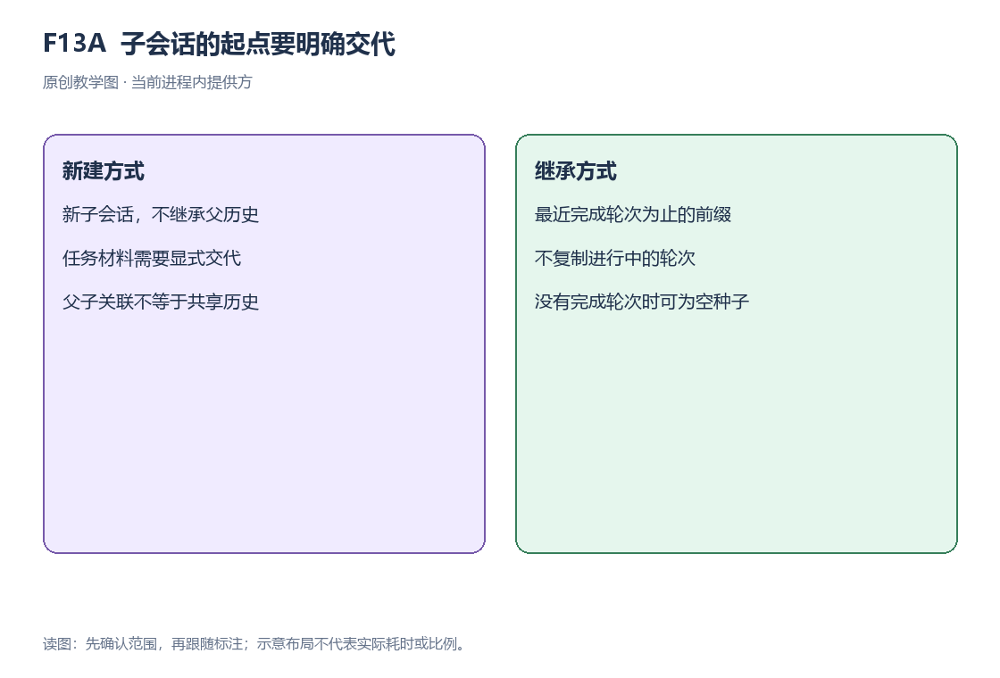

图 13A 左侧是进程内 spawn：新建子 Session，任务材料显式传入。右侧是进程内 fork：复制父 Session 到最近 turn/end 为止的前缀；没有 turn/end 时种子为空。

### 从父工具调用到子运行

父 Agent 调用 Subagent 工具后，执行入口先取得实际调用 Agent，再处理模型选项和 Provider 请求。Runtime 管理启动、Provider 查找和契约检查。一次性任务调用 `start`；后台任务选用支持持续运行的 Provider 时，可调用 `startContinuable` 接纳输入并返回子 Session 身份。Runtime 检查能力和最大深度，后者限制子任务继续创建子任务的层数。检查通过后，Runtime 建立运行描述并交给 Provider。fresh 与 fork 选择初始材料，start 与 startContinuable 选择运行和交付方式。

进程内 spawn 将空种子交给 `startInProcessRun`，fork 则先截取父 Session 到最近 `turn/end` 为止的事件前缀。两种 Provider 复用这份创建流程，为子任务建立新的 Agent 和 Session；子 Agent 接收自己的任务输入，再运行自己的循环。没有已完成轮次时，fork 的种子为空。运行句柄提供结果、取消传递和资源释放。

持续运行的历史起点在创建时捕获，后续继续运行沿用子 Session 已有历史。Provider 的能力契约列明支持的选项，Runtime 在启动前按该契约检查。

### 并发、进程与历史

多个 Agent 和 Session 可以在同一进程内分别运行，各自保存 Inbox、历史与生命周期。进程内 spawn 和 fork 通过这些对象组织任务；进程、容器和操作系统资源由宿主与执行 Provider 管理。

任务拆分需要明确各子任务的职责与输入。例如分别提取功能、核对限制，再由父 Agent 整合。当前轮次读取的 README 尚未进入 fork 的已完成历史前缀，应在启动输入中显式传入，保证两个子任务使用正确的材料。

### 分析示例：执行、启动与汇合的总耗时

教学单代理耗时 1200 ms。若将其拆分为两个各需 700 ms 的子任务，假设允许并发且确实同时开始，启动与参数传递开销为 200 ms，汇合检查为 250 ms，则简化总时间为 200＋max(700,700)＋250＝1150 ms，仅减少 50 ms。

复算记录：[C13 · 并发耗时](examples/calculation-results.json)。

若串行执行，则相同假设下为 1850 ms。若结果不一致还需额外处理。因此比较不仅要计执行区间，还要计材料、请求量与汇合质量。

### 选择任务起点

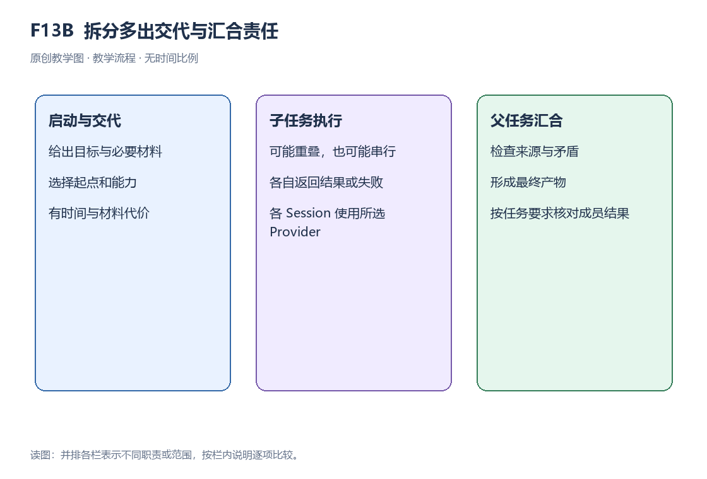

图 13B 用三栏列出拆分任务的工作流程：父任务传入目标和材料，子任务运行并返回结果，父任务验证与汇合。时间分析应将这三个阶段完整计入。

父 Agent 收集子结果，检查材料来源和相互矛盾，再形成最终总结。取消子任务时，Runtime 调用对应 Provider 的取消与清理路径，运行句柄返回收尾结果。

### 常见误解

“fork 复制了父 Agent 当前全部内容”：本 Provider 只取最近已完成轮次前缀。

“多个 Subagent 就是多个独立进程”：当前讨论的是进程内实现。

“一个生成、一个评审就一定更准”：评审输入、标准和责任仍需设计与实验验证。

## 13.4 源码研读

<a id="e13a"></a>

### E13A · 进程内 fork 取到哪里

阅读任务：completedTurnPrefix 从 parent 所指父 Agent 的日志中计算可继承前缀。代码以最近 turn/end 为边界，截取相应的 Session 事件；子 Agent 的创建位于 Provider 的后续逻辑。

代码类型：**真实源码摘录**。证据编号 [E13A](evidence-index.md#e13a)；下表的数字是原文件行号。

```ts
function completedTurnPrefix(parent: Agent): SessionEvent[] {
  // oxlint-disable-next-line typescript/no-deprecated -- Existing Session history read; migration deferred.
  const events = parent.session.snapshotEvents()
  const lastEnd = events.findLast(e => e.type === 'turn/end')
  if (lastEnd === undefined) return []
  // seq === array index (the append contract), so slice up to and including it.
  return events.slice(0, lastEnd.seq + 1)
}
```

| 原文件行号 | 写法 | 在这段流程中的作用 |
| --- | --- | --- |
| 48 | function 和参数类型 | 从父 Agent 计算可继承的完成轮次前缀。 |
| 49 | 原 lint 注释 | 说明当前历史读取接口的弃用警告处理及后续迁移安排。 |
| 50 | const 保存快照 | 获取当前父 Session 的事件数组。 |
| 51 | findLast 和箭头判断 | 从末尾找最后一个 turn/end 事件。 |
| 52 | if 与提前 return | 没有完成轮次时不继承历史。 |
| 53 | 原注释解释序号关系 | 追加契约保证 seq 与数组下标对应，所以可用来切片。 |
| 54 | slice 的不包含结束位置规则 | 加 1 使边界事件也被保留，返回整个前缀而非摘要。 |
| 55 | 结束辅助函数 | Provider 随后用这份起点创建子 Session。 |


执行推演：事件中最后的 turn/end 为 20 号时，返回开头到 20 号的全部事件；21 号以后属于当前未完成部分，不在种子里。没有 turn/end 时返回空数组。

## 13.5 理解检查与讲解问答

### 问题 1 · 当前轮次刚获取的资料会自动进入进程内 fork 吗？

讲解：fork 使用最近一个已完成轮次之前的历史前缀，正在进行的轮次留在父 Session。若子任务需要当前轮次的读取结果，应在启动材料中明确传入。

### 问题 2 · fork 是否自动生成很短的摘要？

讲解：不会。前缀保留边界以前的事件，摘要属于另外的机制。

### 问题 3 · 团队邮箱能否解决同时修改同一文件的冲突？

讲解：邮箱协调消息的投递和确认。共享文件由文件服务修改，多个成员写同一路径时，应拆分修改范围、安排执行顺序，并在整合时检查冲突。

[全书目录](tutorial.md) · [本章与原始证据](evidence-index.md) · [术语索引](glossary.md)

<a id="chapter-14"></a>

# 第 14 章｜Web Client：任务提交与状态同步

本章学习任务：理解任务提交与持续跟随，分析 pending 协调、事件序号、快照和状态同步。

## 14.1 基本概念

网页交互至少有两条信息流：用户向宿主提交任务，宿主把后续变化送回页面。远程调用（RPC）让页面请求另一执行环境执行操作；它这次返回的是接纳结果。持续跟随则让页面在任务推进期间获取变化。

本地回显在请求完成前显示用户输入，提供即时交互反馈。输入此时保存在客户端 pending 状态，Host 接纳后生成正式记录。requestId 关联这两种表示，使客户端能够协调状态并避免重复显示。

快照描述某个位置的已知状态，游标指出后续消费从哪个位置推进。持久事件有序号，助手临时流是尚在生成中的变化。跟随过程在准备快照前安装监听与缓冲，可以保留准备期间发生的事件。

Host 的 follow 按序号发送事件：略过旧事件，发送符合预期的下一项，发现缺口则报错并结束这次流。客户端的历史来源管理与控制流重连分别处理历史和状态，下一节说明两条路径。

## 14.2 沿一个任务看完整流程

用户发送消息后，客户端先创建 pending 记录并显示输入。附件处理完成后，客户端发出带 requestId 的 prompt 请求，Host 接纳后返回回执。后续跟随流提供正式用户消息，客户端根据 requestId 协调 pending 与正式记录，避免重复显示。

基线是已知时点的完整状态，增量是此后发生的变化。订阅登记后续事件的接收关系，缓冲保存尚待处理的事件，监听器响应事件通知。快照与增量结合，持续维护客户端的 Session 镜像。

另一条链路获取快照与后续变化。假设下一预期序号是 41，而缓冲收到 39、41、43：39 为过去的重复记录被略过；41 正常消费后预期更新为 42；43 暴露序号缺口，无法作为 42 消费。Host 跟随生成器因此抛出 gateway/internal 错误。

页面刷新后，客户端重新获取快照，再接收后续变化。已提交的助手消息从 Session 记录恢复；正在生成的文字通过启用的助手临时流观察。页面不更新时，沿提交、接纳、跟随、客户端状态和视图订阅逐项定位。

## 14.3 关键机制与设计取舍

### 两个方向

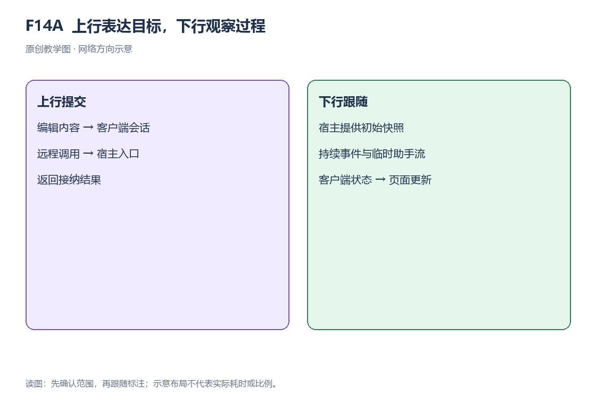

图 14A 左侧是上行提交，右侧是下行跟随。prompt 返回输入接纳结果，follow 提供初始快照、持久事件和启用的助手临时流，客户端据此更新页面。

### 发送路径

Session 交互控制器从编辑器取出内容，用 `beginSubmission` 创建本地 pending 条目，立即显示用户输入。随后处理附件并发出请求；Host 的接纳与消息记录通过另一条通道返回。

本地记录创建时生成 requestId，附件序列化完成后，Client Session 的 `prompt` 将同一标识送往 Host 命令控制器。后续跟随流带回对应记录，客户端据此协调 pending 条目与正式用户消息，避免重复显示。提交失败时，则按失败状态处理本地条目。

### 跟随路径与网络基础

snapshot 提供游标位置的状态，后续订阅从该位置继续接收事件。游标记录事件消费进度。RPC 负责操作请求与回执，持续流负责传递任务执行期间的状态变化。

`SessionHistoryController.follow` 在准备快照前安装事件监听与缓冲，再发出快照并处理缓冲后续。这避免把快照准备期间的变化简单丢掉。持久事件与助手临时流分别处理；临时流只有在请求开启相应能力时提供。

Host 用预期序号检查缓冲事件，旧事件略过，缺口抛错。客户端消费收到的事实并维护 Session 状态，ChatView 订阅状态变化，重新显示相应节点。

### 分析示例：序号去重与缺口

教学快照游标为 40，后续预期序号为 41。缓冲依次包含 39、41、43：39 早于消费位置，予以跳过；消费 41 后，预期序号推进到 42；随后到达的 43 暴露了缺失事件，触发缺口处理。

复算记录：[C14 · 预期序号](examples/calculation-results.json)。

这里的 39、41、43 来自 Host 的事件缓冲。预期 42 却收到 43 时，Host 报告 gateway/internal 并结束该流。客户端 `resync` 用于历史来源地址替换：关闭旧来源，再重新 open 历史窗口。投影状态由另一条控制流管理重连。事件连续性、历史来源替换和状态重连分别对应这些实现。

### 刷新后重建视图

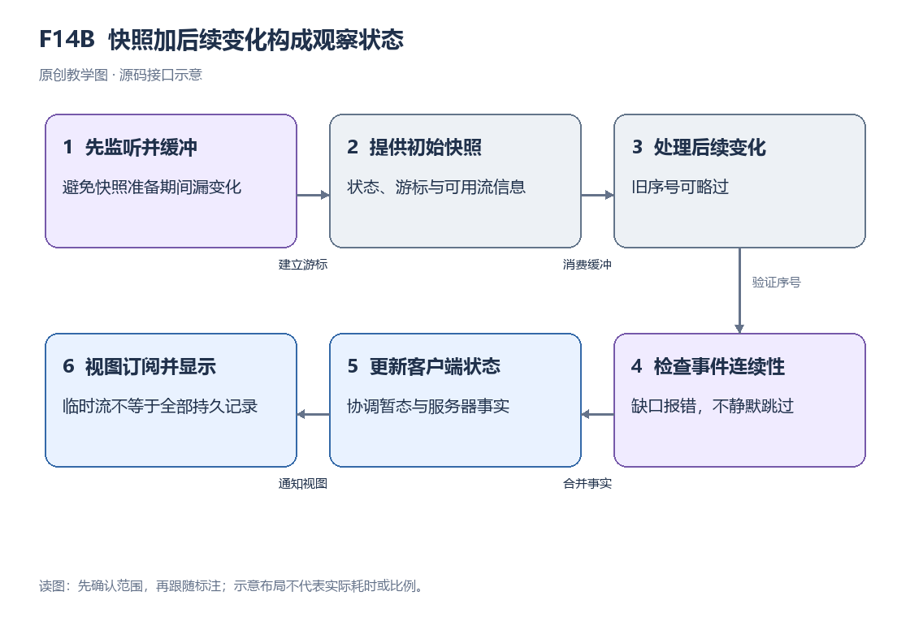

图 14B 从 Host 安装监听和缓冲开始，再发送快照、检查后续事件序号，最后由客户端更新状态、驱动视图。快照建立观察基线，持续事件推进它。

README 正在读取时刷新，页面通过新快照和后续事件重建视图。先前只在本地回显的输入由 pending 状态表示；Host 接纳并记录后的输入，才能在新的历史读取中作为正式用户消息出现。

本地回显让输入立即出现，requestId 把它与 Host 的接纳记录关联；快照和后续事件持续更新聊天视图。

### 常见误解

“提交函数返回成功就是最终回答”：其契约仍然是接纳；连续过程走跟随链。

“刷新会把所有临时片段逐字恢复”：临时流与持久事实的保存方式不同。

“有序号就一定无损恢复”：序号能检查连续性，恢复还要由实际协议与客户端路径完成。

## 14.4 源码研读

<a id="e14a"></a>

### E14A · 跟随时发现重复与缺口

阅读任务：这是跟随消费循环内的节选，item 是当前缓冲事件，nextOffset 是下一个需要的位置。yield 是把一项结果交给流的消费者，后续可再继续生成下一项。

代码类型：**真实源码摘录**。证据编号 [E14A](evidence-index.md#e14a)；下表的数字是原文件行号。

```ts
        const expectedSeq = SessionSeq(nextOffset)
        if (item.event.seq < expectedSeq) continue
        if (item.event.seq !== expectedSeq) {
          throw new RemoteError('gateway/internal', `session event stream skipped seq ${String(expectedSeq)}`, {})
        }
        nextOffset = SessionLogOffset(nextOffset + 1)
        yield entryFor(item.event)
```

| 原文件行号 | 写法 | 在这段流程中的作用 |
| --- | --- | --- |
| 226 | const 与序号包装 | 把当前消费位置转成期待的 Session 事件序号。 |
| 227 | 小于比较和 continue | 跳过已经早于期待位置的重复或旧事件。 |
| 228 | 不等比较 | 事件序号高于预期位置时，判定流中存在缺口。 |
| 229 | throw 构造远程错误 | 报告缺失序号并中断当前跟随流。 |
| 230 | 结束 if | 连续事件才能进入后面推进。 |
| 231 | 赋值和加 1 | 消费当前位置以后，期待下一项。 |
| 232 | yield 调用转换函数 | 把当前事实转成协议条目交给跟随消费者。 |


执行推演：Host 预期 41 时略过 39，收到 41 后发送该项并将预期推进到 42；随后收到 43，就抛出 gateway/internal，结束跟随。客户端的历史来源地址替换由 resync 关闭旧来源并重新 open，投影状态由独立控制流维护。

## 14.5 理解检查与讲解问答

### 问题 1 · 本地出现输入气泡是否证明服务器已接纳？

讲解：客户端提交前会建立 pending 条目，让输入立即显示。提交回执确认入口接纳，随后跟随流带回 Host 记录，客户端再把 pending 条目与正式记录协调。

### 问题 2 · 预期 42 却收到 43，能否继续当作连续事件？

讲解：Host 预期 42 却收到 43，会报告缺失事件并结束跟随。客户端有两项相关机制：历史地址替换时，resync 关闭旧来源并重新 open；投影控制流独立管理重连。Host 的缺口检查负责发现不连续，resync 负责替换历史来源。

### 问题 3 · 提交回执和持续跟随为什么分开？

讲解：提交表达操作并返回接纳，跟随传回后续过程；两者完成时间与数据契约不同。

[全书目录](tutorial.md) · [本章与原始证据](evidence-index.md) · [术语索引](glossary.md)

<a id="chapter-15"></a>

# 第 15 章｜桌面架构：Main、Renderer 与 Node Host

本章学习任务：理解 Main、Renderer 与 Node Host 的职责，追踪页面加载、Host 启动和客户端激活。

## 15.1 基本概念

桌面版通过 Electron 承载 Web 客户端。Renderer 运行页面，Main 管理窗口与应用生命周期，preload 向页面暴露受控桌面接口。Harness 后端服务运行在独立的 Node Host 子进程中，由 Main 管理其启动与退出。

进程是操作系统管理的一次程序运行，有自己的内存与生命周期。进程间通信（IPC）传递启动和退出等消息；聊天业务继续使用网页客户端的请求与持续流。HTTP 组织请求和响应，WebSocket 提供持续双向通道；它们与启动 IPC 各自解决不同问题。

启动时，Main 先加载本地页面，再等待 Host 返回服务地址与启动参数。页面显示等待状态，接收到启动参数后激活客户端。业务请求转发校验页面来源，并向 Host 请求补充认证信息。

普通主窗口关闭时隐藏窗口并保留后台运行；退出应用则进入任务中断检查和后端关闭流程。两类事件分别受桌面应用的生命周期管理。

## 15.2 沿一个任务看完整流程

桌面启动的可见顺序是：Main 导航到本地网页文档，随后启动后端准备；HostProcess 启动独立 Node 子进程，接收 ready 或 fatal 等消息。ready 携带服务 URL 与启动注入资料，同一页面据此继续激活客户端。

假设 200 毫秒看到等待界面，1000 毫秒业务可用，完整启动耗时应计为 1000 毫秒。页面出现但 Host 失败时排查子进程启动；Host 已 ready 但请求失败时排查转发和服务；业务状态已有变化但没有显示时排查客户端与视图。

主进程把页面业务路径转发到 Host，校验来源并适配认证。preload 提供目录选择等桌面接口，聊天请求使用 Web 客户端已有的通信方式。Main 管理窗口与后端生命周期，Node Host 运行 Harness 服务。

## 15.3 关键机制与设计取舍

### 三个环境与通信


图 15A 并列 Main、Renderer 和独立 Node Host。Main 管理窗口与启动，Renderer 显示 Web 产品，Node Host 运行模型、工具和 Session 服务。

### 先加载文档，再等服务准备

`reconcileBackend` 先导航到打包页面，再调用后端启动。窗口加载本地 Web 资源并等待启动注入，在 Host 准备就绪后直接基于当前文档激活服务。

`DesktopHostProcess.start` 创建 Node 子进程，建立 IPC 和输出管道，接收 ready 或 fatal 消息。ready 携带服务 URL 与 injections，也就是页面启动需要的服务地址等参数。已加载页面据此激活客户端，开始向 Host 发起业务请求。

桌面协议分别处理本地静态资源与业务请求。转发函数检查页面来源，映射目标路径和查询参数，并适配认证凭据。WebSocket 为页面与 Host 建立双向流通道。preload 通过受控接口提供目录选择、ready 等桌面能力。

### 进程与受控桥的基础

Main、Renderer 与 Node Host 各有内存和生命周期。preload 为 Renderer 暴露目录选择等桌面接口；文件工具由 Node Host 内的文件服务执行。

普通主窗口关闭会隐藏窗口并保留运行；退出应用进入任务中断检查和后端关闭流程。Main 分别处理这两个生命周期事件。

### 分析示例：页面出现与业务可用

教学启动时间线：0 ms 开始，200 ms 页面显示等待界面，900 ms Host 就绪，1000 ms 客户端可用。页面出现耗时 200 ms，业务可用耗时 1000 ms，中间等待区间为 800 ms。

复算记录：[C15 · 启动耗时](examples/calculation-results.json)。

启动过程中，同一份页面先显示等待状态，收到 Host 的启动资料后再激活客户端。页面较早出现，让用户能看到启动进展；服务准备、启动注入和业务激活则继续在后台推进。

### 启动故障的分层定位


图 15B 按启动顺序展示窗口、打包页面、Host 和启动注入。页面先显示等待状态，收到 ready 资料后激活同一文档中的客户端。

桌面上的 README 总结仍经过 Agent 循环、工具执行和 Session 记录。Renderer 负责界面，Main 负责桌面生命周期，Node Host 中的文件服务执行读取；桌面壳将这三个环境连接起来。

### 常见误解

“页面加载完成就等于模型和工具可用”：Host 和客户端激活还有独立状态。

“所有业务都通过 preload IPC 直接进入 Agent”：已有 Web RPC 和流仍承担聊天过程。

“关闭窗口等于退出应用”：普通主窗口关闭时隐藏并保留运行；退出应用则进入任务中断检查和后端关闭流程。

## 15.4 源码研读

<a id="e15a"></a>

### E15A · 真正启动 Host 子进程的位置

阅读任务：这是 DesktopHostProcess.start 内部的子进程启动节选。this.node 是所选 Node 程序，runtimeDir 与 projectDir 是已准备的目录；本段观察入口、参数与通信管道。ready/fatal 消息处理属于后续路径。

代码类型：**真实源码摘录**。证据编号 [E15A](evidence-index.md#e15a)；下表的数字是原文件行号。

```ts
    const entry = join(this.runtimeDir, 'node_modules', '@deepseek-ai', 'dsh-desktop-host', 'lib', 'index.js')
    const child = spawn(this.node, [
      '--expose-internals',
      ...(this.inspectPort === undefined ? [] : [`--inspect=127.0.0.1:${String(this.inspectPort)}`]),
      entry,
      this.runtimeDir,
      this.projectDir,
      this.primaryRuntime ?? join(this.runtimeDir, '..', 'runtime', 'primary-runtime'),
      ...this.packageManager === undefined ? [] : [this.packageManager.pnpm, this.packageManager.nodeBin],
    ], {
      cwd: this.projectDir,
      env: desktopNodeEnvironment(this.node, undefined, this.environment),
      stdio: ['ignore', 'pipe', 'pipe', 'ipc'],
    })
```

| 原文件行号 | 写法 | 在这段流程中的作用 |
| --- | --- | --- |
| 188 | const 与 join 拼接路径 | 定位运行包中 desktop-host 的入口文件。 |
| 189 | spawn 调用和参数数组开始 | 以指定 Node 程序启动独立子进程。 |
| 190 | 字符串参数 | 给 Node 启用该入口需要的内部能力选项。 |
| 191 | 条件数组展开 | 只有配置检查端口时才增加调试参数。 |
| 192 | 数组成员 | 把 Host 入口交给 Node 执行。 |
| 193 | 数组成员 | 传入运行包目录。 |
| 194 | 数组成员 | 传入当前项目目录。 |
| 195 | 空值合并和 join | 显式主运行环境优先，否则使用约定的默认目录。 |
| 196 | 条件展开 | 存在包管理器信息时追加其命令与 Node 目录。 |
| 197 | 结束参数数组，开始 spawn 选项 | 后续字段配置 Host 子进程的工作目录、环境和通信方式。 |
| 198 | cwd 选项 | 子进程从当前项目目录运行。 |
| 199 | 环境构造函数 | 根据所选 Node 与配置准备 Host 环境。 |
| 200 | stdio 数组 | 不使用标准输入，捕获输出与错误，并开启 IPC。 |
| 201 | 结束 spawn 调用 | 获取子进程句柄，后续管理其 ready、失败与退出。 |


执行推演：Main 的管理对象调用 spawn，启动 dsh-desktop-host 的 Node 子进程。当前项目目录成为子进程工作目录，管道和 IPC 供宿主观察输出与启动消息；spawn 仅返回进程句柄，ready 状态需等待后续 IPC 消息。

## 15.5 理解检查与讲解问答

### 问题 1 · Main 与 Node Host 分别运行哪些功能？

讲解：Main 管理桌面窗口和后端生命周期，独立 Node Host 子进程运行 Harness 服务。

### 问题 2 · 等待页面出现是否等于业务已经可用？

讲解：等待页面表明 Renderer 已加载文档。业务可用还需要 Host 返回 ready，并完成客户端激活。

### 问题 3 · preload 是否直接承接所有聊天业务？

讲解：preload 暴露受控桌面接口，聊天业务使用 Web 客户端已有的请求与持续流通道。

[全书目录](tutorial.md) · [本章与原始证据](evidence-index.md) · [术语索引](glossary.md)

<a id="chapter-16"></a>

# 第 16 章｜测试、模型回放与行为验证

本章学习任务：理解按位置消费的模型回放，区分调用轨迹检查、请求断言与真实任务评价。

## 16.1 基本概念

测试将预期行为表达为可检查的条件。断言规定必须满足的关系，例如失败模型尝试中的工具提议不得进入执行阶段。替身替代选定依赖，回放则用预录制响应替代模型生成，所选的真实循环和工具链继续处理这些响应。

本项目的 LLM 回放按 Session 绑定响应脚本，再按调用位置选择条目。新 Session 绑定下一份脚本，每次模型调用消费下一项响应。响应选择的依据是调用序号，请求字段的正确性由测试中的独立断言检查。

脚本在本章指一个录制 Session 的响应清单，每个条目对应一次模型调用。消费检查发现脚本没有绑定或条目没有用完；请求次数超出清单时也会报错。消费检查验证调用次数与脚本绑定。请求内容、工具动作和最终产物分别用对应断言检查。

固定模型输出减少一种变化来源，不固定操作系统文件、时间、并发调度和远端工具的全部行为。回放时使用哪些文件和工具，由测试 profile 与替身配置决定。

## 16.2 沿一个任务看完整流程

设录制脚本有两个响应：第一项提出 read，第二项生成总结。当前 Session 第一次请求获取第 0 项，第二次获取第 1 项，游标变成 2。只发一次请求时有条目未消费；第三次请求时脚本耗尽。消费检查帮助发现轨迹变化。

位置回放按调用序号返回响应，即使请求上下文存在错误，第一次调用仍会消费第 0 项。验证材料组装时，需要同时断言实际请求中的消息、工具定义和参数。

| 想验证的命题 | 合适观察 |
| --- | --- |
| 错误尝试没有执行工具 | 固定失败响应，并检查调用与执行 |
| 请求包含项目指令 | 检查实际组装的请求内容 |
| 新提示词使模型更少遗漏 | 使用新模型输出和统一任务评价 |
| 客户端没有重复气泡 | 检查客户端提交与历史合并状态 |

修改提示词以后，用真实模型重新生成结果，再按同一任务标准比较；回放用于检查固定响应下的程序行为。

## 16.3 关键机制与设计取舍

### 固定一个依赖，继续执行其他部分

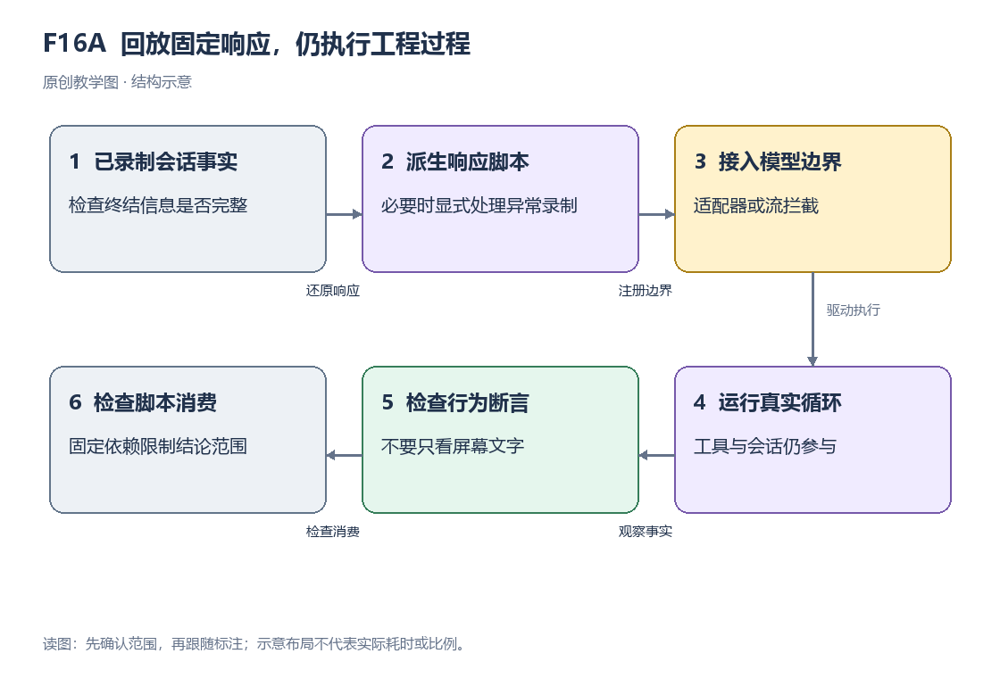

图 16A 从录制日志派生响应脚本，把脚本接到 LLM 边界，再运行循环和工具。测试检查实际行为，同时检查响应清单是否完整消费。

### 证据层怎样选择

单元测试检查局部函数，例如读取窗口；快照测试比较选定输出；回放让固定模型响应驱动真实循环；API 端到端测试连接实际服务，走完整请求链；性能实验记录规定条件下的时间和用量。选择检查方式时，先明确要观察哪个行为。

`deriveReplayScript` 从事件中恢复响应条目。遇到缺失终结的录制，需要在 replay.override.json 中明确提供覆盖响应，让回放使用明确指定的响应。整个 ReplayEntry 数组替换完整脚本；{ patches } 则在可成功派生的脚本上修改指定位置。`installLlmReplay` 加载脚本，按 Session 绑定消费位置；接入有两种方式：配置 providers 时注册 ReplayAdapter，在模型 Provider 层面直接顶替真实模型；否则在 `llm/stream` 边界拦截，请求即将发出时截获并改由脚本应答。

回放的消费检查确认每份脚本都绑定到实际 Session，并且条目全部用完。少一次请求会留下未消费条目，多一次请求会使脚本耗尽。用固定响应定位工程故障时，这些检查可以发现调用轨迹变化。

### 断言、替身与覆盖范围

断言（assertion）写出要检查的条件，替身（mock）替代某项依赖。检查数组长度为 2，只验证数量；检查元素中的工具名、参数和结果，才验证这些字段。回放固定响应序列，断言决定测试实际检查什么。

一个故障测试需要给出触发条件与观察点。例如，构造失败 finish，检查驱动是否记录 attempt、是否执行工具。评价模型总结质量则使用任务集和新生成的产物，按相同要求检查遗漏与错误。

### 分析示例：四个命题选四种检查

“行窗口只返回选定范围”可以用窗口单元测试；“失败尝试没有执行工具”可以用固定失败响应驱动真实循环；“实际服务能够完成协议请求”需要 API 测试；“修改提示词后更少遗漏实验性声明”需要同条件的业务任务评价。

若把最后一项改成固定输出回放，输出内容已经由脚本决定，无法评价提示词对真实模型的影响。回放便于定位工程回归（回归：原本正常的行为在修改后被破坏），真实模型评价则使用新输出。

再看一份含 3 次模型调用的录制。第 2 次缺少 finish 时，`deriveReplayScript` 抛出 “ended without a finish chunk”，要求提供 replay.override.json 覆盖文件。若改用完整的 3 项响应脚本，而实际只发起 2 次请求，`assertConsumed` 报告只消费了 2/3 次。另一项检查针对录制 Session：某份脚本从未绑定实际 Session 时，报告 recorded script(s) never bound。前者检查条目消费，后者检查 Session 绑定。

### README 故障怎样复现

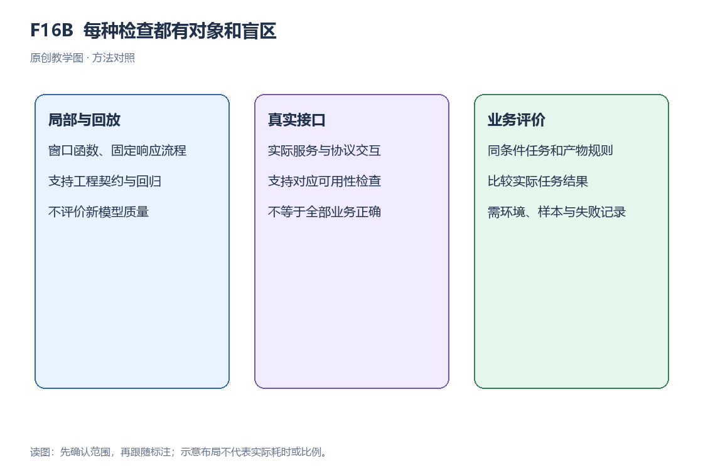

图 16B 比较三类检查：局部函数与固定响应回放、真实服务接口、业务任务评价。前两类检查程序行为和服务交互，业务评价比较新生成的产物。

“总结遗漏功能限制”需要通过任务材料和模型产物定位，再用新生成的结果比较修改效果。固定回放检查工程路径，真实模型输出检查提示与上下文对产物的影响；两类验证分别对应明确的待测行为。

### 常见误解

“测试通过说明所有场景正常”：测试只覆盖给定条件与断言。

“回放通过说明新模型更强”：固定输出没有检验新模型行为。

“读到测试就等于测试通过”：阅读测试说明预期行为，实际执行结果记录该环境下的通过与失败。

## 16.4 源码研读

教材附有[源码验证记录](examples/README.md)：验证代码实际调用第 4 章的读取窗口函数和第 3 章的 Inbox 方法，检查分块换行、达到字节上限后的总行数、越界错误、边界领取及重复输入拒绝。结果记录保存断言观察、执行环境和源文件哈希，可以逐项对应正文机制、函数调用与检查结果。

<a id="e16a"></a>

### E16A · 消费按位置推进

阅读任务：本段在 replay 已依据 Session 找到或建立绑定状态之后。state 保存该 Session 的脚本数组和游标；重点看这次选择响应的依据。后续生成器（可逐个产出值并暂停的函数，配合 yield，见附录）负责脚本耗尽等错误。

代码类型：**真实源码摘录**。证据编号 [E16A](evidence-index.md#e16a)；下表的数字是原文件行号。

```ts
    const boundState = state
    const seenSessions = nextScript
    const totalScripts = scripts.length
    const index = boundState.cursor++
    const entry: ReplayEntry | undefined = boundState.entries[index]
```

| 原文件行号 | 写法 | 在这段流程中的作用 |
| --- | --- | --- |
| 1064 | const 保存同一状态对象 | 后面的生成器使用本次已经绑定的 Session 状态。 |
| 1065 | const 保存数量 | 捕获目前已绑定的脚本数量，用于错误说明。 |
| 1066 | 读取数组 length | 保存录制脚本总数，便于报告未录制 Session。 |
| 1067 | 后缀自增 | 先取旧游标作为 index，再把本 Session 游标增加 1。 |
| 1068 | 方括号按下标取值，联合类型允许 undefined | 选择当前位置响应；越界由后续生成器报错。 |


执行推演：cursor 为 0 时本次取 entries[0]，随后 cursor 变为 1；下次取 entries[1]。这些行没有按请求内容（Payload）查找等价条目。

<a id="e16b"></a>

### E16B · 有路由时与无路由时的接入

阅读任务：本段在回放脚本已经加载后安装模型替身。providers 是回放配置的 Provider 目录，dispose 是以后移除替身的释放函数。

代码类型：**真实源码摘录**。证据编号 [E16B](evidence-index.md#e16b)；下表的数字是原文件行号。

```ts
  const providers = config.providers ?? []
  const dispose = providers.length > 0
    ? ctx.llm.registerAdapter(providers.map(provider => provider.id), new ReplayAdapter(providers, replay))
    : ctx.on('llm/stream', (options: GenerateOptions, _next) => replay(options))
```

| 原文件行号 | 写法 | 在这段流程中的作用 |
| --- | --- | --- |
| 1101 | 空值合并与数组字面量 | 缺省目录采用空数组。 |
| 1102 | const 与长度判断 | 依据是否指定 Provider 目录选择安装方式。 |
| 1103 | map、箭头函数和适配器构造 | 提取 Provider 身份并注册对应回放适配器。 |
| 1104 | on 与回调 | 另一分支在流接口拦截，把请求交给同一 replay 函数。 |


执行推演：providers 非空时登记路由适配器；为空时登记 llm/stream 拦截回调。对应路由的模型调用由 replay 返回；工具和文件服务继续采用测试配置中的实现。

## 16.5 理解检查与讲解问答

### 问题 1 · 两次回放调用都消费完了，是否证明请求材料正确？

讲解：位置消费检查第几次请求使用了第几项响应。要检查材料组装，还要断言实际请求中的消息、工具名和参数；两项检查分别覆盖调用轨迹与请求内容。

### 问题 2 · 固定回答以后能评价新提示词改善了多少吗？

讲解：不能。回答已由脚本决定，评价提示词影响需要新的模型输出。

### 问题 3 · 回放是否自动成为纯内存、无外部动作的测试？

讲解：回放替换模型响应。循环、工具和 Session 继续运行；若测试配置使用真实文件 Provider，工具仍会访问测试工作区。

[全书目录](tutorial.md) · [本章与原始证据](evidence-index.md) · [术语索引](glossary.md)

<a id="chapter-17"></a>

# 第 17 章｜任务评价、TokenMeter 与遥测

本章学习任务：区分 token 估计、Provider 用量和计费口径，联合分析任务质量、耗时与失败。

## 17.1 基本概念

评价由任务正确性规则和资源统计共同组成。质量描述产物满足要求的程度，耗时记录指定起点至终点的时间，用量统计请求、token 和工具调用等资源，失败记录保存未正常完成样本的原因。先明确任务要求，再按照统一口径采集这些指标。

计量记录或估算资源数量，遥测向观测系统输出运行信息。投影从事件维护用量与上下文状态，导出后端负责传输。TokenMeter 管理用量和容量统计，业务规则判断产物是否正确，费用依据 Provider 报告的计费类别与用量计算。

比较需要保持任务集、版本、模型选择和验收规则一致，再改变一个明确因素。通过率是通过数除以全部样本数；百分点是两个百分比的直接差，区别于相对增幅。平均数反映所有纳入样本的算术平均，中位数反映排序后的中间位置，失败样本怎样处理要先写清。

本章用一组十项任务的示例，说明怎样把质量、耗时和用量放在一起比较。

## 17.2 沿一个任务看完整流程

假设同一组十项任务，甲通过九项、消耗 20000 token；乙通过八项、消耗 14000 token。乙用量少了 30%，通过率却从 90% 降到 80%，差 10 个百分点。两种方案的取舍是用量下降、通过率也下降。

对每个任务同时记录输入标识、配置、产物、验收、接纳与终态时间、用量来源和失败原因。成功、失败与取消都保留；缺失数据不能填成零。费用按相应计费类别的用量乘单价求和，正式实验时再核验单价与缓存口径。

TokenMeter 注册用量、压力和材料组成投影，Session 遥测汇集事件并传入导出后端。业务评价将这些过程记录与产物检查关联。例如读取失败时，准确说明资料不足可以满足任务要求；读取成功时，再检查用途和功能总结是否有充分依据。

## 17.3 关键机制与设计取舍

### 一次任务的三组记录

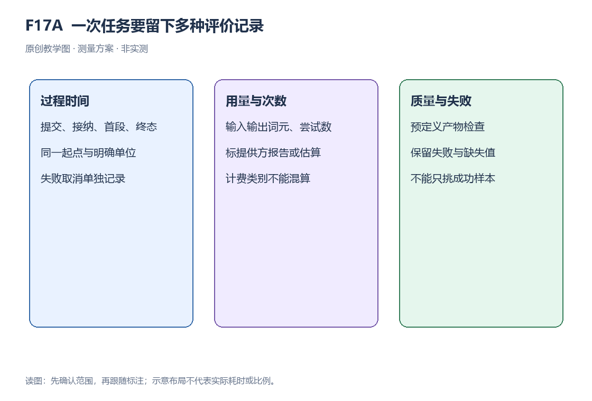

图 17A 的三栏记录过程时间、用量次数、质量与失败。每条任务记录共用任务身份，成功、失败和取消都进入统计。

### TokenMeter 和遥测怎样提供运行数据

TokenMeter 注册三项投影，投影是从事件计算并持续更新的统计视图。`tokenUsage` 记录请求用量，`contextPressure` 估算上下文压力，`contextBreakdown` 展示材料组成。压力计算使用当前 Surface、请求信息和模型路由；符合复用条件时采用 Provider 用量，否则使用本地估计。界面同时展示数值与来源。

Session 遥测协调器观察生命周期、事件和 flush，将选定记录交给导出后端。OTel 即 OpenTelemetry，提供遥测接口；项目后端支持按需捕获和反馈触发等配置。span 记录一段操作的耗时与关联，任务评分则使用产物检查规则。

质量检查是课程另外设计的实验层：README 总结是否准确说明用途、三点是否各有材料依据、是否保留关键限制、是否编造功能。先定义规则，之后才能计算通过率。

### 比例、单位和控制变量

通过率＝通过任务数÷全部任务数。平均耗时是所有相应样本耗时的算术平均，中位数则是排序后的中间位置。先说明失败时用哪个耗时、是否单独报告，才谈两项统计。

比较配置甲与乙时保持输入任务集、版本、模型选择、验收规则和预算一致，记录变更项、重复次数和实验环境。若模型与任务同时变了，不能把比例变化全部归因于某个提示词。

成本按明确计费类别求和：`总成本 = Σ(该类别用量 × 对应单价)`。单价、缓存口径和计费单位在真正实验时核验，缓存输入、普通输入和输出各按自己的单价计算。

### 分析示例：便宜的方案未必更合适

以下全部为教学假设：同样十项任务，方案甲通过九项，用量 20000 token；方案乙通过八项，用量 14000 token。甲通过率 90%，乙 80%；乙用量减少 `(20000−14000)/20000＝30%`，通过率下降 10 个百分点。

方案乙的变化是“用量减少 30%，通过率下降 10 个百分点”。若要求至少九项正确，选择甲；若预算允许八项通过，则继续比较失败类型和费用。将总用量除以通过数，甲约 2222、乙 1750 token，得到的是每项通过任务分摊的总用量，其中包含失败样本的消耗。

多项指标共同说明方案取舍，完整样本记录则支持分析这些差异的来源。扩大任务集并重复测量，可以进一步观察通过率、用量与失败类型的分布。

这组数字有逐项输入和计算记录：[样本文件](examples/metrics-input.json)保存每项任务的通过标记与用量，[calculations 输出](examples/calculation-results.json)列出公式、结果和单位。这里使用本地 `calculations` 工具的 Decimal 四则运算；甲的分摊用量在结果中保留小数，正文取整数近似值。数字仍来自教学假设，计算记录使每一步可以复查。[验证代码](examples/verify-calculations.py)检查百分点与相对增幅的区别，也检查任务身份是否配对和非法输入是否被拒绝。

### 一个小型实验怎样安排

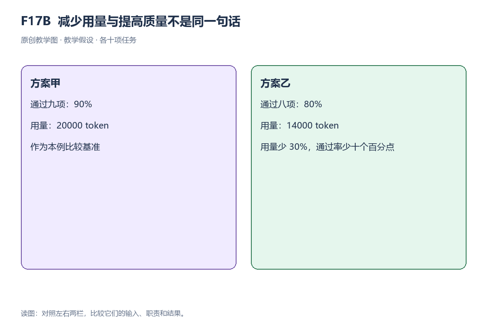

图 17B 中甲通过九项，消耗 20000 token；乙通过八项，消耗 14000 token。乙少用 30% token，同时少通过一项。

任务记录包含输入标识、配置、产物、检查结果、耗时、用量来源和失败原因。token 估算标明来源，缺失终态时间保留为空，避免与零耗时混淆。分析定位到上下文或执行机制后，再按相同任务规则复查修改效果。

### 常见误解

“用量少就是质量好”：上例乙更省却少通过一项。

“通过率从 80% 到 90% 是提高 10%”：绝对差为 10 个百分点，相对增幅为 12.5%，口径必须注明。

“只看成功任务耗时就足够”：失败样本可能消耗更多时间与请求，遗漏会扭曲方案评价。

## 17.4 源码研读

<a id="e17a"></a>

### E17A · 三项计量视图的注册

阅读任务：节选是 TokenMeter 构造时的投影注册。register 保存计算与读取定义，消费者后续查询和事件更新驱动具体统计。三项注册分别对应用量、上下文压力与材料组成。

代码类型：**真实源码摘录**。证据编号 [E17A](evidence-index.md#e17a)；下表的数字是原文件行号。

```ts
    ctx.sessionProjections.register(tokenUsageProjectionDefinition)
    ctx.sessionProjections.register(contextPressureProjectionDefinition)
    ctx.sessionProjections.register(contextBreakdownProjectionDefinition)
```

| 原文件行号 | 写法 | 在这段流程中的作用 |
| --- | --- | --- |
| 114 | 调用投影注册方法 | 登记 tokenUsage 的计算与读取定义，供查询模型用量。 |
| 115 | 同一方法接收另一项定义 | 登记 contextPressure 视图，供观察上下文容量压力。 |
| 116 | 同一方法接收第三项定义 | 登记 contextBreakdown 视图，供解释材料由哪些部分组成。 |


执行推演：计量组件注册三项投影定义，消费者随后按需读取用量、压力与材料组成。投影种类与模型请求次数分别计数。

## 17.5 理解检查与讲解问答

### 问题 1 · 通过率由 80% 到 90% 的直接差是多少？

讲解：10 个百分点；相对增幅是 12.5%，两种口径不同。

### 问题 2 · 未知耗时填零会有什么问题？

讲解：零是有效数值，缺失表示没有相应记录。将未知耗时填成零会降低统计值，并掩盖采集缺失。

### 问题 3 · 计量和遥测能否自动判断总结正确？

讲解：事件和用量记录提供运行事实。评价正确性时，先规定任务要求，再检查产物是否满足要求，例如功能总结是否保留实验性限制、是否标明资料不足。

[全书目录](tutorial.md) · [本章与原始证据](evidence-index.md) · [术语索引](glossary.md)

<a id="chapter-18"></a>

# 第 18 章｜综合案例：read 工具的接入与呈现

本章学习任务：串联 read 的注册、参数校验、执行、结果渲染和客户端呈现，分析各层失败的影响。

## 18.1 基本概念

扩展点是框架允许新增能力的位置，例如工具注册接口。接口契约既规定输入输出，也规定怎样处理生命周期、取消和结果。一个新能力复用这些位置，才能进入现有流程；插件通过 profile 挂载并注入依赖，工具定义才进入运行中的注册表。

规范值是执行体返回的结构化数据，供输出契约检查。schema 定义结构，render 生成模型内容，presentationMeta 提取可持久化的展示元数据。模型使用渲染文本，客户端根据原始事件与 meta 派生卡片数据。

真实 read 工具通过已选文件服务获取有界文本，再构造路径、行范围和总行数等结果。模型从渲染文字获取资料，界面从保存的展示元数据重建读取卡片。持久记录保存模型内容和展示元数据；界面恢复时读取这份记录。

本章将启动装配、参数校验、工具准入、文件读取、结果记录与界面呈现串联为同一条调用链。新增工具通过现有扩展接口接入各环节，复用统一的控制与记录机制。

## 18.2 沿一个任务看完整流程

read 的接入始于 profile 装载文件工具插件。插件声明依赖并注册工具，模型调用提交 file_path、offset 和 limit。ToolRuntime 创建参数 JSON 快照并完成准入；defineTool 的 execute 包装函数随后检查 schema，read 执行体通过 parseReadArgs 补齐缺省值、校验行范围，再调用文件服务读取目标并构造窗口。

执行结果形成规范对象，输出 schema 检查形状，render 生成模型材料，顶层工具调用的 presentationMeta 提取可保存的窗口资料。通用链处理最终结果，循环将 content 和 meta 写入 tool/result。后续模型请求使用 content，Web Client 从原始调用、结果和 meta 生成卡片。

| 出错位置 | 影响 |
| --- | --- |
| 参数解析 | 还未按这些参数读取 |
| 准入拒绝 | 真实执行体不运行 |
| 读取执行 | 需要检查文件服务错误与取消 |
| 结果契约 | 已读取也可能不能形成合法结果 |
| 顶层 presentationMeta 生成 | 执行结果转成工具错误，进入后续结果处理 |
| 客户端卡片数据不匹配 | readCardModel 返回 null，工具行显示原始输出 |

新增工具时，依次实现注册、输入检查、执行、输出渲染和资源释放；专用卡片通过展示契约接入。

## 18.3 关键机制与设计取舍

### 通过扩展接口接入运行链

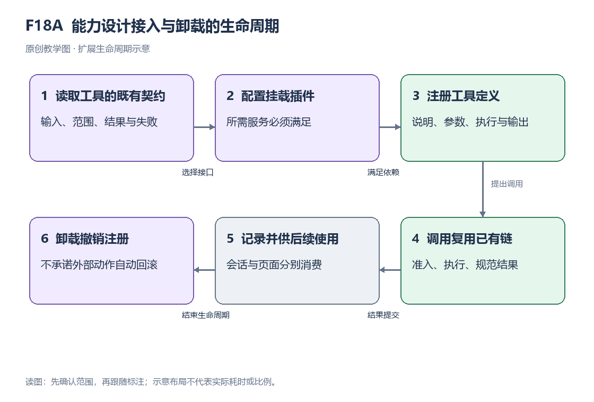

图 18A 按工具接入生命周期展开：确认契约、挂载插件、注册定义、复用 ToolRuntime、记录结果、卸载注册。read 的执行逻辑位于已有运行链中。

### 参数、规范值、模型文本和展示元数据

read 的外部参数是 `file_path`、`offset` 和 `limit`，解析后得到 `filePath`、`offset` 和 `limit`。前者是调用接口的命名，后者供执行逻辑使用：路径是字符串，起始行和最大行数是数字。解析完成后，执行体用这份内部输入读取文件。

执行体返回路径、起始行、行列表和总行数等规范 JSON 值。`output.schema` 检查结构，`output.render` 把该值转成模型面对的文本；`presentationMeta` 抽取可持久化的窗口数据，使支持读取卡片的界面能够重建行号和语言信息。规范值用于执行契约，模型文本供后续请求使用，展示元数据保存窗口事实。page 和 follow 传输原始 Session 事件；客户端再从事件提取卡片数据。

执行体通过所选文件服务读取，并检查取消与输出上限。schema 检查结构，解析逻辑检查具体值。插件的 `name` 标识实现，`inject` 声明依赖，`apply` 在依赖可用时注册工具。卸载时撤销注册，专用卡片则由客户端插件提供。

### 原指南与真实工具各怎样参考

官方最小工具示例说明 defineTool、execute 与 render 的关系，并使用 Node 文件读取展示一个最小形态。实际 tool-fs 使用 DSH 文件服务，由所选 Provider 解析路径；文件观察与执行守卫通过独立插件参与调用。

Web Client 的展示链从原始事件开始。Conversation 通过 callId 关联调用与结果，ToolCallTree 通过工具名称选择 tool.call.toolview 中的 renderer。这个按名称选择组件的入口称为 keyed slot。read 对应 ReadRow，它调用 readCardModel，从原始参数、结果文本与持久 meta 构造 React 组件的 props，即组件使用的输入数据。

readCardModel 先确认这是已结算、成功的顶层 read，再检查参数、meta 中的路径与行号、每行文本，以及模型结果的文件文本格式。通过后生成路径标签、行列表、总行数与语言信息；不符合时返回 null，工具行保留原始输出。没有专用 renderer 时，ToolCallTree 选择 GenericToolCard。

Host 的 presentCall 和 presentResult 是为本地消费方保留的纯转换接口。内置 Web Client 使用自己的卡片模型；page 和 follow 传输原始事实，Host 无需在读取历史时再次计算网页卡片。[展示链核验](evidence-index.md#s03)列出这条路径的实现入口。

### 分析示例：什么证据支持“能读文件”

沿同一次 read 检查六项行为：参数解析、空路径拒绝、文件读取、行窗口构造、输出校验和客户端卡片派生。输入决定前两项，执行轨迹说明读取过程，content 与 meta 分别支持模型材料和界面展示。

输出 schema、render 或顶层 presentationMeta 抛错时，ToolRuntime 将本次返回转成工具错误。结果已经记录以后，客户端的卡片模型只读取并校验事实：数据不符合卡片要求时显示原始输出，已有模型内容保持原样。执行结果的构造与卡片的派生分别发生在 Host 和 Client。

复用通用工具链让文件工具专注获取和表达材料，代价是必须实现已有 schema、结果、准入和生命周期约定。模型文本与专用卡片分别处理，也避免为了界面格式污染模型材料。

### 全书机制回到一个任务

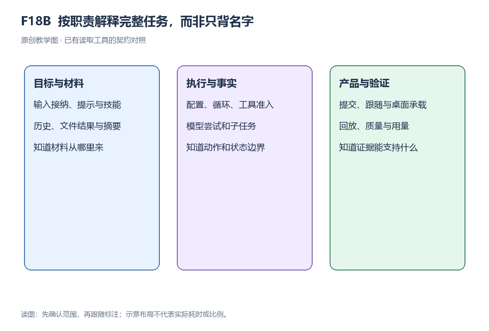

图 18B 用三组职责回顾全书：目标与材料、执行与事实、产品与验证。一次总结任务由这些部件合作完成，read 的输出在 Session、模型请求和界面中各有对应形式。

遇到材料过长，检查压缩后是否保留任务约束；模型失败，检查 attempt 与恢复决定；工具拒绝，检查准入结果；子任务参与，检查初始材料和返回产物。这些机制共同决定总结依据什么资料，以及失败发生在哪里。

### 常见误解

“一段类型定义就是可用插件”：类型不完成挂载、执行或运行验证。

“工具注册后自然有网页专用卡片”：工具行为与客户端呈现分别需要契约。

“更多能力必定更好”：新增接口还带来理解、控制与维护成本，应对准真实任务。

## 18.4 源码研读

<a id="e18a"></a>

### E18A · 卡片资料从规范值派生

阅读任务：这是 read 输出定义中的 presentationMeta 函数属性。value 已是读取规范值，_args 是这里未使用的参数。观察怎样形成可序列化展示对象；模型文本 render 是同一输出定义的另一项职责。

代码类型：**真实源码摘录**。证据编号 [E18A](evidence-index.md#e18a)；下表的数字是原文件行号。

```ts
      presentationMeta: (_args, value) => {
        const lang = langFromPath(value.path)
        return {
          path: value.path,
          offset: value.offset,
          lines: value.lines.map(({ number, text }) => ({ number, text })),
          totalLines: value.totalLines,
          ...lang === undefined ? {} : { lang },
        }
      },
```

| 原文件行号 | 写法 | 在这段流程中的作用 |
| --- | --- | --- |
| 124 | 属性和箭头函数 | 输出层稍后用规范值调用本函数，注册时不立即执行。 |
| 125 | const 与函数调用 | 依据结果路径推断展示语言。 |
| 126 | return 与对象开始 | 建立要保存的展示资料。 |
| 127 | 属性读取 | 保留结果里的显示路径。 |
| 128 | 属性读取 | 保留本次窗口的起始行。 |
| 129 | map、解构和对象返回 | 逐行只提取编号与文字，形成新的可保存数组。 |
| 130 | 属性读取 | 保留结果中的完整行数信息。 |
| 131 | 条件展开 | 可识别语言时才加入 lang 字段。 |
| 132 | 结束对象 | 本次展示资料建立完成。 |
| 133 | 结束函数属性 | 返回可序列化元数据，供工具结果保存与客户端卡片派生使用。 |


执行推演：路径、起始行、每行编号与文字及总行数形成卡片资料。文件扩展名能识别语言时增加 lang；无法识别就不增加。后续界面可以读取保存的元数据，不必再次读文件来重建这个窗口。

## 18.5 理解检查与讲解问答

### 问题 1 · 规范值、模型文本与展示元数据各自有什么用途？

讲解：规范值供契约检查和内部处理，模型文本供模型推理，展示元数据供保存与卡片重建。

### 问题 2 · 专用卡片失败是否意味着模型一定没收到文本？

讲解：Host 将规范结果渲染成模型文本，并为顶层调用保存窗口 meta。Web Client 从原始事件派生卡片；readCardModel 不接受当前数据时，工具行显示原始输出，模型仍使用已保存的文本。

### 问题 3 · 新增工具只写 execute 是否足够？

讲解：不够。还要完成注册、参数与输出契约、准入配合、取消和资源生命周期。

[全书目录](tutorial.md) · [本章与原始证据](evidence-index.md) · [术语索引](glossary.md)

<a id="chapter-19"></a>

# 第 19 章｜Cordis 与 Spatiotemporal Composability

本章从资源登记、依赖变化和插件卸载三个问题出发，讲解 Cordis 的 Spatiotemporal Composability。先用定时器和工具注册理解机制，再把它们与论文的定义和生命周期规则对应起来。

论文是 *A Programming Paradigm for Spatiotemporal Composability*，作者 Yifan Shi、Wei Zhang、Tianyi Cui，本文采用 arXiv:2608.25512 的 v1（2026-08-26）。实现采用固定项目快照里的 `@deepseek-ai/cordis` 4.0.4。下面先解释论文模型，再说明 Cordis 4.0.4 的实现方式。

## 19.1 组件替换与资源释放

假设文件工具插件装入时做两件事：注册 read，监听文件观察事件。模型于是能够使用工具，其他组件也能收到观察通知。后来配置改变，要换成另一份实现。如果只把插件名字从列表删除，旧监听器可能继续接收通知，旧工具也可能留在注册表；重新装入又登记一次，便会出现重复响应或旧对象继续被访问。

组件生命周期同时管理能力启用与贡献撤销。effect 是操作对状态产生的改变，例如注册事件监听器；disposer 是释放该贡献的函数，例如移除本次注册的监听器；inverse 描述对应的逆操作，用于恢复操作前的状态。

read 插件还依赖文件服务。提供者撤销服务后，消费者要重新检查依赖，退出当前实例或等待新的服务。服务名称标识可解析的能力，依赖声明列出装入前需要可用的入口。

论文把这两个问题放在一起：时间方向上，组件的贡献怎样撤回；空间方向上，组件怎样在当前 Context 中获取依赖并随环境变化重新装配。这就是 Spatiotemporal Composability：时间方向上的可撤回与空间方向上的依赖组合。空间维度指服务的组织和解析关系。

## 19.2 可逆操作与恢复见证

设状态 S 表示工具集合，组件 A 装入前为 `{read}`，操作 f 将其变为 `{read, search}`。f 同时提供逆操作 g，g 只移除 A 注册的 search，于是 `g(f(S)) = S`。这个关系要求逆操作恢复本次操作对应的输入状态。

这里的“状态”是数学模型描述的数据，“函数”是从旧状态得到新状态的规则。论文的 witnessed effect function 不仅返回新状态，还返回一项逆操作，并要求逆操作确实恢复其对应输入；Definition 8 给出这项见证条件。witnessed 表示函数附带满足该等式的数学见证。实现中的 ctx.effect 保存 disposer，组件作者负责让它满足恢复条件。

disposer（释放函数）通过闭包保留资源身份。闭包由函数及其引用的外层变量组成，例如清理函数捕获本次创建的 timer 句柄，卸载时据此停止对应定时器。资源创建时登记释放函数，使资源获取与撤销始终保持明确对应。

释放动作由组件作者编写。以定时器为例，disposer 要记住创建时得到的 timer 句柄，并调用 clearInterval 停止它；只打印“已清理”不会停止定时器。论文 §5.1.1 将逆操作的正确性交给组件作者，Cordis 运行时负责登记和调用。文件写入、邮件发送等外部动作，则要由作者按对应服务的实际能力设计后续处理。

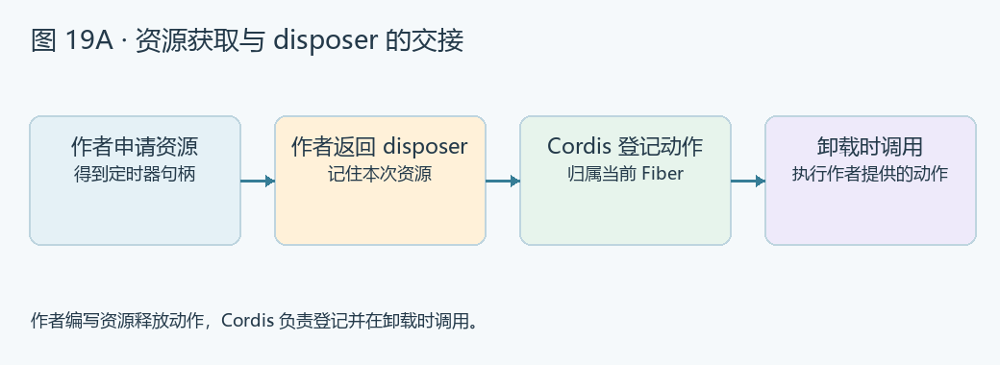

图 19A 从左向右展示资源交接：作者获取资源，返回记住这份资源的 disposer；Cordis 将它登记到当前 Fiber，卸载时调用作者提供的动作。

## 19.3 逆操作的组合与释放顺序

若组件先申请资源 A，再基于 A 创建资源 B，释放时应先清理 B，再释放 A，以保留 B 清理所需的依赖。LIFO（Last-In-First-Out，后进先出）描述这种顺序：后创建的依赖资源先撤销。

论文把每一步返回的逆操作接到已有恢复动作之前，形成反向组合。effect iterator 让装入逐步推进；迭代器每次给出下一项，并说明是否结束。运行时因此可以在步骤之间记录进度、检查目标状态，决定继续装入还是进入撤离。

论文的反向组合、一个 ctx.effect 内的多步恢复、Fiber 上多个 effect 的释放采用不同组织方式。当前 Fiber._unload 用 Promise.all 等待同层释放任务，多个异步 disposer 会重叠运行。有严格依赖的两项清理，应写在同一个 disposer 中依次 await：先撤资源 B，再撤资源 A。

框架捕获并记录单项释放错误，其他释放任务继续推进。排查时，可以从错误记录找到所属实例和释放位置，再检查该项动作停在了哪里。

## 19.4 环境要求：coeffect、服务键与依赖

coeffect 描述组件执行需要从环境获取什么，例如文件服务；effect 描述执行对状态造成什么改变，例如注册工具。服务 key 是用于识别和解析某项能力的名称或标识。提供者发布该键下的能力，消费者声明自己需要它，Context 根据当前范围解析到实际实现。

理解一个组件时，可以依次查看它声明的依赖、提供的服务和装入行为。插件声明描述依赖，服务提供操作登记能力，Fiber 管理这次装入产生的资源。

例如插件 T 需要 tools 和 fs。tools 让它登记工具，fs 让它实现读取。只有依赖条件成立，运行时才推进该实例的装入。fs 的提供者撤去服务时，运行时通知相关消费者重新评价目标状态；它们需要退出当前装配或等待新的满足条件的环境。

响应式依赖使环境变化触发实例的目标状态更新。依赖注入通过统一接口解析服务提供者。实例创建的连接、监听器和后台任务经资源管理接口登记，对应 disposer 随实例卸载被调用。

## 19.5 Fiber 与生命周期：目标变化时怎样收尾

Fiber 是组件的一次运行实例及其生命周期管理对象。每个 Fiber 保存自己的配置、依赖状态和释放动作。相同组件装入多次，可以有不同的 Context、配置、资源记录和状态；讨论清理时要指明是哪一个实例。

论文 §4 用抽象状态和转换规则研究装入、已激活、撤离等过程。论文中的 Reloading 包含推进装入的情形；论文用四类抽象状态表达规则；FiberState 枚举进一步区分运行时状态。实现与官方教程还区分 PENDING、FAILED、DISPOSED 等状态，用于表达依赖未满足、装入失败和实例终结。

装入正在等待连接建立时，配置可能改变。惯性原则要求先完成当前这一步，把结果与 disposer 交给框架，再决定继续装入还是撤回。资源由此及时进入清理记录。若外部操作迟迟不返回，这一步就一直等待；组件要在资源操作中配置超时或取消处理。

依赖撤离时还存在提供者与消费者的顺序问题。消费者的清理可能需要向提供者归还资源。论文的守卫演算通过等待关系限制过早回收，形式化讨论“提供者比它的消费者活得更久”的条件。

当前 Reflect.provide 的释放函数先从公共服务存储撤销入口，通知依赖实例，等待相关 Fiber，再清掉本实例保留的服务入口。这项 disposer 内部按上述顺序等待。Fiber 同层的其他 disposer 仍并发运行；需要消费者先退出才能释放的资源，应与该等待组织在同一受控释放流程中。

| 阶段 | 发生什么 | 需要核对什么 |
| --- | --- | --- |
| 依赖可用 | 消费者可以开始当前装配 | 声明与实际解析是否一致 |
| 提供者撤去入口 | 新解析不能把它当作普通可用服务 | 是否通知了相应消费者 |
| 消费者收尾 | 处理仍属于旧实例的资源 | 清理是否还需提供者 |
| 提供者资源释放 | 撤去自身登记的贡献 | 是否按真实依赖组织等待 |

## 19.6 操作独立性与安全卸载

交换律表示先做 A 再做 B，与先做 B 再做 A，得到同样结果。设 A 登记自己的键 a，B 登记另一个键 b。若两项操作都只改变自己的独立槽位，最终集合可以相同。若两项都修改一个顺序敏感的中间件（请求依次经过的一串处理环节）列表，先后就可能改变请求经过的规则。

Definition 42 要求正向、撤回以及相关变换都满足独立性，并保持对方返回的逆操作与后续迭代。检查两次注册能否交换，只覆盖其中一部分；还要检查卸载 A 时，B 的贡献和后续运行是否保持。

考虑一种有缺陷的释放方式：A 注册前保存整个工具集合，B 随后注册另一项工具，A 卸载时用旧副本替换当前集合。这样会连同 B 的合法贡献一起删除。释放逻辑应识别并移除本实例注册的条目。存在重名、覆盖、排序或共享资源时，还需检查替换与撤销规则是否保持独立性。

这解释了为什么论文讨论服务提供者的责任：它发布的操作采用怎样的表示，直接影响其他组件能否独立撤回。服务提供者在设计注册和撤销规则时，就要处理这些独立性条件。

## 19.7 观测等价与证明条件

观测等价表示按指定的合法观察方式，看不到会影响契约的差别。相同工具集合不要求内存地址、分配顺序或运行时缓存逐字节相同。观察关系由模型规定；网络请求和外部设备写入则有它们自己的可观察状态。

论文 §3.3 通过观察关系界定状态相等的用途，§3.4 再讨论独立性与恢复。证明按这样的顺序展开：先规定状态、操作和观察；写下可逆和依赖条件；再证明满足条件的系统可怎样组合与撤回。

Theorem 73 的推进结果假设依赖先行关系无环、迭代长度有统一有限上界、整个序列涉及的实例名称有限，并且每一步遵守生命周期规则。无环意味着依赖箭头不会从某个组件绕回它自己。在这些条件下，论文给出没有规则层死锁以及有限推进到静止状态（不再有待推进的步骤）的结论。

例如 A 等 B、B 又等 A，构成依赖环，已经不满足 Theorem 73 的无环条件。这个例子说明，依赖图和步骤长度是推进定理本身的组成部分。

## 19.8 服务作用域与模块热重载

ctx.isolate(name, label) 为指定服务名建立新的解析标签，得到派生 Context。默认新标签使该名称在子范围中可以解析到另一项实现；相同标签可以让多个范围共享该服务解析空间。这些 Context 仍处于同一 JavaScript 宿主中，共享进程资源。

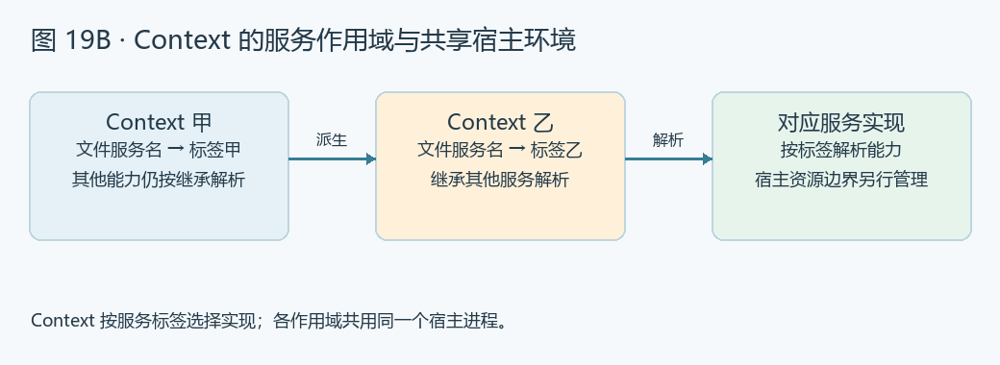

图 19B 先看两个 Context，再看右侧服务实现。派生箭头表示建立子 Context，解析箭头表示按服务标签找到实现。Context 乙为指定服务名使用新标签，其他服务继续沿继承关系解析；两个 Context 共用同一个宿主进程。

第 13 章的子 Session 组织历史与任务，第 11 章的执行环境限制资源访问，Context 的作用域组织服务解析。论文 §6.3 为不可信组件提出独立受限进程或容器等执行隔离，与这里的服务标签分工不同。

HMR 是 Hot Module Replacement，即热模块替换。项目的更新机制根据模块关系决定局部替换还是完整重载。当前 boot/hmr 检测到外部依赖变化时会走 fullReload（完整重载）并调用 loader.exit（结束当前进程以完成重载）。局部替换通过 disposer 释放旧贡献，完整重载则由 loader.exit 交给退出路径。

| 论文对象或问题 | 本项目对应观察位置 |
| --- | --- |
| effect 登记与 disposer 调用 | vendor/cordis 的 Fiber.effect 与卸载路径 |
| 服务提供与依赖通知 | Reflect.provide、notify 与 Fiber 状态 |
| 服务解析作用域 | Context.isolate |
| 工具贡献 | core/tools 注册与文件工具插件 |
| Session 事实持久化 | session-persistence-jsonl |
| 模块更新 | boot/hmr 的局部与完整重载路径 |

## 19.9 源码研读

<a id="e19a"></a>

### E19A · 作者提供资源释放逻辑

阅读任务：这是仓库官方 Cordis 教程中 heartbeat 的 effect 片段。观察定时器句柄怎样进入释放函数，以及 Cordis 怎样获得这项动作。

代码类型：**仓库官方教程示例**。证据编号 [E19A](evidence-index.md#e19a)；下表的数字是原文件行号。

```ts
  ctx.effect(() => {
    const timer = setInterval(() => console.log('tick'), 200)
    return () => {
      clearInterval(timer)
      console.log('heartbeat cleaned up')
    }
  })
```

| 原文件行号 | 写法 | 在这段流程中的作用 |
| --- | --- | --- |
| 20 | effect 接收函数并开始资源获取 | 把本次定时器生命周期登记给所属插件。 |
| 21 | const、setInterval 与回调 | 保存定时器句柄，每 200 毫秒调用日志回调。 |
| 22 | return 返回另一个函数 | 把释放动作作为值交给 Cordis，以后卸载时才调用。 |
| 23 | clearInterval 调用 | 作者使用已捕获的 timer 句柄停止该计时器。 |
| 24 | 日志调用 | 在实际清理时给出教程观察输出。 |
| 25 | 结束返回的释放函数 | 本次逆操作定义完成。 |
| 26 | 结束资源获取函数与 effect 调用 | 框架获得并登记释放函数。 |


执行推演：装入时创建定时器，effect 记录回调返回的释放函数。卸载时框架调用作者写下的 clearInterval；它没有从 setInterval 自动推导这行代码。

<a id="e19b"></a>

### E19B · 服务名称作用域隔离

阅读任务：Context.isolate 为 name 指定的服务名称设置解析标签。可选 label 用于让多个 Context 共享同一服务作用域，返回值是携带新解析表的派生 Context。

代码类型：**真实源码摘录**。证据编号 [E19B](evidence-index.md#e19b)；下表的数字是原文件行号。

```ts
  isolate(name: string, label?: symbol) {
    const shadow = Object.create(this[symbols.isolate])
    shadow[name] = label ?? Symbol(name)
    return this.extend({ [symbols.isolate]: shadow })
  }
```

| 原文件行号 | 写法 | 在这段流程中的作用 |
| --- | --- | --- |
| 121 | 方法、可选参数与 symbol 类型 | 指定哪个服务名称使用独立解析标签。 |
| 122 | Object.create | 创建继承父服务作用域表的新表，保留其他名称的解析关系。 |
| 123 | 下标赋值与空值合并 | 为指定名称使用已有标签，或创建唯一 Symbol 值作为新标签。 |
| 124 | return、extend 与计算属性 | 返回带新作用域表的派生 Context。 |
| 125 | 结束方法 | 隔离针对服务解析；物理执行边界需要另外的机制。 |


执行推演：不提供 label 时为指定服务建立新 Symbol 标签，其他继承关系仍保留；传相同 label 可加入同一服务作用域。没有创建进程、容器或文件权限边界。

<a id="e19c"></a>

### E19C · 同层资源释放并发等待

阅读任务：节选位于 Fiber._unload 的资源释放阶段。_disposables 保存当前 Fiber 的释放函数，Promise.all 等待各项异步清理，每项有独立的异常记录。后续流程清理 store 并更新实例状态。

代码类型：**真实源码摘录**。证据编号 [E19C](evidence-index.md#e19c)；下表的数字是原文件行号。

```ts
  private async _unload() {
    await Promise.all(this._disposables.clear().map(async (dispose) => {
      try {
        await composeError(async (info) => {
          await Promise.resolve()
          info.error = new Error()
          await runDisposable(dispose)
        }, this._runner.getOuterStack)
      } catch (reason) {
        this.ctx.logger.error(reason)
      }
    }))
```

| 原文件行号 | 写法 | 在这段流程中的作用 |
| --- | --- | --- |
| 675 | private async 方法声明 | 内部卸载过程返回可等待的结果。 |
| 676 | Promise.all、clear 与 map | 取出已登记的释放动作，分别启动异步处理并等待整组。 |
| 677 | try | 每项释放有独立异常处理范围。 |
| 678 | await 与传入的异步函数 | 组合释放错误的诊断信息。 |
| 679 | await 已成功完成的 Promise | 先经过一个异步等待边界再继续此释放任务。 |
| 680 | new Error 赋给诊断对象 | 保存本次释放位置的信息。 |
| 681 | await runDisposable | 实际调用并等待这一项作者或注册 API 提供的释放动作。 |
| 682 | 结束诊断回调并传入栈提供者 | 为错误关联所属插件的外层调用信息。 |
| 683 | catch 接收失败原因 | 某项释放失败转入记录分支。 |
| 684 | logger.error | 记录该项释放失败，保留诊断信息；其他释放任务继续执行。 |
| 685 | 结束 catch | 该项处理结束。 |
| 686 | 结束 map 与 Promise.all | 等待这一组并发释放处理收尾，随后进入 store 和状态清理。 |


执行推演：多个释放函数被映射成异步任务，再统一等待。某项失败会记录错误；其他项仍被调用。严格顺序的资源需要在同一个释放动作中依次等待，不能依赖同层异步释放逐项完成。

## 19.10 理解检查与讲解问答

**问题 1：框架能够调用释放函数，为什么不等于保证释放正确？**

讲解：登记把 disposer 与当前 Fiber 联系起来，卸载时框架调用它。以定时器为例，作者必须在 disposer 内调用 clearInterval，并传入本次创建的句柄。论文的见证条件要求恢复原状态；运行时的登记与调用实现资源管理，具体恢复动作由作者完成。

**问题 2：同层两个异步释放函数，能否只靠登记顺序保证第一个完全结束后第二个才开始？**

讲解：_unload 将同层释放函数映射成异步任务，再用 Promise.all 汇总等待。后启动的任务可以先结束。有先后依赖时，在同一个 disposer 中依次 await。

**问题 3：把插件放入 ctx.isolate 后，能否运行不可信代码而无须其他隔离？**

讲解：ctx.isolate 调整服务名称的解析标签，派生 Context 与原 Context 仍共享宿主进程。不可信组件的运行需要独立设计执行隔离、桥接接口与资源访问限制。

**追问：怎样向别人准确讲述 Cordis 的价值？**

Cordis 把插件组织成声明依赖、登记资源、响应环境变化并释放贡献的运行实例。Context 解析服务，Fiber 管理实例状态，effect 保存资源与 disposer 的对应关系。论文解释这些机制需要满足的可逆性和独立性条件，源码给出装入、撤离与依赖通知的具体执行方式。

## 19.11 论文阅读定位

本章实际依照原文讨论的部分：§3.1 revertible effect 及 Definition 8；§3.3 观察关系；§3.4 与 Definition 42 独立性；§4 生命周期与 Theorem 73；§5.1.1 effect tracking、§5.1.2 coeffect resolution、§5.1.3 组件生命周期；§6.1 外部 effect 的边界、§6.3 不可信组件隔离。

[论文信息页](https://arxiv.org/abs/2608.25512) · [v1 原文 PDF](https://arxiv.org/pdf/2608.25512v1)。


[全书目录](tutorial.md) · [本章与原始证据](evidence-index.md) · [术语索引](glossary.md)

## 随用随查与补充能力

[语法与数据基础](appendices.md) · [补充能力](subsystems.md) · [术语首次解释索引](glossary.md) · [实现证据](evidence-index.md) · [原项目文档](reference-index.md)
